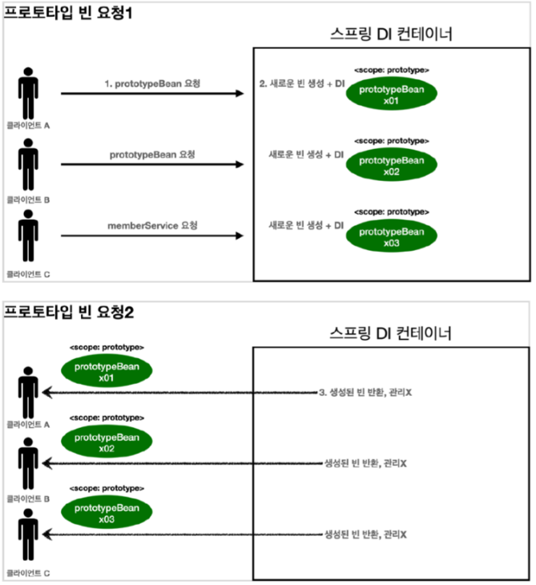

# Bean

Spring DI 컨테이너가 관리하는 객체를 Spring Bean이라고 한다. 즉, ApplicationContext가 만들어 내부에 갖고 있는 객체를 의미한다.

## 등록 방법

- Component Scan

  - @ComponentScan, @Component 사용
  - @SpringBootApplicaion이 @ComponentScan을 포함하기 때문에 해당 클래스가 있는 패키지에서부터 모든 하위 패키지의 클래스 중 @Component가 붙은 클래스를 빈으로 등록한다.

- 빈 설정 파일에 직접 등록
  - 빈 설정 파일은 자바설정파일과 xml로 작성할 수 있다.
  - 자바 설정파일은 @Comfiguration을 붙이며, @Configuration이 @Component를 포함하기 때문에 빈 설정 파일이 읽힐 때 그 안에 정의된 빈들이 등록된다.
  - @Bean을 이용해 직접 빈을 정의할 수 있다. @Bean이 붙은 메서드의 리턴 값에 해당하는 객체가 빈으로 등록된다.

## Bean 생성 과정

> 객체 생성 -> 의존관계 설정 -> 초기화 -> 사용 -> 소멸

- 스프링 컨테이너에 의해 생명주기가 관리된다.
- @PostConstruct와 @PreDestroy를 사용하여 빈 초기화 함수와 소멸 전 콜백함수를 지정할 수 있다. 외부라이러리의 경우 이 두개의 어노테이션을 적용할 수 없기에 @Bean의 initMethod, destroyMethod를 사용해야한다.

## 싱글톤 패턴

애플리케이션이 시작될 때 어떤 클래스가 최초 한번만 메모리를 할당 받고 그 메모리에 인스턴스를 만들어 사용하는 디자인 패턴이다. 클래스의 인스턴스가 한개만 생성되는것을 보장한다. (객체를 미리 생성해두고 다음 사용시에는 생성된 객체를 사용)

### 장점

- 메모리 영역을 할당받아 하나의 인스턴스만 사용하기 때문에 **메모리 낭비**를 방지할 수 있다.

- 싱글톤으로 만들어진 클래스의 인스턴스는 전역 인스턴스이기 때문에 **다른 클래스의 인스턴스들이 데이터**를 공유하기 쉽다.

### 단점

- 의존관계상 클라이언트가 구체 클래스에 의존한다. -> DIP위반

- 클라이언트가 구체 클래스에 의존하기에 OCP를 위반할 가능성이 높다.

- 내부 속성을 변경하기 어렵다.

<br>

#### DIP(Dependency Inversion Principle)

: 의존관계를 맺을 때 변화하기 쉬운 것보다 변화하기 어려운 것에 의존해라.

    의존관계 설정 시 구체클래스보다는 인터페이스나 추상클래스와 의존관계를 맺도록 설계해야하며, DIP를 만족하는 설계는 변화에 유연한 시스템이 된다.

#### OCP(Open-Closed Principle) : 소프트웨어 요소는 확장에는 열려있으나, 변경에는 닫혀있어야 한다.

    기능의 확장을 하더라도 기존 코드의 변경이 있으면 안된다. OCP를 지키려면 객체를 생성하고 연관관계를 맺어주는 별도의 조립, 설정자가 필요하다.

<br>

## Bean Scope

빈 스코프란 빈이 존재할 수 있는 범위를 말하며 singleton, prototype, request, session, application이 있다.

- singleton (default 값)

시본 스코프로 스프링 컨테이너의 시작과 종료까지 하나의 인스턴스만 유지되며 가장 넓은 범위의 스코프다

- prototype

스프링 컨테이너가 빈의 생성과 의존관계 주입, 초기화까지만 관여하고 더이상 관리하지 않은 매우 짧은 범위의 스코프이다.

빈을 요청할 때마다 새로운 빈을 반환하며, 그 이후 빈의 관리 책임은 요청한 클라이언트에게 있다.



- request

웹 요청이 들어오고 나갈때까지 유지되는 스코프로, 각각의 HTTP 요청마다 별도의 빈이 생성되고 관리된다.

- session

웹 세션이 생성되고 종료될때까지 유지되는 스코프이다.

- application

웹의 서블릿 컨텍스트와 같은 범위로 유지되는 스코프이다.

## Prototype과 Singleton

싱글톤 스코프의 빈의 프로토타입 스코프의 빈을 주입받는 경우에는 주의해야 할 점이 있다. 싱글톤 스코프의 빈이 프로토타입 빈을 주입받으면 싱글톤의 프로토타입 빈은 매번 바뀌지 않고 같은 빈이 쓰입니다.

singleton 빈은 ApplicationContext가 처음 앱을 구동할때, 빈을 만들고 빈을 주입해서 앱이 종료될 때 까지 계속 사용 된다. 따라서 singleton 빈 안에 있는 prototype 빈도 처음 주입된 채로 그대로 사용되기 때문입니다.

### 해결법 1 : proxy mode를 이용한다.

```java
@Component
@Scope(value = "prototype", proxyMode = ScopedProxyMode.TARGET_CLASS)
public class ProtoTypeBean {
}
```

@Scope 어노테이션에 proxyMode = ScopedProxyMode.TARGET_CLASS를 넣어주면 된다. 만일 인터페이스라면 proxyMode = ScopedProxyMode.INTERFACES를 쓸 수 있다.

ApplicationConxtext가 빈을 처음에 생성할 때 proto 빈을 주입받는게 아니라 prototype 클래스를 상속받은 **proxy클래스**를 만들어서 빈으로 등록하고 proxy클래스에서 내부적으로 매번 새로운 proto빈을 사용하게 끔 설계 되어있습니다.

### 해결법 2 : Dependency Lookup(DL)과 Provider를 이용하는 방법

가장 간단한 방법은 싱글톤 빈이 프로토타입을 사용할 때마다 스프링 컨테이너에 새로 요청하는 것이다.

```java
@Component
public class SingletoneBean {

    @Autowired
    ObjectProvider<ProtoTypeBean> protoType;

    public ProtoType getProtoType() {
        return protoType.getIfAvailable();
    }
}
```

ObjectProvider는 지정한 빈을 컨테이너에서 대신 찾아주는 DL 서비스를 제공하는 것이다. 과거에는 ObjectFactory였는데 편의기능이 추가되며 ObjectProvider가 만들어졌다.

ObjectProvider의 getObject()를 호출하면 내부에서는 스프링 컨테이너를 통해 해당 빈을 찾아서 반환한다.(DL)

스프링이 제공하는 기능을 사용하지만, 기능이 단순하므로 단위테스트를 만들거나 mock코드를 만들기는 쉬워진다.

### 해결법 3 : JSR-330 Provider 사용

javax.inject:javax.inject:1 라이브러리를 gradle에 추가해야 한다.

```java
@Component
public class SingletoneBean {

    @Autowired
    private Provider<PrototypeBean> provider;

    public int logic() {
        PrototypeBean prototypeBean = provider.get();
        prototypeBean.addCount();
        int count = prototypeBean.getCount();
        return count;
    }
}
```

provider.get()을 통해서 항상 새로운 프로토타입 빈이 생성된다.

provider의 get()을 호출하면 내부에서는 스프링 컨테이너를 통해 해당 빈을 찾아서 반환한다.(DL)

DL정도의 기능만 제공한다.

자바 표준이고, 기능이 단순해서 단위테스트나 mock코드를 만들기 쉽다.
