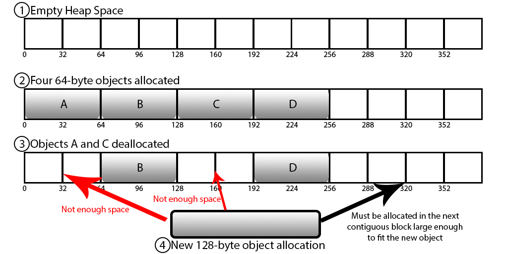

# Redis

데이터의 크기가 커지면서 DB의 한계 발생 

→ SSD로 많이 개선되었지만 여전히 디스크에 데이터를 저장해야 하므로 이 또한 한계 

→ 데이터를 하드디스크나 SSD에 저장하지 않고 메모리에 저장하는 In-Memory DB 활용 (=Redis)

- 고성능 key - Value 구조의 저장소
- 비정형 데이터(구조화되지 않은 데이터)를 저장, 관리하기 위한 오픈 소스 기반 NoSQL
    - NoSQL (RDBMS가 갖는 특성 뿐만 아니라 다른 특성들도 부가 적으로 지원)
- In-Memory 데이터 구조를 가진 저장소
    - 컴퓨터의 주기억장치인 RAM에 데이터를 올려서 사용하는 방법
    - RAM에 데이터를 저장하게 되면 메모리 내부에서 처리 → 데이터 저장/조회 시 하드디스크를 오가는 과정을 거치지 않아도 돼 속도가 빠르다.
    - 서버의 메모리 용량을 초과하는 데이터를 처리할 경우, RAM의 특성인 휘발성에 따라 데이터가 유실될 수 있다.
- DB, Cache, Message Queue, Shared Memory 용도로 사용된다.

⇒ **웹 서버의 부담을 줄이고, 고속으로 데이터 제공 가능**

### Redis 사용 이유

DB는 데이터를 디스크에 직접 저장하기 때문에 서버가 다운돼도 데이터가 손실되지 않는다.

하지만 매번 디스크에 접근해야 하기 때문에 사용자가 많아질 수록 부하가 많아져 느려진다.

→ 캐시 서버를 도입하여야 하는데 캐시 서버로 이용할 수 있는 것이 Redis

같은 요청이 여러 번 들어올 때 Redis를 활용하여 DB 부하를 줄이고 서비스의 속도도 느려지지 않게 할 수 있다.

### 특징

- Key, Value 구조
- 빠른 처리 속도 → 디스크가 아닌 메모리에서 데이터를 처리, 속도 빠름
- **Data Type(Collection)을 지원**
    
    ](images/db01-20.png)
    
    [https://velog.io/@wnguswn7/Redis란-무엇일까-Redis의-특징과-사용-시-주의점](https://velog.io/@wnguswn7/Redis%EB%9E%80-%EB%AC%B4%EC%97%87%EC%9D%BC%EA%B9%8C-Redis%EC%9D%98-%ED%8A%B9%EC%A7%95%EA%B3%BC-%EC%82%AC%EC%9A%A9-%EC%8B%9C-%EC%A3%BC%EC%9D%98%EC%A0%90)
    
    개발의 편의성, 생산성 증가 (DB 정렬해서 읽기보다 Redis Sorted-Set 사용하면 더 빠르고 간단)
    
- AOF, RDB 방식
    - In-Memory 데이터 저장의 휘발성으로 인해 데이터가 유실을 방지하기 위해 백업 기능 제공
    - AOF (Append On File)
        - Redis의 모든 write/update 연산 자체를 모두 log파일에 기록하는 형태
    - RDB (Snapshotting 방식)
        - 순간적으로 메모리에 있는 내용 전체를 디스크에 담아 영구 저장하는 방식
- Redis Sentinel(고가용성) 및 Redis Cluster(분산형 아키텍처)를 통한 자동 파티셔닝 제공
    - Master와 Slaves로 구성하여 여러 대의 복제 본을 만들 수 있고, 여러 대의 서버로 읽기를 확장 가능
    - 파티셔닝(Partioning)
        - 다수의 Redis 인스턴스가 존재할 때 데이터를 여러 곳으로 분산시키는 기술
        - 각 Redis 인스턴스는 전체 키 중 자신에게 할당된 일부 파티션의 키들만 관리
- 다양한 프로그래밍 언어 지원
- 싱글 스레드
    - 한번에 하나의 명령만 수행 가능, Race Condition 거의 발생 X
        - Race Condition
            - 공유 자원에 대해 여러 프로세스가 동시에 접근을 시도할 때, 타이밍이나 순서 등이 결과 값에 영향을 줄 수 있는 상태
            - 즉, 두개의 스레드가 하나의 자원을 놓고 서로 사용하려고 경쟁하는 상황에서 발생
            - 프로그램의 일관성과 정확성을 손상시킬 수 있음

### 사용 시 주의할 점

- 시간 복잡도
    - 싱글 스레드 사용으로 한번에 하나의 명령만 수행 가능, 처리 시간이 긴 요청의 경우 장애가 발생
- 메모리 단편화
    - 크고 작은 데이터를 할당하고 해제하는 과정에서 메모리의 단편화가 발생하여 응답 속도가 느려질 수 있다.
    - RAM에서 메모리를 할당 받고 해제하는 과정에서 위와 같이 빈 공간이 생기는데, 새로운 메모리 할당 시에 사용 가능한 메모리가 충분히 존재하지만 메모리의 크기 만큼의 부분이 없어 마지막 부분에 할당되어 메모리 낭비가 심하게 된다.
    - 이 현상이 계속되면 실제 physical 메모리가 커져 프로세스가 죽는 현상이 발생할 수도 있으므로, Redis를 사용 시에 메모리를 적당히 여유 있게 사용하는 것이 좋다.
    
    
    [https://velog.io/@wnguswn7/Redis란-무엇일까-Redis의-특징과-사용-시-주의점](https://velog.io/@wnguswn7/Redis%EB%9E%80-%EB%AC%B4%EC%97%87%EC%9D%BC%EA%B9%8C-Redis%EC%9D%98-%ED%8A%B9%EC%A7%95%EA%B3%BC-%EC%82%AC%EC%9A%A9-%EC%8B%9C-%EC%A3%BC%EC%9D%98%EC%A0%90)
    
- 주기적인 모니터링
    - 메모리 사용량이 너무 많으면 Redis 서버의 성능 저하나 장애로 이어질 수 있기 때문에 주기적인 모니터링을 통해 메모리를 관리해주어야 한다.

### Ref
https://velog.io/@wnguswn7/Redis%EB%9E%80-%EB%AC%B4%EC%97%87%EC%9D%BC%EA%B9%8C-Redis%EC%9D%98-%ED%8A%B9%EC%A7%95%EA%B3%BC-%EC%82%AC%EC%9A%A9-%EC%8B%9C-%EC%A3%BC%EC%9D%98%EC%A0%90