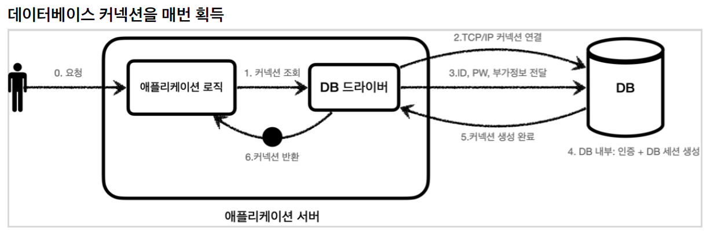

# connection pool

# 커넥션 풀(DBCP)

웹 컨테이너(WAS)가 실행되면서 DB와 미리 connection(연결)을 해놓은 객체들을 pool에 저장해 두었다가, 클라이언트 요청이 오면 connection을 빌려주고, 처리가 끝나면 실행된 상태로 다시 connection을 반납받아 pool에 저장하는 방식을 말함. 

# 커넥션 풀을 사용하는 이유

자바에서 DB에 직접 연결해서 처리하는 경우(JDBC) 드라이버(Driver)를 로드하고 커넥션(connection) 객체를 받아와야 한다. 

⇒ 매번 사용자가 요청을 할 때마다 드라이버를 로드하고 커넥션 객체를 생성하여 연결하고 종료하기 때문에 매우 비효율적이다. 

⇒ 커넥션을 새로 만드는 시간이 추가되기 때문에 결과적으로 응답 속도에 영향을 준다. 

# 커넥션 풀 과정

- 웹 컨테이너(WAS)가 실행되면서 connection객체를 미리 pool에 생성한다.
- HTTP 요청에 따라 pool에서 connection객체를 가져다 쓰고 반환한다.
- 이와 같은 방식으로 물리적인 데이터베이스 connection(연결) 부하를 줄이고 연결 관리 한다.
- pool에 미리 connection이 생성되어 있기 때문에 connection을 생성하는데 드는 요청마다 연결 시간이 소비되지 않는다.
- 커넥션을 계속해서 재사용하기 때문에 생성되는 커넥션 수를 제한적으로 설정한다.

# DBCP의 종류

- Apache의 Commons DBCP
- Tomcat-JDBC
- BoneCP
- HiKariCP 등

## 동시접속자가 많을 경우

- 위에 커넥션 풀 셜명에 따르면, 동시 접속 할 경우 pool에서 미리 생성된 conenction을 제공하고 없을 경우 사용자는 connection이 반환될 때까지 번호순대로 대기상태로 기다린다.
- 여기서 WAS에서 커넥션 풀을 크게 설정하면 메모리소모가 큰 대신 많은 사용자가 대기시간이 줄어들고, 반대로 커넥션 풀을 적게 설정하면 그 만큼 대기시간이 길어진다.

## DB Connection Pool관리를 어떻게 하면 좋을까?

가장 좋은 방법은 애플리케이션을 실제 운영할 시스템 환경에서 성능 테스트를 진행하는 것이다. 성능 테스트를 진행하면서 지금까지 살펴본 DBCP에 대한 원리와 설정을 위한 값들을 복기하면서 시스템 환경에 최적화된 값을 찾아 내는 것이 좋다.

WAS에서 설정해야 하는 값이 굉장히 많지만, 그 중 가장 성능에 많은 영향을 주는 부분은 Thread와 Connection Pool의 개수 이다. 

이들 값은 직접적으로 메모리와 관련이 있기 때문에, 많이 사용하면 할 수록 메모리를 많이 점유하게 된다. 그렇다고 반대로 메모리를 위해 적게 지정한다면, 서버에서는 많은 요청을 처리하지 못하고 대기 할 수 밖에 없다.

**WAS의 Thread는 Connection pool의 갯수보다 여유있게 설정하는 것이 좋다.** 

→ 애플리케이션에 대한 모든 요청이 DB에 접근하는 것은 아니기 때문.

출처

[https://velog.io/@mooh2jj/커넥션-풀Connection-pool은-왜-쓰는가](https://velog.io/@mooh2jj/%EC%BB%A4%EB%84%A5%EC%85%98-%ED%92%80Connection-pool%EC%9D%80-%EC%99%9C-%EC%93%B0%EB%8A%94%EA%B0%80)

[https://linked2ev.github.io/spring/2019/08/14/Spring-3-커넥션-풀이란/](https://linked2ev.github.io/spring/2019/08/14/Spring-3-%EC%BB%A4%EB%84%A5%EC%85%98-%ED%92%80%EC%9D%B4%EB%9E%80/)