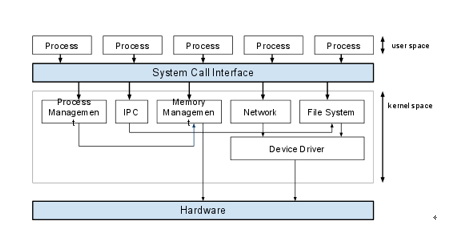
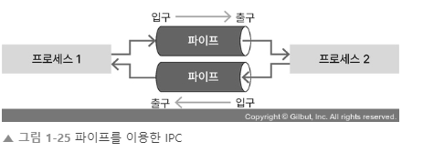
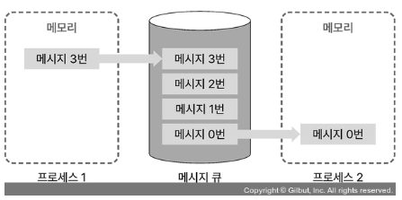

# IPC (InterProcess Communication)

- 프로세스는 독립적으로 실행된다. 각각의 프로세스는 다른 프로세스들에게 영향을 받지 않는다

> 메모리공간이 독립되어있다.
> 스레드는 프로세스 안에서 자원을 공유하므로 다른 스레드의 영향을 받는다.

- 프로세스들 간에 통신이 필요할 경우, IPC 통신을 이용해야 한다.

> 프로세스는 커널이 제공하는 IPC 설비를 이용해 프로세스간 통신을 할 수 있다.

# IPC 종류

### 익명 PIPE

파이프는 두 개의 프로세스를 연결하는데, 하나의 프로세스는 데이터를 쓰기만하고, 다른 하나는 데이터를 읽기만 할 수 있다.

> 한쪽 방향으로만 통신이 가능한 반이중 통신이라고 부른다.

> 따라서 양쪽으로 모두 송/수신을 하고 싶으면 2개의 파이프를 만들어야한다.

- 매우 간단하게 사용할 수 있는 장점이 있고, 단순한 데이터 흐름을 가질 땐 파이프를 사용하는 것이 효율적이다.
- 단점으로는 전이중 통신을 위해 2개를 만들어야 할 때는 구현이 복잡해지게 된다.

## Named PIPE (FIFO)

Named 파이프는 전혀 모르는 상태의 프로세스들 사이 통신에 사용한다.

> 익명 파이프는 통신할 프로세스를 명확히 알 수 있는 경우 사용한다. (부모-자식 프로세스)

> 익명 파이프의 확장된 상태로 부모 프로세스와 무관한 다른 프로세스도 통신이 가능한 것 (통신을 위해 이름있는 파일을 사용)

- Named 파이프 역시 읽기/쓰기 동시에 불가능하다. 전이중 통신을 위해서는 익명파이프처럼 2개를 만들어야 가능하다.

## Message Queue

입출력 방식은 Named 파이프와 동일하나, 메시지 큐는 파이프처럼 데이터의 흐름이 아니라 메모리 공간이다.

- 사용할 데이터에 번호를 붙이면서 여러 프로세스가 동시에 데이터를 쉽게 다룰 수 있다.

## 공유 메모리

파이프, 메시지 큐가 통신을 이용한 설비라면, 공유 메모리는 데이터 자체를 공유하도록 지원하는 설비다.

> 프로세스의 메모리 영역은 독립적으로 가지며 다른 프로세스가 접근하지 못하도록 반드시 보호되어야 한다. 하지만, 다른 프로세스가 데이터를 사용하도록 해야하는 상황도 필요하다. 파이프를 이용한 통신을 통해 데이터 전달도 가능하지만, 스레드처럼 메모리를 공유하도록 해준다면 더욱 편할 것이다.

> 공유 메모리는 프로세스간 메모리 영역을 공유해서 사용할 수 있도록 허용해준다.
> 프로세스가 공유 메모리 할당을 커널에 요청하면, 커널은 해당 프로세스에 메모리 공간을 할당해주고 이후 모든 프로세스는 해당 메모리 영역에 접근할 수 있게된다.

- 중개자 없이 곧바로 메모리에 접근할 수 있어서 IPC중에 가장 빠르게 작동한다.

## 메모리 맵

공유 메모리처럼 메모리를 공유한다. 메모리 맵은 열린 파일을 메모리에 매핑시켜서 공유하는 방식이다. (즉 공유 매개체가 파일 + 메모리)

> 파일로 대용량 데이터를 공유해야할 때 사용

## 소켓

네트워크 소켓 통신을 통해 데이터를 공유한다.

클라이언트와 서버가 소켓을 통해서 통신하는 구조로, **원격에서** 프로세스간 데이터를 공유할 때 사용한다.

서버 : bind, listen, accept
클라이언트 : connect

이런 IPC 통신에서 프로세스간 데이터를 동기화하고 보호하기 위해 세마포어와 뮤텍스를 사용한다. (공유자원에 한번에 하나의 프로세스만 접근시킬 때)
