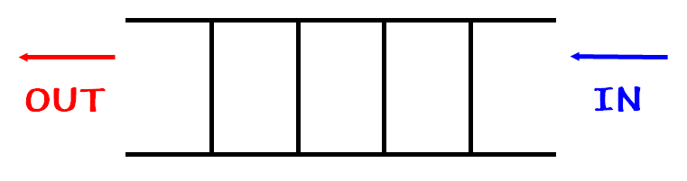

# Queue

# queue 란



줄을 지어 순서대로 처리되는, 선입선출(FIFO : First In First Out)의 성격을 지닌 자료구조

## queue : LinkedList, ArrayDeque

1. 선언
    
    ```java
    import java.util.LinkedList;
    import java.util.ArrayDeque;
    
    Queue<Integer> queue = new LinkedList<>();
    ArrayDeque<Integer> queue = new ArrayDeque<>();
    ```
    
2. 삽입
    
    ```java
    queue.add(1);
    ```
    
3. 삭제
    
    ```java
    queue.offer(1);
    queue.poll(); // queue에 첫번째 값을 반환하고 제거 비어있다면 null
    queue.remove();     // queue에 첫번째 값 제거
    queue.clear();      // queue 초기화
    ```
    
4. 제일 앞 데이터 출력
    
    ```java
    queue.peek(); 
    ```
    

참고자료

[https://kwin0825.tistory.com/157](https://kwin0825.tistory.com/157)

[https://coding-factory.tistory.com/602](https://coding-factory.tistory.com/602)