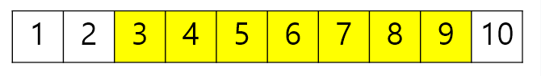

# Segment Tree

# 세그먼트 트리 란

- 여러개의 데이터가 존재할 때 특정 구간의 합(최솟값, 최댓값, 곱 등)을 구하는 데 사용되는 자료구조
- 트리의 종류 중 하나로 이진 트리의 형태이며, 특정 구간의 합을 가장 빠르게 구할 수 있다. O(logN)

## 사용 이유



인덱스 2부터 8까지의 수를 모두 더하자 → 인덱스 2번부터 8번까지 순차적으로 더한다. → O(N)

구간합을 구하는데 속도가 너무 느리다.

세그먼트 트리 사용하자.

## 동작 및 구현

```java
int[] arr = {1, 2, 3, 4, 5, 6, 7, 8, 9, 10}
```

### 트리 클래스 생성 및 트리 생성


```java
class SegmentTree{
        long tree[]; //각 원소를 저장할 트리
        int treeSize; // 트리의 크기

        public SegmentTree(int arrSize){
            
            // 트리 높이 구하기
            int h = (int) Math.ceil(Math.log(arrSize)/ Math.log(2));
						// 높이를 이용한 배열 사이즈 구하기
            this.treeSize = (int) Math.pow(2,h+1);
            // 배열 생성
            tree = new long[treeSize];
        }
		// arr = 원소배열, node = 현재노드, start = 현재구간 배열 시작, start = 현재구간 배열 끝
     public long init(long[] arr, int node, int start,int end){
            
            // 배열의 시작과 끝이 같다면 leaf 노드이므로
            // 원소 배열 값을 트리에 저장. 
            if(start == end){
                return tree[node] = arr[start];
            }
			
            // leaf 노드가 아니면, 자식노드 합 트리에 저장
            return tree[node] = init(arr,node*2,start,(start+ end)/2) + init(arr,node*2+1,(start+end)/2+1,end);
        }
}
```

### 세그먼트 트리로 구간 합 구하기


인덱스 6에서 9까지의 합을 구하기 → 더해야하는 인덱스드들이 범위 안에 있는 경우 더해주기.

```java
// node: 현재 노드, start : 배열의 시작, end : 배열의 끝
// left: 원하는 누적합의 시작, right: 원하는 누적합의 끝
public long sum(int node, int start, int end, int left, int right){
    // 범위를 벗어나게 되는 경우 더할 필요 없음
    if(left > end || right < start){
        return 0;
    }

    // 범위 내 완전히 포함 시에는 더 내려가지 않고 바로 리턴 (범위가 완전 같다면)
    if(left <= start && end <= right){
        return tree[node];
    }

    // 그 외의 경우 좌 / 우측으로 지속 탐색 수행
    return sum(node*2, start, (start+end)/2, left, right)+ sum(node*2+1, (start+end)/2+1, end, left, right);
}
```

세그먼트 트리에서 데이터 변경하기


인덱스 6의 값을 수정하는 경우. 해당 인덱스를 포함하고 있는 노드들만 변경하기.

```java
// node: 현재노드 idx, start: 배열의 시작, end:배열의 끝
// idx: 변경된 데이터의 idx, diff: 원래 데이터 값과 변경 데이터값의 차이
public void update(int node, int start, int end, int idx, long diff){
    // 만약 변경할 index 값이 범위 바깥이면 확인 불필요
    if(idx < start || end < idx) return;

    // 차를 저장
    tree[node] += diff;

    // 리프노드가 아니면 아래 자식들도 확인
    if(start != end){
        update(node*2, start, (start+end)/2, idx, diff);
        update(node*2+1, (start+end)/2+1, end, idx, diff);
    }
}
```

참고자료

[https://velog.io/@kimdukbae/자료구조-세그먼트-트리-Segment-Tree](https://velog.io/@kimdukbae/%EC%9E%90%EB%A3%8C%EA%B5%AC%EC%A1%B0-%EC%84%B8%EA%B7%B8%EB%A8%BC%ED%8A%B8-%ED%8A%B8%EB%A6%AC-Segment-Tree)

[https://cano721.tistory.com/38](https://cano721.tistory.com/38)