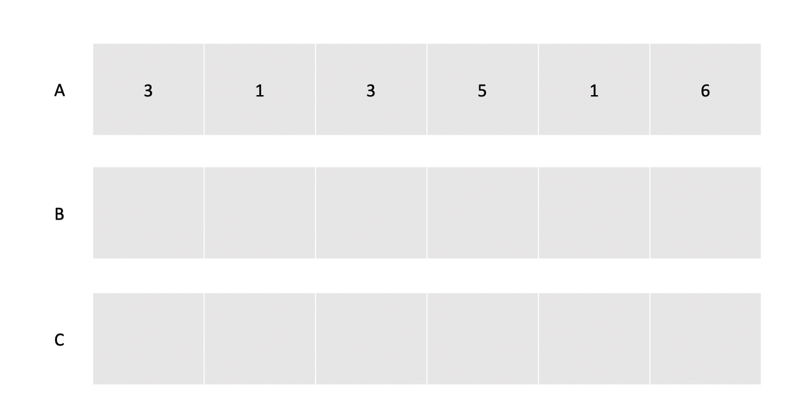
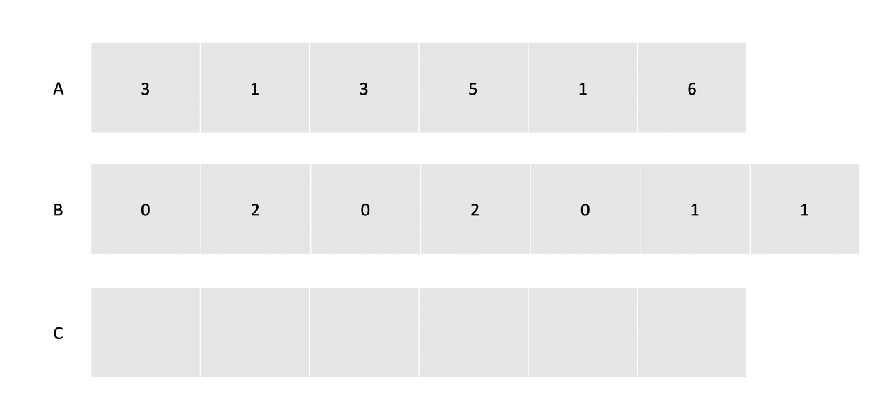
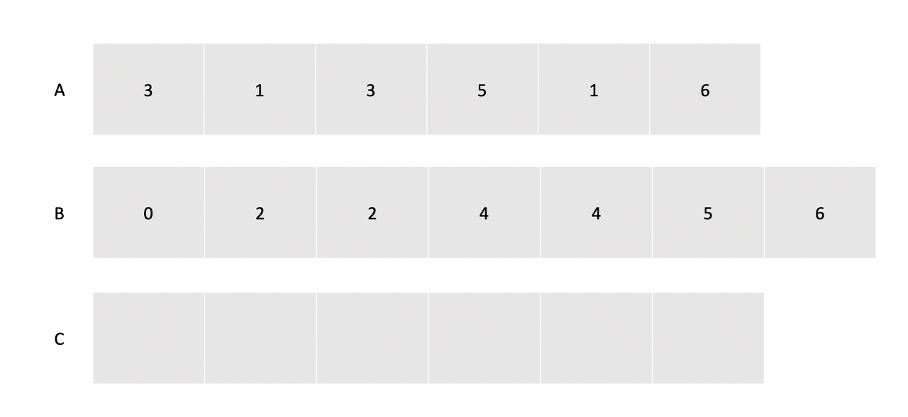
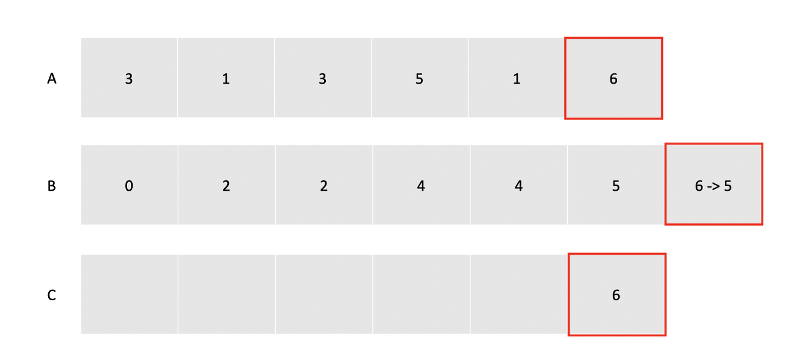
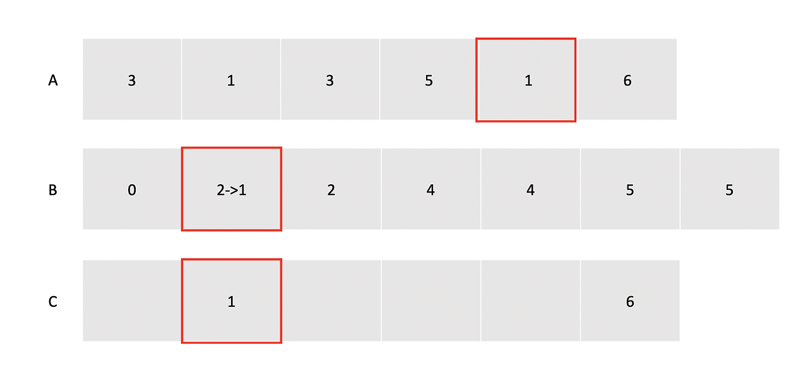
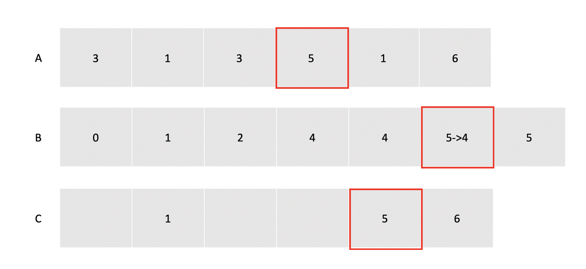
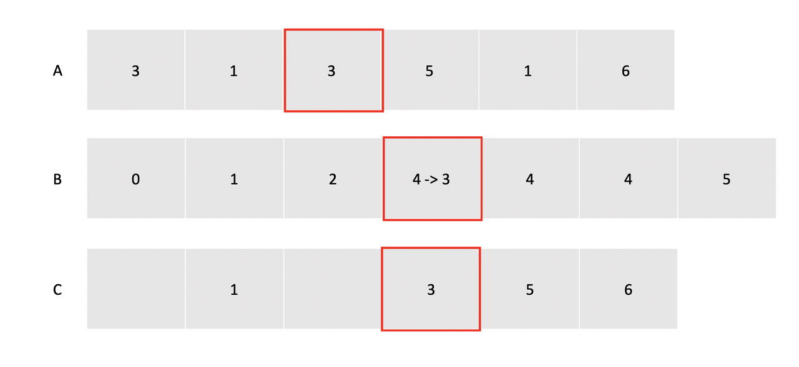
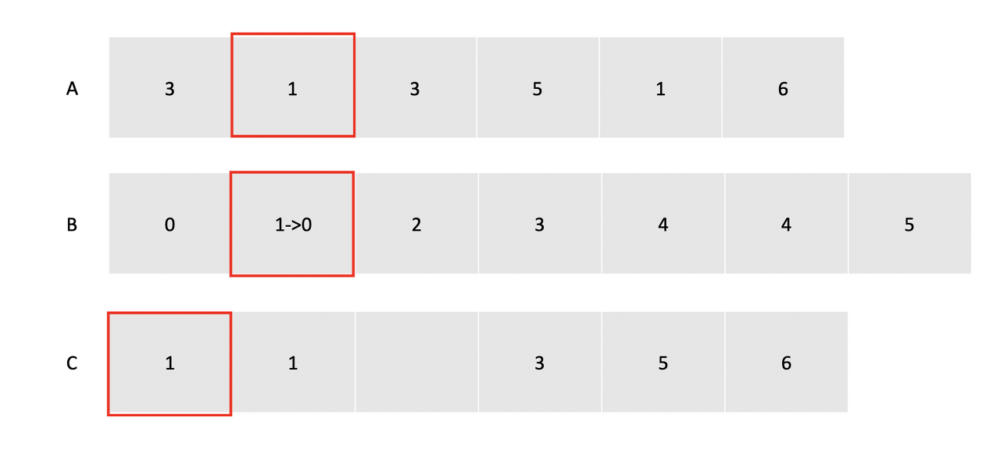
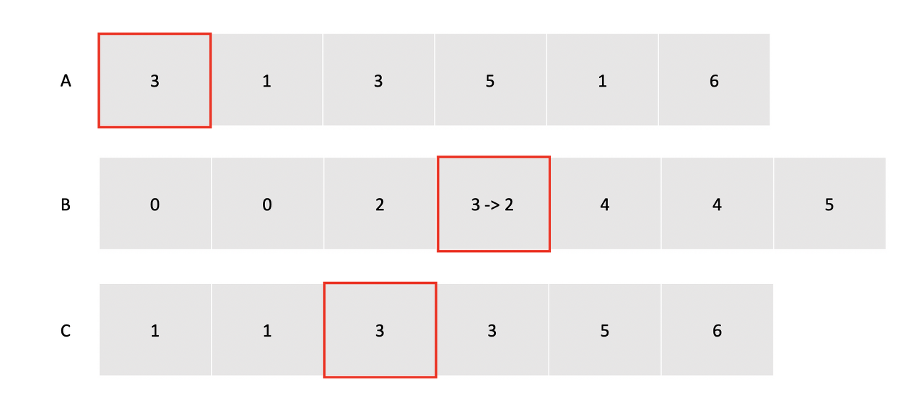

# 계수정렬

## 계수정렬(Counting sort)이란

- 배열 내에 특정한 값이 몇번 등장했는지에 따라 정렬을 수행하는 알고리즘
- 원소들간의 비교를 하지 않는다.

## 특징

- 불안정 정렬중 하나
    - 불안정 정렬 알고리즘
        
        → 두 개의 원소가 같은 값일 때, 둘 사이의 기존의 정렬 순서가 유지되지 않는 정렬.
        
- O(n+k) → n : 데이터의 개수, k : 데이터의 최대값

## 동작



1. 데이터 저장하는 배열 A, 데이터의 개수를 저장해서 누적합을 구할 배열 B, 최종 상태 저장할 배열 B
    
    이때 배열 B의 크기는 데이터의 최대값 → 데이터의 최대값 k가 시간복잡도에 영향을 미친다.
    



1. 배열 A에서 각 데이터를 인덱스로 하여 데이터 개수를 B로 저장



1. 자기자신까지 포함하는 누적합을 B에 저장



1. A의 마지막데이터인 6을 연산. → B의 6번째 인덱스 보기 → 값이 6임( 자신보다 작거나 같은 수가 6개 있다.) → C의 6번째에 저장. → B배열의 값 하나 줄여주기



1. A의 뒤에서 두번째 값인 1을 연산 → B의 1번째 인덱스 보기 → 값이 2임( 자신보다 작거나 같은 수가 2개 있다.) → C의 2번째에 저장. → B배열의 값 하나 줄여주기



1. A의 뒤에서 세번째 값인 5을 연산 → B의 5번째 인덱스 보기 → 값이 5임( 자신보다 작거나 같은 수가 5개 있다.) → C의 5번째에 저장. → B배열의 값 하나 줄여주기



1. A의 뒤에서 네번째 값인 3을 연산 → B의 3번째 인덱스 보기 → 값이 4임( 자신보다 작거나 같은 수가 4개 있다.) → C의 4번째에 저장. → B배열의 값 하나 줄여주기



1. A의 뒤에서 다섯번째 값인 1을 연산 → B의 1번째 인덱스 보기 → 값이 1임( 자신보다 작거나 같은 수가 1개 있다.) → C의 1번째에 저장. → B배열의 값 하나 줄여주기



1. A의 뒤에서 여섯번째 값인 3을 연산 → B의 3번째 인덱스 보기 → 값이 3임( 자신보다 작거나 같은 수가 3개 있다.) → C의 3번째에 저장. → B배열의 값 하나 줄여주기

```java
void counting_sort(int A[], int B[], int C[]){
 
		//A[i] : 숫자데이터
    /* 카운팅 배열 0으로 초기화 */
    for (int i = 0 ; i <= k ; i++){
        B[i] = 0;
    }
 
    /* 카운팅 값 갱신  */
    for (int i = 1 ; i <= n ; i++){
        B[A[i]] = B[A[i]] + 1; //숫자데이터를 인덱스로 가지는 곳에 +1
    }
 
    /* 누적합 계산 */
    for (int i = 1 ; i <= k ; i++){
        B[i] = B[i] + B[i-1]; 
    }
 
    /* 결과 배열에 값 넣기 */
    for (int i = n ; i >= n ; i--){
		//(숫자데이터를 인덱스로 가지는 곳의 데이터)숫자데이터count를 인덱스 하여 결과배열에 저장
        C[B[A[i]]] = A[i];
		//(숫자데이터를 인덱스로 가지는 곳의 데이터)숫자데이터count를 -1
        B[A[i]] = B[A[i]] - 1;
    }
}
```

출처 : [https://jeonyeohun.tistory.com/103](https://jeonyeohun.tistory.com/103)

참고자료

[https://jeonyeohun.tistory.com/103](https://jeonyeohun.tistory.com/103)