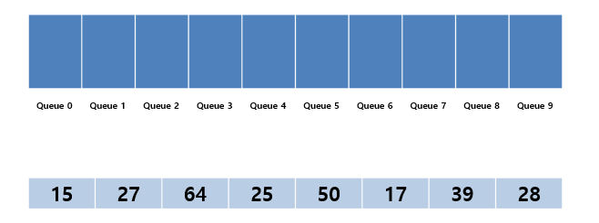
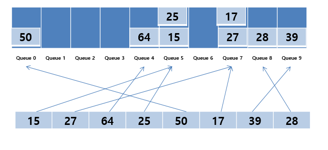
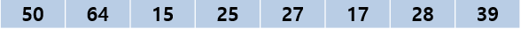
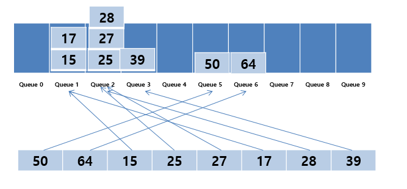
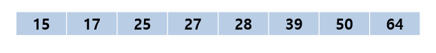

# 기수정렬

# 기수정렬(Radix Sort)이란

- 자리수를 기준으로 정렬하는 알고리즘
- 원소들간의 비교를 하지 않는다.

# 특징

- 속도가 빠르다.
- 안정정렬이다.
- 추가 메모리가 필요하다.
- 값들간에 비교연산을 하지 않고 정렬할 수 있다.
- 안정적인 정렬 알고리즘 중 하나.
    - 안정 정렬 알고리즘
        
        → 두 개의 원소가 같은 값일 때, 둘 사이의 기존의 정렬 순서가 유지되는 정렬.
        
- O(dn) → d : 최고자리수, n : 데이터의 개수

# 동작

1. 0 부터 9 까지의 버킷준비.
2. 모든 데이터에 대하여 가장 낮은 자리수에 해당하는 Bucket에 차례대로 데이터 저장.
3. 0번 버킷부터 차례대로 버킷에서 데이터 가져오기.
4. 자리수를 높여가며 2번 3번 과정 반복.

1. 0부터 9까지 버킷 준비



2. 일의 자리에 해당하는 버킷에 넣기



3. 0번버킷부터 데이터 가져옴.



4. 십의 자리에 해당하는 버킷에 넣기



5. 0번 버킷부터 데이터 가져옴



```java
public class RadixSort {
    private static int[] A = { 38, 27, 43, 9, 3, 82, 10 };
    private static final int BUCKET_SIZE=10; 
    
    public static void main(String[] args) {
        System.out.println("정렬 전: " + Arrays.toString(A));
        radixSort(A.length);
        System.out.println("정렬 후: " + Arrays.toString(A));
    }
    
    public static void radixSort(int len) {
        Queue<Integer>[] bucket = new LinkedList[BUCKET_SIZE];
        for(int i=0; i<BUCKET_SIZE; i++) {
            bucket[i] = new LinkedList<>();
        }
        
        
        // 샘플데이터의 최대자리수가 2임. d 2번 돌기.
        int m = 1;
        for(int d=0; d<2; d++) {
            for(int i=0; i<len; i++) {
                bucket[(A[i]/m)%10].add(A[i]); //m의자리 체크해서 해당 버킷에 넣기.
            }
            
            for(int i=0, j=0; i<BUCKET_SIZE; i++) {
                while(!bucket[i].isEmpty()) {
                    A[j++] = bucket[i].poll(); //0번버킷부터 데이터 가져오기.
                }
            }
            m *= 10; //자리수 올려주기
        }
    }
}

```

출처 : [https://kind-coding.tistory.com/227](https://kind-coding.tistory.com/227)

참고자료

[https://velog.io/@cleangun/기수-정렬-Radix-Sort](https://velog.io/@cleangun/%EA%B8%B0%EC%88%98-%EC%A0%95%EB%A0%AC-Radix-Sort)

[https://lktprogrammer.tistory.com/48](https://lktprogrammer.tistory.com/48)