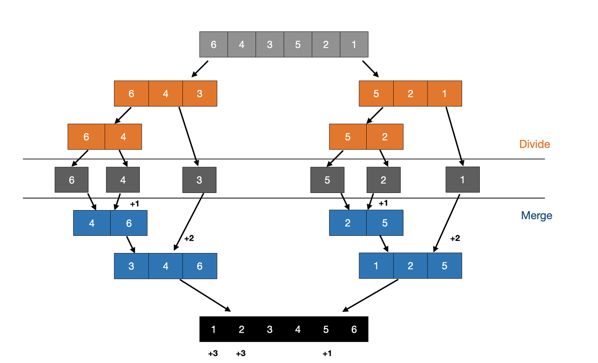
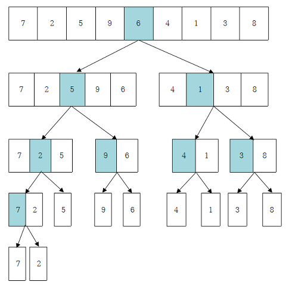
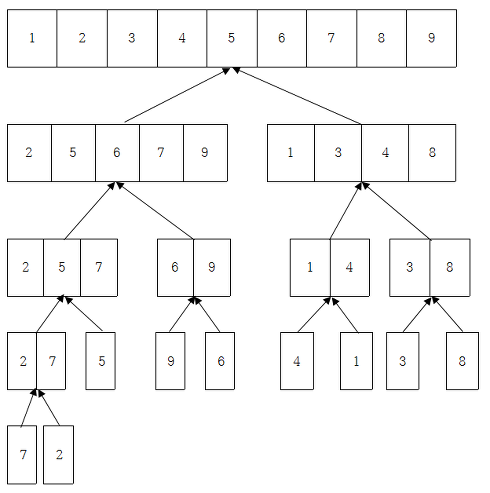

# 분할정복

- 분할정복 알고리즘 (Divide and conquer algorithm)은 그대로 해결할 수 없는 문제를 작은 문제로 분할하여 문제를 해결하는 방법이다. 

> 대표적인 예로는 정렬 알고리즘 중에서 퀵 정렬이나 합병 정렬과 이진 탐색 문제들이 대표적이다.


## 분할정복 설계

1. Divide : 문제가 분할이 가능한 경우, 2개 이상의 문제로 나눈다.

2. Conquer : 나누어진 문제가 여전히 분할이 가능하면, 또 다시 Divide를 수행한다. 그렇지 않으면 문제를 푼다.

3. Combine : Conquer한 문제들을 통합하여 원래 문제의 답을 얻는다.

> Divide를 제대로 나누면 Conquer과정은 자동으로 쉬워진다. 그래서 Divide를 잘 설계하는 것이 중요!



## 분할정복 장단점 

- 장점
    - Top-down 재귀방식으로 구현하기 때문에 코드가 직관적이다.
    - ~~문제를 나누어 해결한다는 특징상 병렬적으로 문제를 해결할 수 있다.~~
- 단점
    - 재귀 함수 호츨로 오버헤드가 발생할 수 있다. 
    - 스택에 다량의 데이터가 보관되는 경우 오버플로우가 발생할 수 있다.

> 분할정복 알고리즘은 재귀 알고리즘이 많이 사용되는데, 이 부분에서 분할정복 알고리즘의 효율성을 깎아내릴 수 있다.

 
## 응용 : MergeSort

> 하나의 리스트를 두 개의 균등한 크기로 분할하고 분할된 부분 리스트를 정렬한 다음, 두 개의 정렬된 부분 리스트를 합하여 전체가 정렬된 리스트가 되게 하는 방법.

1. Divide 

    - 입력 배열을 같은 크기의 2개의 부분배열로 분할

2. Conquer

    - 부분 배열의 크기가 충분히 작지 않으면 재귀를 이용하여 다시 분할 정복 방법을 적용한다. -> 크기가 1이며 정렬이 되어 있다고 판단!

3. Combine

    - 정렬된 부분 배열들을 하나의 배열에 합병한다.








```java
import java.util.*;

// 제가 임의로 구현해봤습니다! 문제가 있다면 수정해주셔도 좋아요~
public class MergeSort {
	
	static int n;
	static int[] arr;
	
	public static void main(String[] args) {
		
		arr = new int[] {7,2,5,9,6,4,1,3,8};
		n = 9;
		
		mergeSort(0, n-1);
		
		System.out.println("##### 결과 #####");
		System.out.println(Arrays.toString(arr));
	}

	private static void mergeSort(int l, int r) {
		if(l >= r) return; // left 가 right보다 크거나 작다면 더이상 나눌 수 없다.
		
		// 절반 나누기!
		int mid = (l+r) / 2;
		mergeSort(l, mid);
		mergeSort(mid+1, r);
		
		// 합치기
		merge(l, mid, r);
	}

	private static void merge(int l, int mid, int r) {
		System.out.println("merge => left : " + l + ", mid : " + mid + ", right : " +r);
		int nl = l;
		int nr = mid+1;
		int idx = l;
		
		int[] temp = new int[n];
		while(nl <= mid && nr <= r) {
			int lv = arr[nl];
			int rv = arr[nr];
			System.out.println("비교 : " + lv + " " + rv);
			if(lv < rv) { // 왼쪽 배열의 첫번째가 더 작다!
				temp[idx++] = lv;
				// left를 다 채웠다면 나머지는 오른쪽에서 채운다.
				if(++nl > mid)  System.arraycopy(arr, nr, temp, idx, r - nr+1);
			}
			else { // 오른쪽 배열의 첫번째가 더 작다
				temp[idx++] = rv;
				// right를 다 채웠다면 나머지는 왼쪽에서 채운다.
				if(++nr > r) System.arraycopy(arr, nl, temp, idx, mid - nl+1);
			}
		}
		
		for(int i = l; i <= r; i++) arr[i] = temp[i];

		System.out.println("merge 결과 : " + Arrays.toString(arr));
		System.out.println();
	}

}
```