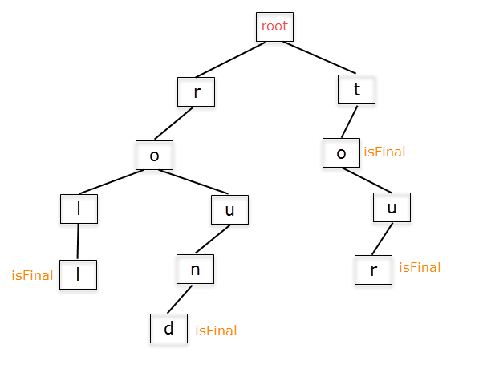

# Trie

-  트라이(Trie)는 문자열을 저장하고 효율적으로 탐색하기 위한 트리 형태의 자료구조이다.

- 우리가 검색할 때 볼 수 있는 자동완성 기능, 사전 검색 등 문자열을 탐색하는데 특화되어있는 자료구조라고 한다.



 > roll의 존재 여부를 위해서는 root -> r -> o -> l -> l (isFinal)

## 시간 복잡도 

> 제일 긴 문자열의 길이를 L, 총 문자열들의 수를 M이라 할 때의 시간복잡도

- 생성시 시간복잡도: O(M*L), 모든 문자열들을 넣어야하니 M개에 대해서 트라이 자료구조에 넣는건 가장 긴 문자열 길이만큼 걸리니 L만큼 걸려서 O(M*L)만큼 걸립니다. 물론 삽입 자체만은 O(L)만큼 걸립니다.

- 탐색시 시간복잡도: O(L), 트리를 타고 들어가봤자 가장 긴 문자열의 길이만큼만 탐색하기 때문에 O(L)만큼 걸립니다.


> 트라이를 쓰지 않는다면, 문자열을 sort하고 이진탐색을 통해 찾지 않았을까?
> sort + 이진탐색 O(Mlog(M)) + O(log(M)) 이니깐 문자열의 종류가 매우 많다고 생각하면 트라이가 매우 효율적!


## 구현

> 트라이를 구현에는 두 가지 방법이 있습니다. 

-  std::map에 사용하는 간선만큼의 데이터만 저장하는 방법

- 사용되는 문자 종류의 개수만큼 간선을 만들어서 배열에 저장하는 방법

첫 번째 방법은 불필요한 간선을 만들지 않지만 map 자체가 무겁습니다. 만약 사용되는 문자의 종류가 적다면(이를 테면 문자열이 알파벳 소문자로만 되어 있을 경우) 두 번째 방법이 더 효과적입니다.

```java
import java.util.*;

// 제가 임의로 구현해봤습니다! 문제가 있다면 수정해주셔도 좋아요~
class Solution {
	
	static class Node {
		Map<Character, Node> childNode = new HashMap<Character, Node>();
		boolean isFinal; // 마지막인지
		
		public Node getChild(char c) {
			Node child = childNode.get(c); // 이미 알파벳이 존재한다면 그대로
			if(child == null) { // 존재하지 않는다면 만들어서 넣어준다.
				child = new Node();
				childNode.put(c, child);
			}
			return child;
		}
	}

	static class Trie {
		Node rootNode = new Node();

		// 문자열 삽입
		void insert(String str) {
			Node node = this.rootNode;

			for(int i = 0; i < str.length(); i++) {
				node = node.getChild(str.charAt(i));
			}
			node.isFinal = true;
		}
		
		// 해당 문자열이 존재하는 지 확인
		boolean search(String str) {
			Node node = this.rootNode;
			
			for(int i = 0; i < str.length(); i++) {
				node = node.childNode.get(str.charAt(i));
				if(node == null) return false;
			}
			return node.isFinal;
		}
	}
	
	
	public static void main(String[] args) {
		Trie trie = new Trie();
		String[] inputs = {"roll", "round", "tour"};
		for(String str : inputs) trie.insert(str);
		
		String[] targets = {"rol", "roll", "round", "rounds", "tour", "kour"};
		for(String str : targets) System.out.println(trie.search(str));
	}
	
}
```

## 활용

(아직 해시를 공부하지 못해서 이해가 잘 안되네요. 다음에 해시발표 듣고 같이 설명... ㅎ)

- 트라이에서 문자열의 삽입/삭제/탐색은 언제나 O(문자열의 길이)입니다. 이는 해시와 같은 시간 복잡도로 매우 빠릅니다.

- 해시는 데이터 순서를 무작위로 저장하지만, 트라이는 다릅니다. 트라이도 트리의 한 종류이기 때문에 Binary Search Tree의 동작을 응용하여 k번째 문자열 찾기, 같은 접두사를 가지는 문자열 개수 세기 등 해시 테이블로는 할 수 없는 동작까지 할 수 있습니다.

- 트라이의 공간 복잡도는 O(삽입된 문자열의 총 길이) 입니다.

## 문제 예시

- 최장 공통 접미사
- k번째 접미사 찾기
- K번째 문자열 찾기
