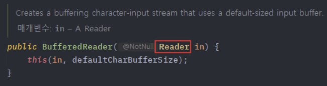

# 어댑터(Adapter) 패턴

어댑터 패턴 = 호환성이 없는 인터페이스 때문에 함께 동작할 수 없는 클래스들을 **함께 작동해주도록 변환해주는 패턴** (호환성 부여 및 신규 기능 확장)

](images/dp01-03.png)

[https://inpa.tistory.com/entry/GOF-💠-어댑터Adaptor-패턴-제대로-배워보자](https://inpa.tistory.com/entry/GOF-%F0%9F%92%A0-%EC%96%B4%EB%8C%91%ED%84%B0Adaptor-%ED%8C%A8%ED%84%B4-%EC%A0%9C%EB%8C%80%EB%A1%9C-%EB%B0%B0%EC%9B%8C%EB%B3%B4%EC%9E%90)

### 방식

1. **객체 어댑터 (Object Adapter)** ⭐
    - 합성(Composition)된 멤버에게 위임을 이용한 어댑터 패턴
        - 자기가 해야 할 일을 클래스 멤버 객체의 메서드에게 다시 시킴으로써 목적을 달성하는 것을 위임이라고 한다.
    - 합성을 활용했기 때문에 런타임 중에 Adaptee(Service)가 결정되어 유연하다.
    - 그러나 Adaptee(Service) 객체를 필드 변수로 저장해야 하기 때문에 공간 차지 비용이 든다.
    
    ](images/dp01-04.png)
    
    [https://inpa.tistory.com/entry/GOF-💠-어댑터Adaptor-패턴-제대로-배워보자](https://inpa.tistory.com/entry/GOF-%F0%9F%92%A0-%EC%96%B4%EB%8C%91%ED%84%B0Adaptor-%ED%8C%A8%ED%84%B4-%EC%A0%9C%EB%8C%80%EB%A1%9C-%EB%B0%B0%EC%9B%8C%EB%B3%B4%EC%9E%90)
    
    1. Adaptee(Service) : 어댑터 대상 객체, 기존 시스템
    2. Target(Client Interface) : Adapter가 구현하는 인터페이스
    3. Adapter : Client와 Adaptee(Service) 중간에서 호환성이 없는 둘을 연결시켜주는 역할
        1. Object Adapter 방식에선 합성을 이용해 구성
        2. Adaptee(Service)를 따로 클래스 멤버로 설정하고 위임을 통해 동작 매칭
    4. Client : 기존 시스템을 어댑터를 통해 이용하려는 쪽, Client Interface를 통해 Service를 이용
    
    ```java
    // Adaptee : 클라이언트에서 사용하고 싶은 기존의 서비스 (하지만 호환이 안되서 바로 사용 불가능)
    class Service {
    
        void specificMethod(int specialData) {
            System.out.println("기존 서비스 기능 호출 + " + specialData);
        }
    }
    
    // Client Interface : 클라이언트가 접근해서 사용할 고수준의 어댑터 모듈
    interface Target {
        void method(int data);
    }
    
    // Adapter : Adaptee 서비스를 클라이언트에서 사용하게 할 수 있도록 호환 처리 해주는 어댑터
    class Adapter implements Target {
        Service adaptee; // composition으로 Service 객체를 클래스 필드로
    
        // 어댑터가 인스턴스화되면 호환시킬 기존 서비스를 설정
        Adapter(Service adaptee) {
            this.adaptee = adaptee;
        }
    
        // 어댑터의 메소드가 호출되면, Adaptee의 메소드를 호출하도록
        public void method(int data) {
            adaptee.specificMethod(data); // 위임
        }
    }
    출처: https://inpa.tistory.com/entry/GOF-💠-어댑터Adaptor-패턴-제대로-배워보자 [Inpa Dev 👨‍💻:티스토리]
    ```
    
    ```java
    class Client {
        public static void main(String[] args) {
            // 1. 어댑터 생성 (기존 서비스를 인자로 받아 호환 작업 처리)
            Target adapter = new Adapter(new Service());
    
            // 2. Client Interfac의 스펙에 따라 메소드를 실행하면 기존 서비스의 메소드가 실행된다.
            adapter.method(1);
        }
    }
    출처: https://inpa.tistory.com/entry/GOF-💠-어댑터Adaptor-패턴-제대로-배워보자 [Inpa Dev 👨‍💻:티스토리]
    ```
    
2. **클래스 어댑터 (Class Adapter)**
    - 클래스 상속을 이용한 어댑터 패턴
    - Adaptee(Service)를 상속했기 때문에 따로 객체 구현없이 바로 재사용 가능
    - 상속은 대표적으로 기존에 구현된 코드를 재사용하는 방식이지만, 자바에서는 다중 상속이 불가능하기 때문에 전반적으로 권장되지 않는 방식
    
    ](images/dp01-05.png)
    
    [https://inpa.tistory.com/entry/GOF-💠-어댑터Adaptor-패턴-제대로-배워보자](https://inpa.tistory.com/entry/GOF-%F0%9F%92%A0-%EC%96%B4%EB%8C%91%ED%84%B0Adaptor-%ED%8C%A8%ED%84%B4-%EC%A0%9C%EB%8C%80%EB%A1%9C-%EB%B0%B0%EC%9B%8C%EB%B3%B4%EC%9E%90)
    
    1. Adaptee(Service)  : 어댑터 대상 객체, 기존 시스템
    2. Target(Client Interface) : Adapter가 구현하는 인터페이스
    3. Adapter : Client와 Adaptee(Service) 중간에서 호환성이 없는 둘을 연결시켜주는 역할
        1. Class Adapter 방식에선 상속을 이용해 구성
        2. Existing Class와 Adaptee(Service)를 동시에 implements, extends하여 구현
    4. Client : 기존 시스템을 어댑터를 통해 이용하려는 쪽, Client Interface를 통해 Service를 이용
    
    ```java
    // Adaptee : 클라이언트에서 사용하고 싶은 기존의 서비스 (하지만 호환이 안되서 바로 사용 불가능)
    class Service {
    
        void specificMethod(int specialData) {
            System.out.println("기존 서비스 기능 호출 + " + specialData);
        }
    }
    
    // Client Interface : 클라이언트가 접근해서 사용할 고수준의 어댑터 모듈
    interface Target {
        void method(int data);
    }
    
    // Adapter : Adaptee 서비스를 클라이언트에서 사용하게 할 수 있도록 호환 처리 해주는 어댑터
    class Adapter extends Service implements Target {
    
        // 어댑터의 메소드가 호출되면, 부모 클래스 Adaptee의 메소드를 호출
        public void method(int data) {
            specificMethod(data);
        }
    }
    출처: https://inpa.tistory.com/entry/GOF-💠-어댑터Adaptor-패턴-제대로-배워보자 [Inpa Dev 👨‍💻:티스토리]
    ```
    
    ```java
    class Client {
        public static void main(String[] args) {
            // 1. 어댑터 생성
            Target adapter = new Adapter();
    
            // 2. 인터페이스의 스펙에 따라 메소드를 실행하면 기존 서비스의 메소드가 실행된다.
            adapter.method(1);
        }
    }
    출처: https://inpa.tistory.com/entry/GOF-💠-어댑터Adaptor-패턴-제대로-배워보자 [Inpa Dev 👨‍💻:티스토리]
    ```
    

### 특징

- 패턴 사용 시기
    - Legacy 코드를 사용하고 싶지만 새로운 인터페이스가 호환되지 않을 때
    - 이미 만든 것을 재사용하고자 하나 이 재사용 가능한 라이브러리를 수정할 수 없을 때
    - 이미 만들어진 클래스를 새로운 인터페이스(API)에 맞게 개조할 때
    - 소프트풰어의 구버전과 신버전을 공존시키고 싶을 때
- 장점
    - 프로그램의 기본 비즈니스 로직에서 인터페이스 또는 데이터 변환 코드를 분리할 수 있기 때문에 SRP 만족
    - 기존 클래스 코드를 건들지 않고 동작, OCP 만족
    - 만일 추가로 필요한 메서드가 있다면 어댑터에 빠르게 만들 수 있다. 만약 버그가 발생해도 기존의 클래스에는 버그가 없으므로 Adapter 역할의 클래스를 중점적으로 조사하면 되고, 프로그램 검사도 쉬워진다.
- 단점
    - 새로운 인터페이스와 어댑터 클래스 세트를 도입해야 하기 때문에 코드의 복잡성이 증가한다.
    - 때로는 직접 Adaptee 클래스를 변경하는 것이 간단할 수 있다.

### 실무 예제

**JAVA**

- java.util.Arrays 의 asList()
- java.util.Collections 의 list()
- java.util.Collections 의 enumeration()
- java.io.InputStreamReader(InputStream) (returns a Reader)
- java.io.OutputStreamWriter(OutputStream) (returns a Writer)
- javax.xml.bind.annotation.adapters.XmlAdapter 의 marshal() and unmarshal()

**InputStreamReader**

```java
BufferedReader br = new BufferedReader(new InputStreamReader(System.in));
```

input을 행하는 System.in을 BufferedReader 객체에 사용하고 싶은데 이 중간을 InputStreamReader가 어댑터 역할해주고 있다.



](images/dp01-07.png)

[https://inpa.tistory.com/entry/GOF-💠-어댑터Adaptor-패턴-제대로-배워보자](https://inpa.tistory.com/entry/GOF-%F0%9F%92%A0-%EC%96%B4%EB%8C%91%ED%84%B0Adaptor-%ED%8C%A8%ED%84%B4-%EC%A0%9C%EB%8C%80%EB%A1%9C-%EB%B0%B0%EC%9B%8C%EB%B3%B4%EC%9E%90)

서로 타입이 맞지 않아 BufferedReader(System.in) 형식으로 사용 불가

](images/dp01-08.png)

[https://inpa.tistory.com/entry/GOF-💠-어댑터Adaptor-패턴-제대로-배워보자](https://inpa.tistory.com/entry/GOF-%F0%9F%92%A0-%EC%96%B4%EB%8C%91%ED%84%B0Adaptor-%ED%8C%A8%ED%84%B4-%EC%A0%9C%EB%8C%80%EB%A1%9C-%EB%B0%B0%EC%9B%8C%EB%B3%B4%EC%9E%90)

InputStreamReader 클래스는 생성자로 InputStream 타입을 받고 인스턴스화 하며, InputStreamReader 클래스 자체가 Reader 추상 클래스를 상속하고 있기 때문에 업캐스팅으로 변환하여 BufferedReader의 생성자 인자로 들어가게 해준다.

](images/dp01-09.png)

[https://inpa.tistory.com/entry/GOF-💠-어댑터Adaptor-패턴-제대로-배워보자](https://inpa.tistory.com/entry/GOF-%F0%9F%92%A0-%EC%96%B4%EB%8C%91%ED%84%B0Adaptor-%ED%8C%A8%ED%84%B4-%EC%A0%9C%EB%8C%80%EB%A1%9C-%EB%B0%B0%EC%9B%8C%EB%B3%B4%EC%9E%90)

BufferedReader 클래스와 InputStreamReader 클래스는 Reader 추상 클래스를 동시에 상속받는다.

InputStreamReader 클래스는 InputStream 타입을 받을 수 있는 생성자를 가지고 있으므로 System.in을 InputStreamReader 생성자에 넘겨 인스턴스화 하면, 같은 Reader 부모 클래스를 상속하고 있는 BufferedReader의 생성자의 인자로 넘겨줄 수 있기 때문에 마치 System.in을  BufferedReader에 넣은 것처럼 호환 역할을 InputStreamReader가 어댑터로 행하고 있다고 볼 수 있다.

**Arrays의 asList()**

기존의 배열을 리스트로 변환 & 호환 작없을 해주는 asList()도 어댑터로 볼 수 있다.

```java
public static void main(String[] args) {
	// String 배열 : adaptee 기존 서비스
    String[] s = {"a", "b", "c"};
    
    // List<String> : target 인터페이스
    List<String> list
    
    // Arrays.asList() : adapter 기존 서비스 배열을 리스트로 변환 & 호환하게 해주는 역할
    list = Arrays.asList(s);
}
출처: https://inpa.tistory.com/entry/GOF-💠-어댑터Adaptor-패턴-제대로-배워보자 [Inpa Dev 👨‍💻:티스토리]
```

**Collections의 enumeration()**

리스트와 Enumeration 간의 변환 & 호환 작업을 해주는 Collections의 정적 메서드도 어댑터로 볼 수 있다.

```java
public static void main(String[] args) {

	// 리스트 : adaptee 기존 서비스
	List<String> list = new ArrayList<>();
    list.add("a");
    list.add("b");
    list.add("c");
    
    // Enumeration<String> : target 인터페이스
    Enumeration<String> enum
    
    // adapter 기존 서비스 배열을 리스트로 변환 & 호환하게 해주는 역할
    enum = Collections.enumeration(list); // list → enumeration
    ArrayList<String list2 = Collections.list(enum) // enumeration → list
}
출처: https://inpa.tistory.com/entry/GOF-💠-어댑터Adaptor-패턴-제대로-배워보자 [Inpa Dev 👨‍💻:티스토리]
```

### Ref)

[https://inpa.tistory.com/entry/GOF-💠-어댑터Adaptor-패턴-제대로-배워보자](https://inpa.tistory.com/entry/GOF-%F0%9F%92%A0-%EC%96%B4%EB%8C%91%ED%84%B0Adaptor-%ED%8C%A8%ED%84%B4-%EC%A0%9C%EB%8C%80%EB%A1%9C-%EB%B0%B0%EC%9B%8C%EB%B3%B4%EC%9E%90)