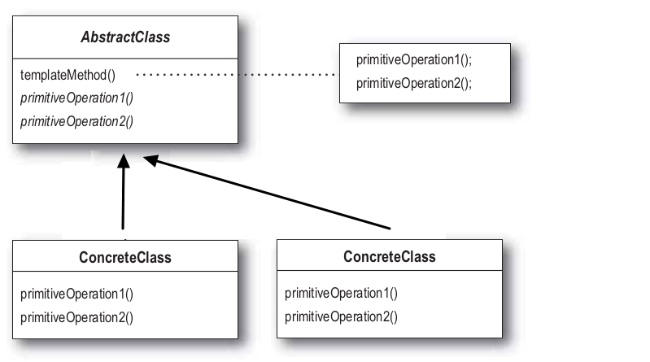

# 템플릿 메소드 패턴

# 템플릿 메소드 패턴

여러 클래스에서 공통으로 사용하는 메서드를 템플릿화 하여 상위 클래스에서 정의하고, 하위 클래스마다 세부 동작 사항을 다르게 구현하는 패턴.

즉, 변하지 않는 기능(템플릿)은 상위 클래스에 만들어두고 자주 변경되며 확장할 기능은 하위 클래스에서 만들도록 하여, 상위의 메소드 실행 동작 순서는 고정하면서 세부 실행 내용은 다양화 될 수 있는 경우에 사용된다. 

→ 전체적으로는 동일하면서 부분적으로는 다른 구문으로 구성된 메서드의 코드 중복을 최소화 할 때 유용하다.

## 템플릿 메서드 패턴 구조

AbstractClass (추상 클래스)

템플릿 메소드를 구현하고, 템플릿 메소드에서 돌아가는 추상메소드를 선언한다. 이 추상 메소드는 하위 클래스인 ConcreteClass 역할에 의해 구현된다.

ConcreteClass (구현 클래스)

AbstractClass를 상속하고 추상 메소드를 구체적으로 구현한다. ConcreteClass에서 구현한 메소드는 AbstractClass의 템플릿 메소드에서 호출된다. 

## 템플릿 메소드 패턴 장점

- 중복코드를 줄일 수 있다.
- 자식클래스의 역할을 줄여 핵심 로직의 관리가 용이하다.
- 좀더 코드를 객체지향적으로 구성할 수 있다.

## 템플릿 메소드 패턴 단점

- 추상 메소드가 많아지면서 클래스 관리가 복잡해진다.
- 클래스간의 관계와 코드가 꼬일 수도 있다.

출처

[https://inpa.tistory.com/entry/GOF-💠-템플릿-메소드Template-Method-패턴-제대로-배워보자](https://inpa.tistory.com/entry/GOF-%F0%9F%92%A0-%ED%85%9C%ED%94%8C%EB%A6%BF-%EB%A9%94%EC%86%8C%EB%93%9CTemplate-Method-%ED%8C%A8%ED%84%B4-%EC%A0%9C%EB%8C%80%EB%A1%9C-%EB%B0%B0%EC%9B%8C%EB%B3%B4%EC%9E%90)

[https://coding-factory.tistory.com/712](https://coding-factory.tistory.com/712)