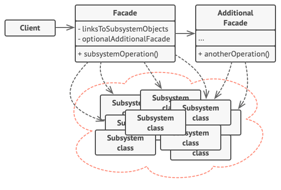
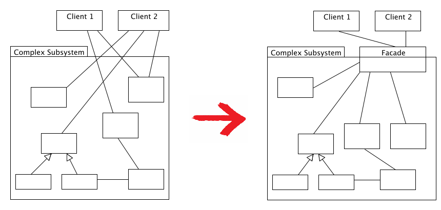
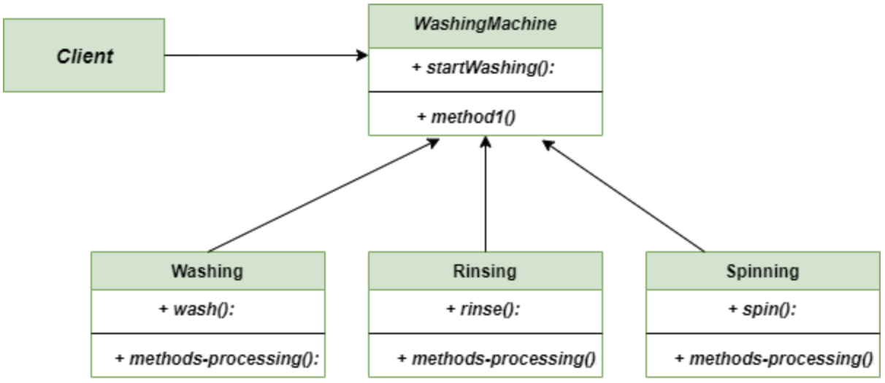

# 퍼사드 패턴

## Facade Pattern이란

사용하기 복잡한 클래스에 대해 사용하기 편하게 간편한 인터페이스(API)를 구성하기 위한 고조 패턴이다. 라이브러리의 각 클래스와 메서드들이 어떤 목적의 동작인지 이해하기 어려워 바로 가져다 쓰기에 난이도가 높을때, 이에 대한 적절한 네이밍과 정리를 통해 사용자로 하여금 쉽게 라이브러리르 다룰수 있도록 인터페이스를 만드는데, 우리가 교제를 보고 필기노트에 재정리를 하듯이 클래스를 재정리하는 행위로 보면 된다. 

→ 복잡한 서브클래스들의 공통적인 기능을 정의하는 상위 수준의 인터페이스를 제공하는 패턴. 

퍼사드객체(Facade Object)

- 서브클래스의 코드에 의존하는 일을 감소시켜주고, 복잡한 소프트웨어를 간단히 사용 할 수 있게 간단한 인터페이스를 제공해준다.





## 퍼사드 패턴 특징

### 패턴 사용 시기

- 시스템이 복잡할 때
- 간단한 인터페이스를 통해 복잡한 시스템을 접근하도록 하고 싶을 때
- 시스템을 사용하고 있는 외부와 결합도가 너무 높을 때 의존성을 낮추기 위할 때

### 패턴 장점

- 하위 시스템의 복잡성에서 코드를 분리하여, 외부에서 시스템을 사용하기 쉬워진다.
- 하위 시스템 간의 의존관계가 많을 경우 이를 감소시키고 의존성을 한 곳으로 모을 수 있다.
- 복잡한 코드를 감춤으로써, 클라이언트가 시스템의 코드를 모르더라도 Facade클래스만 이해하고 사용 가능하다.

### 패턴 단점

- 퍼사드가 앱의 모든 클래스에 결합된객체가 될 수 있다.
- 퍼사드 클래스 자체가 서브시스템에 대한 의존성을 가지게 되어 의존성을 완전히는 피할 수 는 없다.
- 추가적인 코드가 늘어나는 것이기 때문에 유지보수 측면에서 공수가 더 많이 들게 된다.

## 예시

### 세탁 이라는 행위에 퍼사드 패턴 적용




세탁을 하기 위해 Washing, Rinsing, Spinning 동작이 필요.

이들은 SubSystem들로써, Facade Object를 통해 ‘세탁’이라는 행위에 필요한 공통 기능들을 정의할 수 있다. 

### 기존 코드 (Facade Pattern 미적용)

### Washing

```java
class Rinsing{
    void rinse(){
        System.out.println("do Rinsing")
    }
}
```

### Rinsing

```java
class Spinning{
    void spin(){
        System.out.println("do Spinning")
    }
}
```

### Spinning

```java
class Washing{
    void wash(){
        System.out.println("do Washing")
    }
}
```

### Client (sub class 사용 객체)

```java
class Client{
	Washing washing = new Washing();
    Rinsing rinsing = new Rinsing();
    Spinning spinning = new Spinning();

    washing.wash();
    rinsing.rinse();
    spinning.spin();
}
```

### Facade Pattern 적용

### WashingMachine

```java
class WashingMachine{

    Washing washing = new Washing();
    Rinsing rinsing = new Rinsing();
    Spinning spinning = new Spinning();

	void startWashing(){
	    	washing.wash();
        rinsing.rinse();
        spinning.spin();
    }
}
```

### Client

```java
class Client{
    WashingMachine washingMachine = new WashingMachine();
    washingMachine.strartWahsing();
}
```

client에서 Facade Object(WashingMachine)만을 호출하여 ‘세탁’이라는 동작을 수행한다. 

출처

[https://velog.io/@bagt/Design-Pattern-Facade-Pattern-퍼사드-패턴](https://velog.io/@bagt/Design-Pattern-Facade-Pattern-%ED%8D%BC%EC%82%AC%EB%93%9C-%ED%8C%A8%ED%84%B4)

[https://inpa.tistory.com/entry/GOF-💠-퍼사드Facade-패턴-제대로-배워보자](https://inpa.tistory.com/entry/GOF-%F0%9F%92%A0-%ED%8D%BC%EC%82%AC%EB%93%9CFacade-%ED%8C%A8%ED%84%B4-%EC%A0%9C%EB%8C%80%EB%A1%9C-%EB%B0%B0%EC%9B%8C%EB%B3%B4%EC%9E%90)