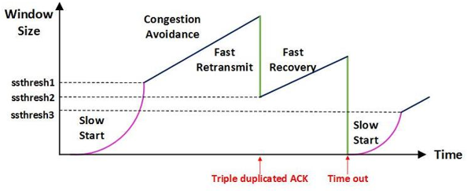

# 3. TCP 흐름 제어 & 혼잡 제어

### 흐름 제어 Flow Control : 송신측과 수신측의 데이터 처리 속도 차이를 해결하기 위한 기법

- 수신자가 처리할 수 있는 데이터 속도가 다르기 때문에, 송신 측은 수신 측의 데이터 처리 속도를 파악하고 얼마나 빠르게 어느 정도의 데이터를 전송할 지 제어
- 송신측의 전송량 > 수신측의 처리량인 경우, 패킷이 수신 측의 큐를 넘어 손실될 수 있어서 송신측 패킷의 전송량을 제어해줘야 함, 패킷 손실시 불필요한 추가 패킷 전송이 발생하기 때문
- 기본 개념은 수신측에서 송신측에 자신의 상태를 피드백 하는 것
- 전송의 전체 과정
    1. Application Layer : 송신 측 Application Layer가 소켓에 데이터를 입력
    2. Transport Layer : 데이터를 세그먼트로 감싸고 Network Layer에 전달
    3. 수신측 노드로 세그먼트가 전송됨, 동시에 송신측의 Send Buffer와 수신측의 Receive Buffer 각각에 데이터가 저장됨
    4. 수신측 Application Layer에서 준비가 되면 Receive Buffer에 있는 데이터를 읽기 시작함
    5. 따라서, **Receive Buffer가 넘쳐나지 않도록 하는 것이 흐름 제어의 핵심**
- **흐름 제어 방법**
    - Stop and Wait(정지 대기) : 매번 전송한 패킷에 대해 확인 응답을 받아야만 그 다음 패킷을 전송하는 방법
        - 단점 : 패킷을 하나씩 보내기 때문에 비효율적
        
        ](images/img9.png)
        
        출처) [https://yeoneeds.tistory.com/m/25](https://yeoneeds.tistory.com/m/25)
        
    - Sliding Window (Go Back N ARQ)
        - 수신측에서 설정한 윈도우 크기만큼 송신측에서 확인 응답 없이 세그먼트를 전송할 수 있게 하여 데이터 흐름을 동적으로 조절하는 제어 기법
        - 수신측에서 설정한 윈도우 크기만큼은 송신측에서 확인 응답 ACK를 받기 전에 전송 가능
        - 송신 버퍼의 범위는 수신 측의 여유 버퍼 공간을 반영하여 동적으로 바뀜
        - 동작 방식
            - 먼저 윈도우에 포함되는 모든 패킷을 전송하고, 그 패킷들의 전달이 확인(ACK)되는대로 이 윈도우를 옆으로 옮김으로써 그 다음 패킷들을 전송
            
            ](images/img10.png)
            
            출처) [https://yeoneeds.tistory.com/m/25](https://yeoneeds.tistory.com/m/25)
            
        - Window : TCP/IP를 사용하는 모든 호스트들은 송신하기 위한 것과 수신하기 위한 2개의 Window를 가지고 있다. 호스트들은 실제 데이터를 보내기 전에 3 way handshake를 통해 수신 호스트의 receive window size에 자신의 send window size를 맞추게 됨
        - 세부 구조 - [https://yeoneeds.tistory.com/m/25](https://yeoneeds.tistory.com/m/25)

### 혼잡 제어 Congestion Control: 송신측의 데이터 전달과 네트워크의 데이터 처리 속도 차이를 해결하기 위한 기법

- 네트워크가 불안정하여 데이터가 원활히 통신이 안되면 제어를 통해 재전송을 하게 되는데, 재전송 작업이 반복되면 네트워크가 붕괴될 위험 발생 (오버플로우나 데이터 손실), 따라서 네트워크 혼잡 상태가 감지되면 송신측의 전송 데이터 크기(속도?)를 강제로 줄여서 조절함
- 네트워크 내에 패킷 수가 과도하게 증가하는 현상을 혼잡이라 하며, 혼잡 현상을 방지하거나 제거하는 기능을 혼잡 제어라 함
- **송신 측에서 보내는 데이터의 전송 속도를 제어**
- 혼잡제어는 호스트와 라우터를 포함한 보다 넓은 관점에서 전송 문제를 다룸
- **혼잡제어 방법**
    - AIMD(Additive Increase / Multiplicative Decrease)
        - 처음에 패킷을 하나씩 보내고 이것이 문제없이 도착하면 Window 크기(단위 시간 내에 보내는 패킷의 수)를 1씩 증가시켜가며 전송하는 방법
        - 패킷 전송에 실패하거나 일정 시간을 넘으면 패킷의 보내는 속도를 절반으로 줄인다.
        - 공평한 방식으로, 여러 호스트가 한 네트워크를 공유하고 있으면 나중에 진입하는 쪽이 처음에는 불리하지만, 시간이 흐르면 평형상태로 수렴하게 되는 특징이 있다.
        - **문제점:** 초기에 네트워크의 높은 대역폭을 사용하지 못하여 오랜 시간이 걸리게 되고, 네트워크가 혼잡해지는 상황을 미리 감지하지 못한다. 즉, 네트워크가 혼잡해지고 나서야 대역폭을 줄이는 방식이다.
    
    
    
    - Slow Start (느린 시작)
        - AIMD 방식은 네트워크의 수용량 주변에서는 효율적으로 작동하지만, 처음에 전송 속도를 올리는데 시간이 오래 걸리는 단점이 존재
        - Slow Start 방식은 AIMD와 마찬가지로 패킷을 하나씩 보내면서 시작하고, 패킷이 문제없이 도착하면 각각의 ACK 패킷마다 window size를 1씩 늘려준다. 즉, 한 주기가 지나면 window size가 2배로 된다.
        - 전송 속도는 AIMD에 반해 지수 함수 꼴로 증가한다. 대신에 혼잡 현상이 발생하면 window size를 1로 떨어뜨리게 된다.
        - 처음에는 네트워크의 수용량을 예상할 수 있는 정보가 없지만, 한번 혼잡 현상이 발생하고 나면 네트워크의 수용량을 어느 정도 예상할 수 있다.
        - 그러므로 혼잡 현상이 발생하였던 window size의 절반까지는 이전처럼 지수 함수 꼴로 창 크기를 증가시키고 그 이후부터는 완만하게 1씩 증가시킨다.
    - Fast Retransmit (빠른 재전송)
        - 빠른 재전송은 TCP의 혼잡 조절에 추가된 정책이다.
        - 패킷을 받는 쪽에서 먼저 도착해야할 패킷이 도착하지 않고 다음 패킷이 도착한 경우에도 ACK 패킷을 보내게 된다.
        - 단, 순서대로 잘 도착한 마지막 패킷의 다음 패킷의 순번을 ACK 패킷에 실어서 보내게 되므로, 중간에 하나가 손실되게 되면 송신 측에서는 순번이 중복된 ACK 패킷을 받게 된다. 이것을 감지하는 순간 문제가 되는 순번의 패킷을 재전송 해줄 수 있다.
        - 중복된 순번의 패킷을 3개 받으면 재전송을 하게 된다. 약간 혼잡한 상황이 일어난 것이므로 혼잡을 감지하고 window size를 줄인다.
    - Fast Recovery (빠른 회복)
        - 혼잡한 상태가 되면 window size를 1로 줄이지 않고 반으로 줄이고 선형증가시키는 방법이다. 이 정책까지 적용하면 혼잡 상황을 한번 겪고 나서부터는 순수한 AIMD 방식으로 동작하게 된다.
- 자세한 내용 [https://steady-coding.tistory.com/507](https://steady-coding.tistory.com/507)

### ref)

[https://velog.io/@chullll/흐름제어-혼잡제어](https://velog.io/@chullll/%ED%9D%90%EB%A6%84%EC%A0%9C%EC%96%B4-%ED%98%BC%EC%9E%A1%EC%A0%9C%EC%96%B4)

[https://steady-coding.tistory.com/507](https://steady-coding.tistory.com/507)

[https://github.com/gyoogle/tech-interview-for-developer/blob/master/Computer Science/Network/TCP (흐름제어혼잡제어).md#tcp-흐름제어혼잡제어](https://github.com/gyoogle/tech-interview-for-developer/blob/master/Computer%20Science/Network/TCP%20(%ED%9D%90%EB%A6%84%EC%A0%9C%EC%96%B4%ED%98%BC%EC%9E%A1%EC%A0%9C%EC%96%B4).md#tcp-%ED%9D%90%EB%A6%84%EC%A0%9C%EC%96%B4%ED%98%BC%EC%9E%A1%EC%A0%9C%EC%96%B4)