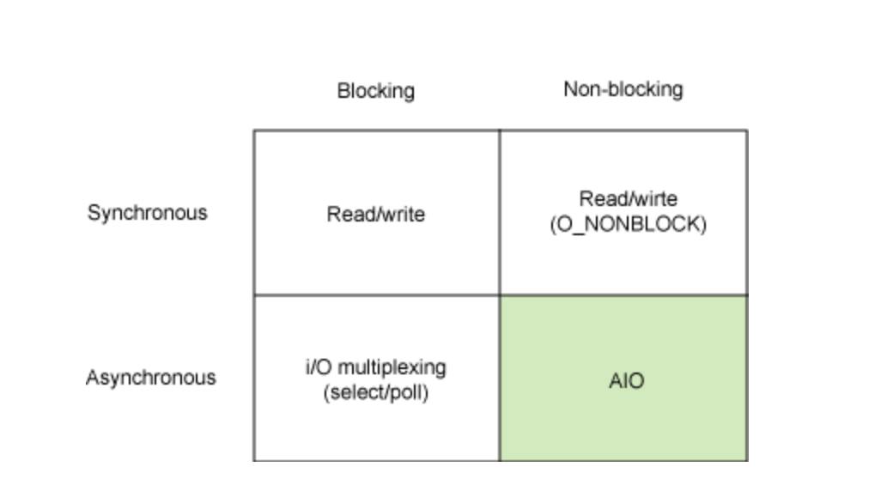

# I/O

- 주로 파일의 입출력을 다룰 때 흔히 볼 수 있다. 네트워크에서도 흔히 볼 수 있는데, 예를들어 소켓의 read와 send를 생각하면 될 것이다.

- I/O 작업은 User레벨에서 직접 수행할 수 없고, 실제 IO 작업을 수행하는 위치는 Kernel(커널, 즉 운영체제)에서만 가능하다. 유저 프로세스 (or 스레드)는 커널에게 요청을 하고 작업 완료 후 커널에 반환하는 결과를 기다릴 뿐이다.

# Blocking / Non-Blocking

- 호출된 함수가 호출한 함수에게 제어권을 바로 주느냐 안주느냐

### Blocking
- A 함수가 B 함수를 호출 할 때, B 함수가 자신의 작업이 종료되기 전까지 A 함수에게 제어권을 돌려주지 않는 것

- 가장 기본적인 I/O 모델로, Linux에서의 모든 소켓 통신은 기본 Blocking 으로 동작한다.

### Non Blocking

- A 함수가 B 함수를 호출 할 때, B 함수가 제어권을 바로 A 함수에게 넘겨주면서, A 함수가 다른 일을 할 수 있도록 하는 것.

# Sync / Async

- 호출된 함수의 종료를 호출한 함수가 처리하느냐, 호출된 함수가 처리하느냐의 차이다.

### Sync
A 함수가 B 함수를 호출 할 때, B 함수의 결과를 A 함수가 처리하는 것.

### Async
A 함수가 B 함수를 호출 할 때, B 함수의 결과를 B 함수가 처리하는 것. (callback)

----

----

예시 : 대표님, 개발자 좀 더 뽑아주세요..

### Non-blocking & Asynchronous
> 나 : 대표님, 개발자 좀 더 뽑아주세요.. 
> 대표님 : 알겠습니다. 가서 볼 일 보세요. 
> 나 : 넵! 
> 대표님 : (채용 공고 등록.. 지원자 연락.. 면접 진행.. 연봉 협상..) 
> 나 : (열일중..) 
> 대표님 : 한 분 모시기로 했습니다~! 
> 나 : 😍 

- 시스템 콜리 즉시 IO개시 여부를 반환한다. 사용자 프로세스는 다른일을 할 수 있고(CPU는 다른 업무를 볼 수 있다.), IO는 백그라운드에서 처리된다.
- IO 응답이 도착하면 신호나 콜백으로 IO전달을 완료한다.

### Non-blocking & Synchronous
> 나 : 대표님, 개발자 좀 더 뽑아주세요.. 
> 대표님 : 알겠습니다. 가서 볼 일 보세요. 
> 나 : 넵! 
> 대표님 : (채용 공고 등록.. 지원자 연락.. 면접 진행.. 연봉 협상..) 
> 나 : 채용하셨나요? 
> 대표님 : 아직요. 
> 나 : 채용하셨나요? 
> 대표님 : 아직요. 
> 나 : 채용하셨나요? 
> 대표님 : 아직요~!!!!!! 

- 동기 블로킹의 개선안이지만 비효율적. -> 논블로킹은 정상 데이터가 올 때까지 계속 시스템콜을 하며 문맥교환을 한다.
- IO 지연 초래

(EWOULDBLOCK : 입력데이터가 없다는 의미)

### Blocking & Asynchronous
> 나 : 대표님, 개발자 좀 더 뽑아주세요.. 
> 대표님 : 오케이, 잠깐만 거기 계세요! 
> 나 : …?!! 
> 대표님 : (채용 공고 등록.. 지원자 연락.. 면접 진행.. 연봉 협상..) 
> 나 : (안 궁금함.. 지나가는 말로 여쭈었는데 붙잡혀버림.. 딴 생각.. 못 가고 계속 서 있음) 

- IO는 논블로킹이고 notify가 블로킹인 방식.
- select() 시스템함수 호출이 사용자 프로세스를 블로킹한다.
- 비효율적

### Blocking & Synchronous

> 나 : 대표님, 개발자 좀 더 뽑아주세요..  
> 대표님 : 오케이, 잠깐만 거기 계세요!  
나 : …?!!  
>  대표님 : (채용 공고 등록.. 지원자 연락.. 면접 진행.. 연봉 협상..)  
> 나 : (과정 지켜봄.. 궁금함.. 어차피 내 일 하러는 못 가고 계속 서 있음)  

- 프로그램이 블로킹을 일으키는 시스템 함수를 호출
- 한 작업당 한번의 사용자-커널 사이의 문맥교환 발생
- 정지된 프로그램은 cpu를 사용하지 않고 커널의 응답을 대기
- 프로그램 관점에서 보면 마치 처리로직이 오래걸리는 것 같지만, 사실은 커널의 일을 기다리느라 블록되어 있는 것.

------
[출처]

https://musma.github.io/2019/04/17/blocking-and-synchronous.html

https://velog.io/@maketheworldwise/SyncAsync-BlockingNon-Blocking-%EB%AC%B4%EC%8A%A8-%EC%B0%A8%EC%9D%B4%EC%9D%BC%EA%B9%8C

https://jh-7.tistory.com/25