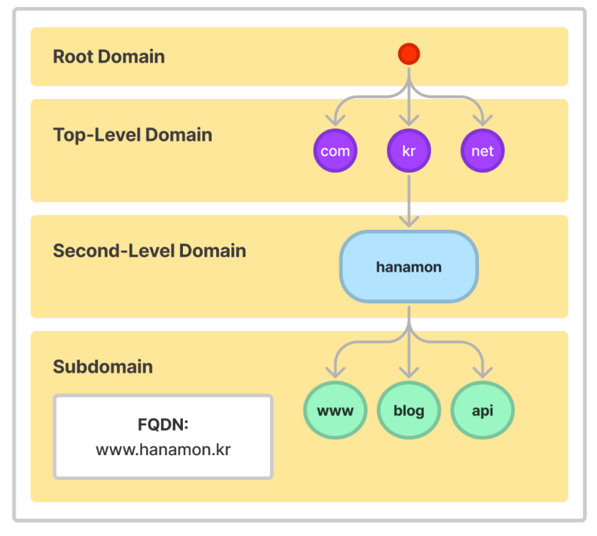
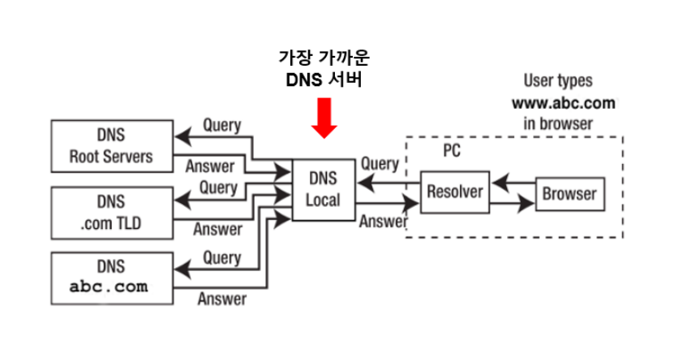
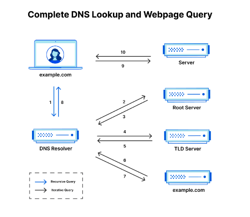
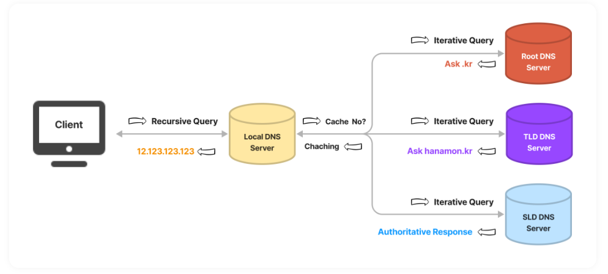

# DNS

## DNS란

- Domain Name System의 약자
- 외우기 어려운 IP주소 대신, 별명처럼 접속 가능하게 해주는 일종의 전화번호부
- DNS는 해당 사이트의 올바른 IP 주소를 찾는 역할을 한다.
- 입력한 도메인을 실제 네트워크상에서 사용하는 IP 주소로 바꾸고 해당 IP주소로 접속하는 과정이 필요하다.
- 계층구조를 가지는 분산 데이터베이스 구조

## DNS의 구성요소

### 1. 도메인 네임 스페이스 : DNS가 저장 관리하는 계층적 구조

도메인 네임 스페이스라는 규칙(방법)으로 도메인 이름 저장을 분산한다. 

- **계층적 도메인 레벨 (Hierarchical Domain Level)**
    
    
    
    - 도메인 네임스페이스는 일반적으로 트리구조를 하고 있으며 최상위 레벨부터 순차적으로 계층적 소속 관계를 나타낸다.
    - 하위 조직의 네임스페이스를 할당하고 관리하는 방식은 각 하위 기관의 관리 책임자에게 위임된다.
        - naver.com 도메인은 com 도메인을 관리하는 네임서버에 등록되어있고 www.naver.com은 naver.com 을 관리하는 네임서버에 등록되어 관리한다.
- **Fully Qualified Domain Name(FQDN)**
    - 도메인의 전체 이름을 표기하는 방식
        - 도메인 이름 : naver.com
        - 호스트 이름 : www
        - FQDN : www.naver.com

### 2. 네임 서버(DNS 서버) : 권한 있는 DNS서버

- 문자열로 표현된 도메인 이름을 실제 컴퓨터가 통신할 때 사용하는 IP주소로 변한하기 위해서는 도메인 네임 스페이스의 트리 구조에 대한 정보가 필요한데 이러한 정보를 가지고 있는 서버를 네임 서버라고 한다.
- 데이터베이스 역할, 찾아주는 역할, 요청 처리 응답 구현의 역할 수행
    
    
    **네임서버의 분류**
    
    1. **Root DNS Server**
        
        DNS의 최상위 네임서버로 DNS해석부터 발생한 DNS요청에 대하여 적절한 TLD네임서버 정보를 반환한다. 
        
    2. **Top - Level Domain(TLD) DNS Server**
        
        도메인 등록 기관이 관리하는 서버로 Authoritative DNS 서버의 주소를 저장하고 안내하는 역할을 한다. 
        
    3. **Second-Level Domain(SLD) DNS Server ( Authoritative DNS Server)**
        
        실제 개인 도메인과 IP주소의 관계가 기록(저장, 변경)되는 서버
        
    4. **권한 없는 DNS서버 (리졸버 서버, 리컬시브 서버, 리커서)**
        
        권한이 있는 DNS서버는 IP주소와 도메인 이름을 매핑하지만 권한이 없는 DNS서버는 IP주소를 알아내거나 캐시한다. 
        
        **DNS Resolver**
        
        - 사용자의 컴퓨터나 네트워크에 위치한 DNS 클라이언트
        - 사용자가 도메인 이름을 입력하면, 해당 도메인 이름을 IP주소로 변환하기 위해 DNS서버에 요청하여 질문하는 역할을 한다.
        - 하나의 네임 서버에게 DNS 요청을 전달하고, 해당 서버에 정보가 없으면 다른 네임 서버에게 요청을 보내 정보를 받아온다.
            
            
            

## DNS의 동작과정

1. **브라우저 → DNS Resolver**
    
    사용자가 웹 브라우저에 도메인 이름을 입력하면, DNS Resolver는 우선 자신의 캐시에 해당 도메인 이름에 대한 IP 주소가 저장되어 있는지 확인한다.
    
    캐시에 저장된 IP 주소가 있다면, DNS Resolver는 바로 해당 IP 주소를 반환한다.
    
    하지만 캐시에 저장된 IP 주소가 없거나, 캐시에 저장된 IP 주소가 만료되었다면, DNS Resolver는 DNS 서버에 요청한다.
    
2. **DNS Resolver → Root DNS Server → DNS Resolver**
    
    먼저, DNS Resolver는 Root DNS Server에 요청한다.
    
    Root DNS Server는 전 세계에 13개가 존재하며, 각각의 Root DNS Server는 모든 도메인 이름에 대한 IP 주소를 가지고 있지는 않는다.
    
    대신 Root DNS Server는 TLD DNS Server에 대한 정보를 가지고 있으며, 해당 TLD DNS Server의 IP 주소를 DNS Resolver에게 전달한다.
    
3. **DNS Resolver → TLD DNS Server → DnsResolver**
    
    DNS Resolver는 이제 TLD DNS Server에 대해 질의를 수행한다.
    
    예를 들어, 사용자가 입력한 도메인 이름이 "example.com"이라면, DNS Resolver는 .com TLD DNS Server에 요청한다.
    
    TLD DNS Server는 해당 도메인 이름의 Authoritative DNS Server의 IP 주소를 DNS Resolver에게 반환한다.
    
4. **DNS Resolver→ Authoritative DNS Server → DNS Resolver → 브라우저**
    
    마지막으로, DNS Resolver는 Authoritative DNS Server에 요청한다.
    
    Authoritative DNS Server는 해당 도메인 이름에 대한 IP 주소를 가지고 있으며, 이를 DNS Resolver에게 반환한다.
    
    DNS Resolver는 이제 해당 IP 주소를 캐시에 저장하고, 이후 동일한 도메인 이름에 대한 질의가 들어올 때 캐시에 저장된 IP 주소를 사용한다.
    
    이러한 과정을 통해, DNS 시스템은 사용자가 도메인 이름을 입력할 때마다 해당 도메인 이름에 대한 IP 주소를 찾아서 반환하게 된다.
    
    이를 통해, 사용자는 도메인 이름을 쉽게 기억하고 입력할 수 있으며, 인터넷 서비스 제공자는 서버의 IP 주소를 변경하더라도 도메인 이름을 유지할 수 있다.
    

### **DNS Query(쿼리)란?**

DNS Query(쿼리)는 사용자가 도메인 이름을 입력하고 IP 주소를 얻기 위해 DNS 서버에 보내는 요청을 말한다. 이 요청은 DNS Resolver가 사용자 컴퓨터에서 생성하고 DNS 서버에 전송한다

DNS 쿼리는 Recursive(재귀적) 또는 Iterative(반복적)으로 구분된다.

### **Recursive Query (재귀적 질의)**

재귀적 질의라고 하며 결과물(IP 주소)를 돌려주는 작업이다.

DNS Resolver에서 Root DNS Server로 도메인 주소를 물으면,

Root DNS Server에서 다 알아서 찾아 주는것이 아니라,

Root DNS Server 자신에 등록되어 있는 최상위 도메인(TLD)에서 해당 도메인에 붙어있는 TLD 주소를 찾아서

DNS Resolver 에게 준다.

그럼 기지국 DNS Resolver는 Root DNS Server에게 받은 TLD Server에게 다시 물어본다.

이하 찾을때 까지 반복한다.

사전적 의미로써 재귀로, 응답을 돌려주는 쿼리

### **Iterative Query (반복적 질의)**

Recursive DNS 서버가 다른 DNS 서버에게 쿼리를 보내어 응답을 요청하는 작업이다.

Recursive 서버가 권한 있는 네임 서버들에게 반복적으로 쿼리를 보내서 결과물(IP 주소)를 알아낸다.

Recursive 서버에 이미 IP 주소가 캐시 되어있다면 이 과정은 건너 뛴다.

참고자료

[https://velog.io/@zinukk/9kpyzbdt](https://velog.io/@zinukk/9kpyzbdt)

[https://hanamon.kr/dns란-도메인-네임-시스템-개념부터-작동-방식까지/](https://hanamon.kr/dns%EB%9E%80-%EB%8F%84%EB%A9%94%EC%9D%B8-%EB%84%A4%EC%9E%84-%EC%8B%9C%EC%8A%A4%ED%85%9C-%EA%B0%9C%EB%85%90%EB%B6%80%ED%84%B0-%EC%9E%91%EB%8F%99-%EB%B0%A9%EC%8B%9D%EA%B9%8C%EC%A7%80/)
