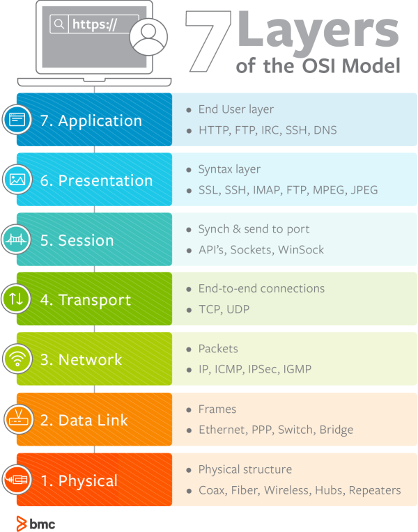
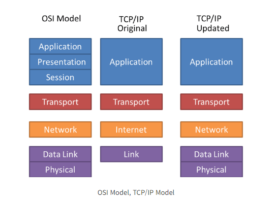
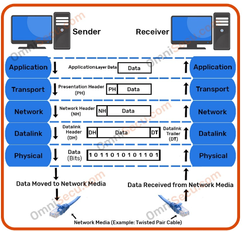

# OSI 7계층

##### OSI 계층을 왜 만들었는가? 
- **서로 다른** 하드웨어 소프트웨어를 사용하는 시스템 사이에서 원할하게 통신이 이루어지도록 하기 위해서
- 문제 발생 시에 **어느 계층에서 문제가 발생했는지 파악**하기 용이함. 

## 동작 흐름

사용자가 웹사이트에서 게시판에 글 남기는 경우를 예시

Application Layer : 사용자가 작성 완료 버튼을 클릭하면, HTTP 프로토콜을 이용해 다음 계층으로 데이터가 전달된다.
Presentation Layer : 사용자가 작성한 게시글을 수신측(네트워크)에서 읽을 수 있도록 JSON, XML와 같은 형태로 인코팅 혹은 압축한다. 특정 경우에는 암호화를 진행.
Session Layer : 세션을 구축, 유지, 관리를 하며 단방향인지, half duplex, full duplex인지 등 통신방법을 결정합니다.

Transport Layer : 논리적 연결을 담당. 데이터를 세그먼트 단위로 분할하고, 송신자와 수신자 사이에서 흐름제어와 오류제어를 수행합니다.
Network Layer : 송수신자 사이의 경로를 설정하고, 도메인과 같은 논리적 주소를 IP주소로 변환합니다. 세그먼트를 pkt로 나눈다.
Data Link Layer : 정확한 주소를 위해 송, 수신자의 MAC 주소를 확인한다. pkt를 frame 단위로 쪼갠다.
Physical Layer : 케이블과 허브같은 물리적인 장치를 통해 0과 1로 이루어진 비트스트림이 전선을 타고 전달한다.

수신 측(이 경우는 서버)에서는 반대로, 

Physical Layer : 전선을 타고 전달된 비트스트림을 물리 계층에서 받아 프레임으로 변환한 다음 데이터링크 계층으로 넘긴다.
Data Link Layer : 프레임은 패킷으로 조립되고, 네트워크 계층에서 세그먼트로 합친다.
Network Layer : 네트워크 계층에서 세그먼트로 합친다. 
Transport Layer : 세그먼트를 하나의 데이터로 만든 다음 세션 계층으로 보낸다. 

Session Layer : 다음으로 데이터를 넘긴 뒤에는 세션이 종료됩니다. 
Presentation Layer : 표현 계층에서 암호화나 압축을 풀고, 다시 사람이 읽을 수 있는 형태로 변환이 이루어집니다. 
Application Layer : 사용자에게 데이터가 전달된다. DBMS에 의해서 DB에 글 내용이 저장된다. 

### 1. Physical Layer
- 데이터를 전기신호(0, 1 bit)로 변환하여 주고 받는 공간. 데이터를 전송하는 역할만을 수행한다.

    단위 : Bit
    장비 : Repeaters(전기 신호를 증폭), Hubs 

### 2. Data Link Layer
- 물리 계층으로 송수신되는 정보를 관리하여 안전하게 전달. Mac 주소를 통해 통신
- Frame에 Mac 주소를 부여하고 에러검출, 재전송, 흐름제어 등을 진행

    단위 : Frame
    장비 : Switch, Bridge

    ##### Mac 주소
        - 컴퓨터의 고유한 주소, 컴퓨터 간 데이터를 전송하기 위해 있는 컴퓨터의 물리적 주소

### 3. Network Layer

- 데이터를 목적지까지 가장 안전하고 빠르게 전달하는 기능(라우팅)을 담당
- 라우터를 통해 이동할 경로를 선택하여 **IP주소**를 지정하고, 해당 경로에 따라 패킷을 전달해준다. 
- **라우팅**, 흐름 제어, 오류 제어, 세그먼테이션 등을 수행한다.

    단위 : Packet 
    장비 : Router, Switch
    
    ##### Packet
        - 전달해야하는 데이터는 출발지 정보, 목적지 정보가 부가적으로 필요하며 해당 정보는 IP로 처리하고, IP정보를 붙인 데이터를 패킷이라고 한다. 

### 4. Transport Layer

- **TCP**와 **UDP** 프로토콜을 통해 통신을 활성화한다. 
- **포트**를 열어두고, 프로그램들이 전송을 할 수 있도록 제공해준다. 
- 포트 기반의 데이터 세그먼트 전송

    단위 : TCP(Segment), UDP(Datagram)

### 5. Session Layer

- TCP/IP 세션을 만들고 없애는 책임을 가지고 있다.
- 세션 설정, 유지, 종료, 전송 중단시 복구 등의 기능이 있다.
- API, Socekt

### 6. Presentation Layer

- 데이터 표현에 대한 독립성을 제공하고, 암호화하는 역학을 담당한다. (코드 간의 번역을 담당하여 사용자 시스템에서 데이터의 형식 상 차이를 다루는 부담을 응용 계층으로부터 덜어준다.)

- **파일 인코딩**, **명령어를 포장, 압축, 암호화**한다.

### 7. 응용 Application

- 최종 목적지로 응용 프로세스와 직접 관계하여 일반적인 **응용 서비스**를 수행한다.

- 사용자 인터페이스, 전자우편, 데이터베이스 관리 등의 서비스를 제공한다.

    HTTP, SMTP, FTP

    단위 : Data

## TCP/IP 모델

- OSI 7계층 모델이란 네트워크에서 통신이 일어나는 과정을 7단계로 나눠서 설명한 모델이다.

- OSI 모델 외에도 TCP/IP 모델이 있는데 현재 인터넷은 TCP/IP 모델(updated)로 구현되어 있다.

- OSI 모델은 역할에 기반한 모델, TCP/IP 모델은 프로토콜에 기반한 모델이다.

- OSI 모델은 논리적인 모델, TCP/IP 모델은 실무적인 모델에 가깝다.

## 캡슐화/ 비캡슐화

- 캡슐화 : 각 계층에서 계층의 특징들이 담긴 헤더들이 붙는 과정

- 네트워크를 통해 전달되는 데이터를 패킷이라고 한다. 이 패킷은 ** 헤더 + 페이로드 + 풋터 ** 로 구성된다. 여기서 페이로드는 실제로 보내려는 데이터를 나타낸다.

- 패킷을 송신할 때, 데이터가 AL에서부터 PL까지 내려가며 캡슐화가 이러난다. 즉 상위계층에서 하위계층으로 내려갈 때, 상위계층의 패킷이 페이로드가 되고, 하위계층의 프로토콜이 헤더로 붙는 과정이다. 

- 반대로 수신할 때는, 반대로 PL에서 AL로 올라가면서 역캡슐화가 발생하며 각각의 계층에 맞는 정보를 가져가 철리한다.

 
 

Q1. OSI 7계층을 간략하게 설명하고, 계층으로 구분하는 이유를 설명하시오

Q2. 사용자가 웹사이트에서 게시판에 글 남기는 경우에 어떻게 OSI계층에서는 어떻게 동작하는 지 설명하시오

Q3. 캡슐화란 무엇인가??

 
 
 
 
 
-------------------------------------------------------

[출처]

https://velog.io/@reasonz/2022.08.07-%EB%84%A4%ED%8A%B8%EC%9B%8C%ED%81%AC-%EA%B0%9C%EB%85%90%EA%B3%BC-%EB%B6%84%EB%A5%98LANMANWAN

https://velog.io/@rlaghdtlr012/%EB%84%A4%ED%8A%B8%EC%9B%8C%ED%81%AC-%ED%86%A0%ED%8F%B4%EB%A1%9C%EC%A7%80-%EB%B3%91%EB%AA%A9%ED%98%84%EC%83%81

https://land-turtler.tistory.com/154

https://co1nam.tistory.com/75

https://choar816.tistory.com/174

