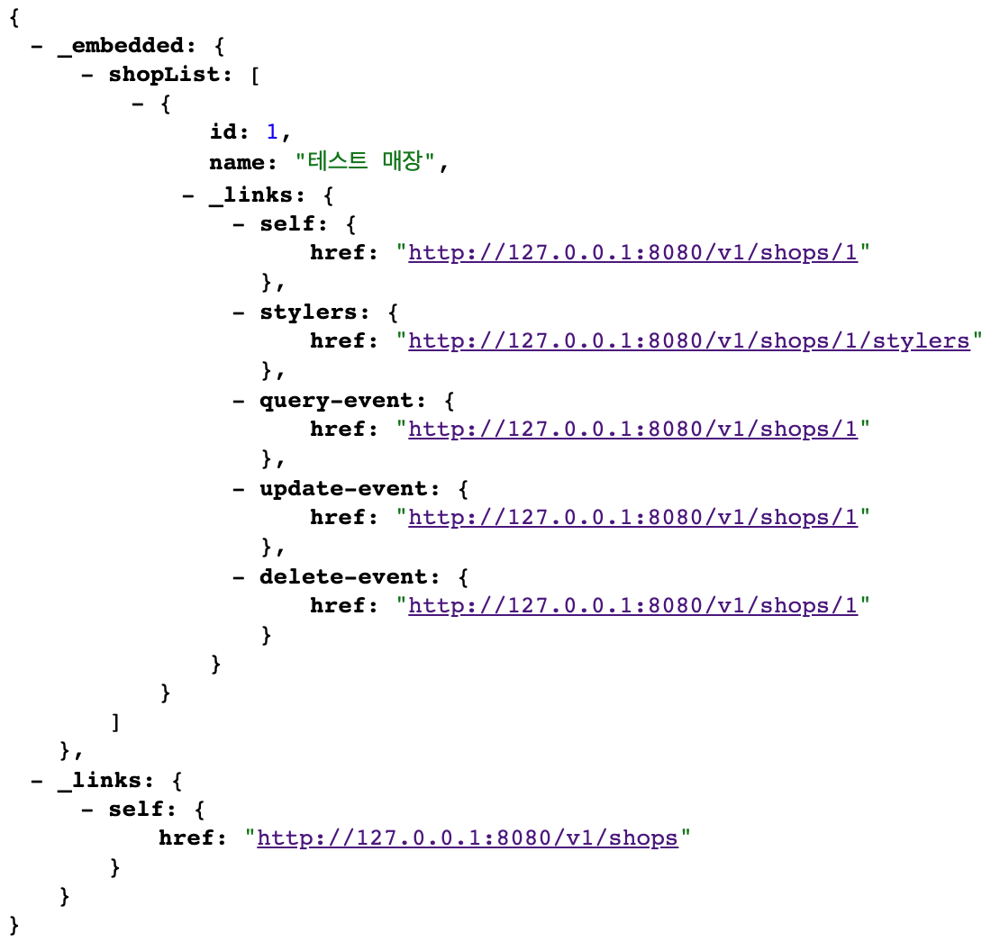

# RESTful API

# API
- 웹 기반 소프트웨어 애플리케이션에 액세스하기 위한 일련의 프로그래밍 지침 및 표준.
- 통신에 참여하는 애플리케이션 간의 약속, 규약이다. 
- 소통의 목적과 종류에 따라 사용하는 API가 달라진다.

> 일반적인 소통 ⇒ REST API.

> 프론트, 백엔드 간의 긴밀한 실시간 소통이 필요하면 ⇒ WebSocket API.

> 빅데이터 업체에서 로그, 어제 시청자 통계처럼 다계층적인 데이터를 백엔드 개발자에게 제공해야 한다면 ⇒ GraphQL API.

# REST(Representational State Transfer)
- 자원을 이름으로 구분하여 해당 자원의 상태를 주고받는 모든 것을 의미합니다.

> HTTP URI(Uniform Resource Identifier)를 통해 자원(Resource)을 명시하고

> HTTP Method(POST, GET, PUT, DELETE, PATCH 등)를 통해 

> 해당 자원(URI)에 대한 CRUD Operation을 적용하는 것을 의미합니다.

## RESTful API 
- REST 아키텍처 스타일의 규칙을 지켜 디자인한 API
- REST의 규칙을 모두 지키기에, 구현이 어렵고 오히려 개발 생산성이나 보안에 취약해질 수도 있다. 

## REST API
- REST의 모든 규칙을 지키는 건 비효율적이기에, 규칙을 좀 줄여 융통성 있게 만든 API

## REST 구성요소
1. 자원 : HTTP URI
2. 자원에 대한 행위 : HTTP METHOD
3. 자원에 대한 행위의 내용 : HTTP Message Pay Load

## REST의 특징
1. Server-Client(서버-클라이언트 구조)

2. Stateless(무상태) 
- 백앤드 세션을 쓰지 마라
- 백엔드 서버는 별도로 요청하는 쪽을 기억하지 않고, request만 분석해서 처리
-> stateless해야 백앤드 서버를 여러개 늘릴 수 있기 때문에

3. Cacheable(캐시 처리 가능) 
- client : 같은 페이지는 계속 서버에 요청하지 않고 데려온다.
- server : 매번 DB에서 정확하게 데려오지 않아도 되는 내용은 캐시에 저장해둔 데이터 활용(조회수)

4. Layered System(계층화) 
- 서버를 여러개로 만들어라. -> 관심사의 분리로 인한 확장성 증가

5. Uniform Interface(인터페이스 일관성)
- 일반적인 규약을 사용해라

    1. identication of resource 
    > 모든 자원은 고유한 식별자를 가지고 있어야 한다. -> id가 1인 사용자 정보 보내줘 {id = 1, name : "네트워크" } => id를 한번 더 말해줘서 client측에서 이전의 요청정보 신경쓰지 않아도 되도록

    2. resource manipulation through representation
    > 정보의 원천과 표현은 달라도 된다. -> db 내용 고대로 가져오는 것이 아니라, client와 약속한대로 포장해서 보내도 된다.

    3. self-descriptive messages
    > 응답에 필요한 내용을 header에 다 넣으라는 규칙 -> status code를 이용해 통신 성공과 로직 성공을 분리해서 처리해라.

    4. hateoas
    > 응답에 단순 내용만 넣는 것이 아니라, 추가로 접근할 수 있는 end point들도 같이 넣어줘라 (비난 받는 중..)

     

    
## REST API 설계 예시
1. URI는 동사보다는 명사를, 대문자보다는 소문자를 사용하여야 한다.

> Bad Example http://khj93.com/Running/

> Good Example  http://khj93.com/run/  
 

2. 마지막에 슬래시 (/)를 포함하지 않는다.

> Bad Example http://khj93.com/test/  

> Good Example  http://khj93.com/test
 

3. 언더바 대신 하이폰을 사용한다.

> Bad Example http://khj93.com/test_blog

> Good Example  http://khj93.com/test-blog  
 

4. 파일확장자는 URI에 포함하지 않는다.

> Bad Example http://khj93.com/photo.jpg  

> Good Example  http://khj93.com/photo  
 

5. 행위를 포함하지 않는다.

> Bad Example http://khj93.com/delete-post/1  

> Good Example  http://khj93.com/post/1  

## REST의 장단점
### 장점 

- 쉬운 사용성 

> rest api 메세지를 읽는 것만으로 메세지의 의도를 확실히 파악할 수 있다.

> http 인프라를 그대로 사용하기 때문에, api 사용을 위한 별도의 인프라 구축이 필요하지 않다.

- 클라이언트와 서버의 완전한 분리

> stateless의 특징을 잘 살려서, 업무량감소 및 플랫폼의 독립성 확장

- 특정한 데이터의 명확한 표현

### 단점 

- 표준이 자체가 존재하지 않아 정의가 필요하다.

- HTTP Method 형태가 제한적이다.

 

--------------

[출처]
- https://engineerinsight.tistory.com/356#%E2%9C%94%EF%B8%8F%C2%A0API-1
- https://khj93.tistory.com/entry/%EB%84%A4%ED%8A%B8%EC%9B%8C%ED%81%AC-REST-API%EB%9E%80-REST-RESTful%EC%9D%B4%EB%9E%80