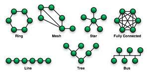
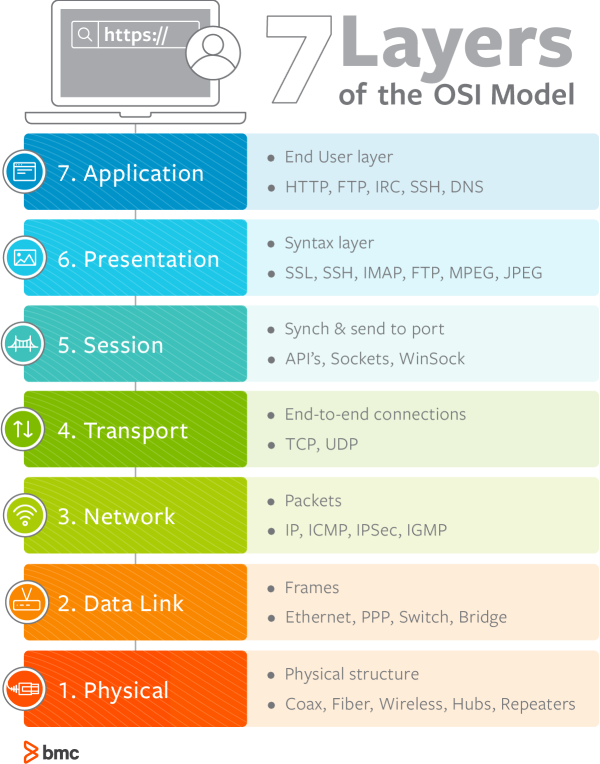

# 네트워크란?

## 네트워크 정의

- 네트워크는 컴퓨터 등의 장치로 통신망을 통해 서로 그물처럼 연결된 체계를 의미한다.

- 노드와 링크가 서로 연결되어 있거나, 연결되어 있지 않은 집합체를 의미하기도 한다. (여기서 노드는 서버, 라우터, 스위치와 같은 네트워크 장치를 의미, 링크는 유선 또는 무선을 의미한다.)

    노드와 링크로 이루어진 리소스.

## 네트워크 분류
- 네트워크 규모에 따라 네트워크를 분류할 수 있다.

1. LAN(Local Area Network)
2. MAN(Metropolitan Area Nework)
3. WAN(Wide Area Network)

#### LAN (근거리 통신망)
- 근거리 통신망을 의미하며 보통 집, 사무실, 학원 등 상대적으로 좁은 공간에서 사용한다.
- 전송 속도가 빠르고 혼잡하지 않다. 

#### MAN (도시 지역 통신망)
- 서울시와 같은 시처럼 도시 규모에서 사용되는 네트워크를 의미한다.
- 전송 속도는 보통이며 LAN보다는 혼잡하다는 특징이 있다.

#### WAN (광역 통신망)
- 국가나 대륙과 같이 광범위한 지역을 연결하는 네트워크이다.
- 전송 속도는 낮으며 MAN보다 혼잡하다.

## Topology 토폴로지

- Topology : 노드와 링크가 어떻게 배치되어 있는지에 대한 방식이자 연결형태

- 토폴로지는 병목현상을 찾을 때 주요한 기준이 된다.

    #### 병목현상(Bottle neck)

    - 전체 시스템의 성능이나 용량이 하나의 구성요소로 인해 제한받는 현상을 말한다.

    - 병목현상 발생 시, 네트워크가 어떤 토폴로지를 갖는 지, 또 어떠한 경로로 이루어져 있는 지 안다면, 병목현상에 좀 더 효율적으로 대처할 수 있다. 

### Topology의 종류

#### Tree Topology(트리 포폴로지 = 계층형 토폴로지) 

- 트리 형태로 배치한 네트워크 구성.

- 장점 : 노드의 추가와 삭제가 쉽다.

- 단점 : 특정 노드에 트래픽이 집중되면 하위 노드에 영향을 끼칠 수 있다.

#### 버스 토폴로지
- 버스 토폴로지는 중앙 통신 회선 하나에 여러 개의 노드가 연결되어 공유하는 네트워크 구성을 말한다.

- 장점 : 설피비용이 적고 신뢰성이 좋다! 중앙 통신회선에서 노드를 추가, 삭제 쉽다.

- 단점 : 공통배선의 대역폭을 공유하기 때문에, 노드 수가 증가하면 배선의 트래픽이 증가해 네트워크 성능이 떨어진다. 스푸핑이 가능하다

    ##### 스푸핑(spoofing) 이란?
    다른 사람의 컴퓨터 시스템에 접근할 목적으로 ip주소를 변조한 후 합법적인 사용자인 것처럼 위장하여 시스템에 접근. 나중에 ip주소에 대한 추적을 피하는 해킹 기법의 일종이다.

#### 스타 토폴로지 
- 중앙에 있는 노드에 모두 연결된 네트워크 구성을 의미.

- 장점 : 노드를 추가하거나 에러를 탑지하기 쉽고, 패킷의 충돌 발생 가능성이 적다. 중앙 노드가 아니라면 다른 노드에 영향을 끼치는 것이 적다.
- 단점 : 중앙 노드에서 장애가 발생하면 전체 네트워크에 문제가 발생. 설치 비용이 높다는 단점

#### 링형 토폴로지
- 각각의 노드가 양 옆의 노드와 연결하여 전체적으로 고리처럼 하나의 연속된 길을 통해 통신하는 망 구성 방식
- 장점 : 노드의 수가 증가 되어도 네트워크상의 손실이 거의 없고, 충돌이 발생되는 가능성이 적다.(단방향 가능)
- 단점 : 네트워크 구성 변경이 어렵고, 회선에 장애가 발생하면 네트워크 전체에 영향을 끼치는 단점이 존재한다.

#### 메시 토폴로지(망형 토폴로지)
- 그물망처럼 연결되어 있는 구조
- 장점 : 한 단말 장치에서 장애가 발생해도 여러 개의 경로가 존재하므로 네트워크를 계속 사용할 수 있음. 트래픽을 분산처리할 수 있다
- 단점 : 노드의 추가가 어렵고, 구축 비용과 운용이 고가

## 네트워크 대역폭

- 단위 : bps (= bits per second)

- Network Bandwitdh(대역폭) : 네트워크에서 특정 시간 내에 전송 될 수 있는 데이터의 최대 용량을 의미한다. 네트워크의 대역폭이 높을수록, 한번에 더 많은 데이터가 전송 될 수 있다. 

- 대역폭에 따른 병목현상이 발생할 수 있다.

    - 100의 네트워크 출력을 가진 노드가 대역폭이 1인 회선을 이용하는경우 최대 출력으로 데이터 전송 하는 경우

- bandwidth는 네트워크의 실질적인 성능을 나타내지는 않는다.

    - Bandwidth와 Throughput의 차이
    Throughput은 네트워크에서 초당 실제로 처리되는 패킷의 양을 나타내는 실용적인 지표이다.
    반면 Bandwidth은 네트워크에서 잠재적으로 동시에 전송될 수 있는 데이터의 최대치를 나타낸다.

    - Bandwidth와 Speed 의 차이
    Network speed는 시작 지점에서 도착 지점까지 데이터가 처리되는 '속도'의 개념이다. Network speed는 download speed, upload speed, lantency(지연시간)의 영향을 받는다. 때문에 데이터의 양에 대한 개념인 bandwitdh 와는 차이가 있다.

 
 
 

##### Q. 네트워크란 무엇인가? 종류에는 어떤 것이 있는 지?

##### Q. 토폴로지가 중요한 이유는? (병목현상과 관련해서)

##### Q. LAN에서는 주로 어떤 토폴로지를 사용하는 가?

##### Q. Network Bandwitdh은 네트워크의 실질적인 성능을 나타낸다(o, x)

 
 
 
 
 
 
 

# OSI 7계층

##### OSI 계층을 왜 만들었는가? 
- **서로 다른** 하드웨어 소프트웨어를 사용하는 시스템 사이에서 원할하게 통신이 이루어지도록 하기 위해서
- 문제 발생 시에 **어느 계층에서 문제가 발생했는지 파악**하기 용이함. 

## 동작 흐름

사용자가 웹사이트에서 게시판에 글 남기는 경우를 예시

Application Layer : 사용자가 작성 완료 버튼을 클릭하면, HTTP 프로토콜을 이용해 다음 계층으로 데이터가 전달된다.
Presentation Layer : 사용자가 작성한 게시글을 수신측(네트워크)에서 읽을 수 있도록 JSON, XML와 같은 형태로 인코팅 혹은 압축한다. 특정 경우에는 암호화를 진행.
Session Layer : 세션을 구축, 유지, 관리를 하며 단방향인지, half duplex, full duplex인지 등 통신방법을 결정합니다.

Transport Layer : 논리적 연결을 담당. 데이터를 세그먼트 단위로 분할하고, 송신자와 수신자 사이에서 흐름제어와 오류제어를 수행합니다.
Network Layer : 송수신자 사이의 경로를 설정하고, 도메인과 같은 논리적 주소를 IP주소로 변환합니다. 세그먼트를 pkt로 나눈다.
Data Link Layer : 정확한 주소를 위해 송, 수신자의 MAC 주소를 확인한다. pkt를 frame 단위로 쪼갠다.
Physical Layer : 케이블과 허브같은 물리적인 장치를 통해 0과 1로 이루어진 비트스트림이 전선을 타고 전달한다.

수신 측(이 경우는 서버)에서는 반대로, 

Physical Layer : 전선을 타고 전달된 비트스트림을 물리 계층에서 받아 프레임으로 변환한 다음 데이터링크 계층으로 넘긴다.
Data Link Layer : 프레임은 패킷으로 조립되고, 네트워크 계층에서 세그먼트로 합친다.
Network Layer : 네트워크 계층에서 세그먼트로 합친다. 
Transport Layer : 세그먼트를 하나의 데이터로 만든 다음 세션 계층으로 보낸다. 

Session Layer : 다음으로 데이터를 넘긴 뒤에는 세션이 종료됩니다. 
Presentation Layer : 표현 계층에서 암호화나 압축을 풀고, 다시 사람이 읽을 수 있는 형태로 변환이 이루어집니다. 
Application Layer : 사용자에게 데이터가 전달된다. DBMS에 의해서 DB에 글 내용이 저장된다. 

### 1. Physical Layer
- 데이터를 전기신호(0, 1 bit)로 변환하여 주고 받는 공간. 데이터를 전송하는 역할만을 수행한다.

    단위 : Bit
    장비 : Repeaters(전기 신호를 증폭), Hubs 

### 2. Data Link Layer
- 물리 계층으로 송수신되는 정보를 관리하여 안전하게 전달. Mac 주소를 통해 통신
- Frame에 Mac 주소를 부여하고 에러검출, 재전송, 흐름제어 등을 진행

    단위 : Frame
    장비 : Switch, Bridge

    ##### Mac 주소
        - 컴퓨터의 고유한 주소, 컴퓨터 간 데이터를 전송하기 위해 있는 컴퓨터의 물리적 주소

### 3. Network Layer

- 데이터를 목적지까지 가장 안전하고 빠르게 전달하는 기능(라우팅)을 담당
- 라우터를 통해 이동할 경로를 선택하여 **IP주소**를 지정하고, 해당 경로에 따라 패킷을 전달해준다. 
- **라우팅**, 흐름 제어, 오류 제어, 세그먼테이션 등을 수행한다.

    단위 : Packet 
    장비 : Router, Switch
    
    ##### Packet
        - 전달해야하는 데이터는 출발지 정보, 목적지 정보가 부가적으로 필요하며 해당 정보는 IP로 처리하고, IP정보를 붙인 데이터를 패킷이라고 한다. 

### 4. Transport Layer

- **TCP**와 **UDP** 프로토콜을 통해 통신을 활성화한다. 
- **포트**를 열어두고, 프로그램들이 전송을 할 수 있도록 제공해준다. 
- 포트 기반의 데이터 세그먼트 전송

    단위 : TCP(Segment), UDP(Datagram)

### 5. Session Layer

- TCP/IP 세션을 만들고 없애는 책임을 가지고 있다.
- 세션 설정, 유지, 종료, 전송 중단시 복구 등의 기능이 있다.
- API, Socekt

### 6. Presentation Layer

- 데이터 표현에 대한 독립성을 제공하고, 암호화하는 역학을 담당한다. (코드 간의 번역을 담당하여 사용자 시스템에서 데이터의 형식 상 차이를 다루는 부담을 응용 계층으로부터 덜어준다.)

- **파일 인코딩**, **명령어를 포장, 압축, 암호화**한다.

### 7. 응용 Application

- 최종 목적지로 응용 프로세스와 직접 관계하여 일반적인 **응용 서비스**를 수행한다.

- 사용자 인터페이스, 전자우편, 데이터베이스 관리 등의 서비스를 제공한다.

    HTTP, SMTP, FTP

    단위 : Data

### 캡슐화

- 아직 못적었습니다.

 
 

Q1. OSI 7계층을 간략하게 설명하고, 계층으로 구분하는 이유를 설명하시오

Q2. OIS 7계층의 동작 흐름을 간단한 예시와 함께 설명

Q3. 캡슐화란 무엇인가?

 
 
 
 
 
-------------------------------------------------------

[출처]

https://velog.io/@reasonz/2022.08.07-%EB%84%A4%ED%8A%B8%EC%9B%8C%ED%81%AC-%EA%B0%9C%EB%85%90%EA%B3%BC-%EB%B6%84%EB%A5%98LANMANWAN

https://velog.io/@rlaghdtlr012/%EB%84%A4%ED%8A%B8%EC%9B%8C%ED%81%AC-%ED%86%A0%ED%8F%B4%EB%A1%9C%EC%A7%80-%EB%B3%91%EB%AA%A9%ED%98%84%EC%83%81

https://land-turtler.tistory.com/154

https://co1nam.tistory.com/75

