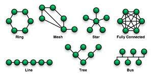

# 네트워크란?

## 네트워크 정의

- 네트워크는 컴퓨터 등의 장치로 통신망을 통해 서로 그물처럼 연결된 체계를 의미한다.

- 노드와 링크가 서로 연결되어 있거나, 연결되어 있지 않은 집합체를 의미하기도 한다. (여기서 노드는 서버, 라우터, 스위치와 같은 네트워크 장치를 의미, 링크는 유선 또는 무선을 의미한다.)

    노드와 링크로 이루어진 리소스.

## 네트워크 분류
- 네트워크 규모에 따라 네트워크를 분류할 수 있다.

1. LAN(Local Area Network)
2. MAN(Metropolitan Area Nework)
3. WAN(Wide Area Network)

#### LAN (근거리 통신망)
- 근거리 통신망을 의미하며 보통 집, 사무실, 학원 등 상대적으로 좁은 공간에서 사용한다.
- 전송 속도가 빠르고 혼잡하지 않다. 

#### MAN (도시 지역 통신망)
- 서울시와 같은 시처럼 도시 규모에서 사용되는 네트워크를 의미한다.
- 전송 속도는 보통이며 LAN보다는 혼잡하다는 특징이 있다.

#### WAN (광역 통신망)
- 국가나 대륙과 같이 광범위한 지역을 연결하는 네트워크이다.
- 전송 속도는 낮으며 MAN보다 혼잡하다.

## Topology 토폴로지

- Topology : 노드와 링크가 어떻게 배치되어 있는지에 대한 방식이자 연결형태

- 토폴로지는 병목현상을 찾을 때 주요한 기준이 된다.

    #### 병목현상(Bottle neck)

    - 전체 시스템의 성능이나 용량이 하나의 구성요소로 인해 제한받는 현상을 말한다.

    - 병목현상 발생 시, 네트워크가 어떤 토폴로지를 갖는 지, 또 어떠한 경로로 이루어져 있는 지 안다면, 병목현상에 좀 더 효율적으로 대처할 수 있다. 

### Topology의 종류

#### Tree Topology(트리 포폴로지 = 계층형 토폴로지) 

- 트리 형태로 배치한 네트워크 구성.

- 장점 : 노드의 추가와 삭제가 쉽다.

- 단점 : 특정 노드에 트래픽이 집중되면 하위 노드에 영향을 끼칠 수 있다.

#### 버스 토폴로지
- 버스 토폴로지는 중앙 통신 회선 하나에 여러 개의 노드가 연결되어 공유하는 네트워크 구성을 말한다.

- 장점 : 설피비용이 적고 신뢰성이 좋다! 중앙 통신회선에서 노드를 추가, 삭제 쉽다.

- 단점 : 공통배선의 대역폭을 공유하기 때문에, 노드 수가 증가하면 배선의 트래픽이 증가해 네트워크 성능이 떨어진다. 스푸핑이 가능하다

    ##### 스푸핑(spoofing) 이란?
    다른 사람의 컴퓨터 시스템에 접근할 목적으로 ip주소를 변조한 후 합법적인 사용자인 것처럼 위장하여 시스템에 접근. 나중에 ip주소에 대한 추적을 피하는 해킹 기법의 일종이다.

#### 스타 토폴로지 
- 중앙에 있는 노드에 모두 연결된 네트워크 구성을 의미.

- 장점 : 노드를 추가하거나 에러를 탑지하기 쉽고, 패킷의 충돌 발생 가능성이 적다. 중앙 노드가 아니라면 다른 노드에 영향을 끼치는 것이 적다.
- 단점 : 중앙 노드에서 장애가 발생하면 전체 네트워크에 문제가 발생. 설치 비용이 높다는 단점

#### 링형 토폴로지
- 각각의 노드가 양 옆의 노드와 연결하여 전체적으로 고리처럼 하나의 연속된 길을 통해 통신하는 망 구성 방식
- 장점 : 노드의 수가 증가 되어도 네트워크상의 손실이 거의 없고, 충돌이 발생되는 가능성이 적다.(단방향 가능)
- 단점 : 네트워크 구성 변경이 어렵고, 회선에 장애가 발생하면 네트워크 전체에 영향을 끼치는 단점이 존재한다.

#### 메시 토폴로지(망형 토폴로지)
- 그물망처럼 연결되어 있는 구조
- 장점 : 한 단말 장치에서 장애가 발생해도 여러 개의 경로가 존재하므로 네트워크를 계속 사용할 수 있음. 트래픽을 분산처리할 수 있다
- 단점 : 노드의 추가가 어렵고, 구축 비용과 운용이 고가

## 네트워크 대역폭

- 단위 : bps (= bits per second)

- Network Bandwitdh(대역폭) : 네트워크에서 특정 시간 내에 전송 될 수 있는 데이터의 최대 용량을 의미한다. 네트워크의 대역폭이 높을수록, 한번에 더 많은 데이터가 전송 될 수 있다. 

- 대역폭에 따른 병목현상이 발생할 수 있다.

    - 100의 네트워크 출력을 가진 노드가 대역폭이 1인 회선을 이용하는경우 최대 출력으로 데이터 전송 하는 경우

- bandwidth는 네트워크의 실질적인 성능을 나타내지는 않는다.

    - Bandwidth와 Throughput의 차이
    Throughput은 네트워크에서 초당 실제로 처리되는 패킷의 양을 나타내는 실용적인 지표이다.
    반면 Bandwidth은 네트워크에서 잠재적으로 동시에 전송될 수 있는 데이터의 최대치를 나타낸다.

    - Bandwidth와 Speed 의 차이
    Network speed는 시작 지점에서 도착 지점까지 데이터가 처리되는 '속도'의 개념이다. Network speed는 download speed, upload speed, lantency(지연시간)의 영향을 받는다. 때문에 데이터의 양에 대한 개념인 bandwitdh 와는 차이가 있다.

 
 
 

##### Q. 네트워크란 무엇인가? 종류에는 어떤 것이 있는 지?

##### Q. 토폴로지가 중요한 이유는? (병목현상과 관련해서)

##### Q. Network Bandwitdh은 네트워크의 실질적인 성능을 나타낸다(o, x)

