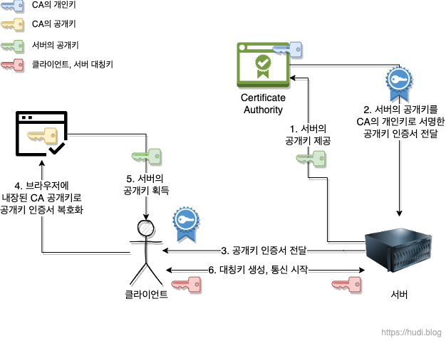

## 개념

### 대칭키(Symmetric Key) 암호화 방식

> 암호화키 == 복호화키, 암복호화키가 동일하므로, 해당 키를 아는 사람이 문서를 복호화한다. <br/>
> 비유: 자물쇠를 잠구는 열쇠와 여는 열쇠가 같다.(암호화할 때와 복호화할 때의 키가 같은 방식)

- 장점:
  - 기밀성(허가받은 자만 정보에 접근할 수 있다.)
  - 수행시간이 짧다(공개키 암호화 방식에 비해).
- 단점:
  - 키 분배 시 주의 필요, 안전한 키 교환방식이 요구됨(키 탈취 우려)
  - 사람이 증가할수록 키관리가 어려워짐.(각각의 키가 필요하기 때문에)
- 문제점
  - 키를 교환하는 중 키가 탈취될 수도 있다.
  - 사용자가 증가할수록 각각의 키가 필요하기에 관리해야 할 키가 방대하게 많아진다.
- 문제점에 대한 해결책: 키의 사전 공유, 키 배포 센터 사용, Diffie-Hellman 키 교환, 공개키 암호화 방식

- ex) 공인인증서의 암호화방식으로 유명한 SEED, DES, 3DES, AES, ARIA, 최근 주목받고 있는 암호인 ChaCha20
  <br/>
  
  <br/><br/>
  

<br/><br/>

### 공개키(Public Key) / 비대칭 키(Asymmetric Key) 암호화 방식

> 암호화키 != 복호화키 (잠그는 키와 여는 키가 따로 있는 방식) <br/>
> 송신자가 수신자의 공개된 키(Public Key)로 정보를 잠그면, 수신자가 자신의 키(Private Key)로 연다. <br/>
> 비유: 은행 계좌번호(공개키), 송금자에게 자신의 계좌번호를 보내면 해당 계좌로 돈을 보내고, 수신자는 자신의 비밀번호(개인 키)로 출금하는 방식

- 장점:
  - 키 분배를 안전하게 할 수 있음
  - 기밀성/인증/부인방지 기능을 제공.
- 단점:
  - 대칭키 암호화 방식에 비해 속도가 느림(암호와와 복호화를 위해 복잡한 수학 연산을 수행하기 때문)
  - 키 관리와 분배가 복잡해서 비용이 많이 듦. => 효율은 떨어지지만, 대칭키 암호화 방식의 키를 교환해야 하는 문제를 해결하기 위해 등장(안전)
- ex) Diffie-Hellman, RSA, DSA, ECC

<br/>

<br/><br/>

공개키 암호화 방식 진행 과정

```
1. A가 웹 상에 공개된 'B의 공개키'를 이용해 평문을 암호화하여 B에게 보냄.
2. B는 자신의 비밀키로 복호화한 평문을 확인, A의 공개키로 응답을 암호화하여 A에게 보냄.
3. A는 자신의 비밀키로 암호화된 응답문을 복호화함.
```


<br/><br/>

1. 공개키로 정보를 암호화하는 경우(정보자체에 대한 암호화가 필요할 때 사용)

- 공개키는 누구나 알 수 있도록 공개된 키이므로, 어떤 정보를 특정 사용자에게 보낼 때, 해당 사용자의 공개키를 통해 정보를 암호화하여 전송함.
- 해당 정보는 공개키로 암호화되었기 때문에 개인키가 필요함.(대칭키에서의 키값 교환에 따른 문제를 해결한 방법)

2. 개인키로 정보를 암호화하는 경우(정보를 생산한 사람의 신원에 대한 정보가 필요할 때 사용)

- 개인키는 자신만이 가지고 있는 키이므로, 어떠한 정보를 특정 사용자에게 보낼 때, 자기 자신의 개인키를 통해 정보를 암호화하여 전송한다.
  1. 해당 정보는 개인키를 통해 암호화 되었기 때문에, 공개 키가 있어야 열어볼 수 있다.
  2. 공개 키는 누구나 알 수 있도록 공개되어있음.
  3. 따라서 공개 키를 통해 해당 정보를 열어 볼 수 있다.
  4. 해당 정보는 누구나 열어볼 수 있음(공개키를 가지고 있다면)
  5. 해당 정보가 무엇인가보다는, 누가 보냈는지에 초점을 맞춘 방법(무결성, 허가받은 자만 변경해야한다.)
  6. 개인키로 암호화된 정보를 공개키로 열어볼 수 있기 때문에, 해당 정보는 해당 유저가 보낸게 확실하다.
  7. 데이터 제공자의 신원이 보장되는 ‘전자서명’ 등의 공인 인증체계의 기본이 된다.

## 추가

### HTTPS (하이브리드 방식) -> SSL 탄생의 시초가 됨.

- 대칭키만을 사용하면 키가 탈취될 수 있다는 위험이 존재한다.
- 그렇다고 공개키만을 사용하면 HTTP 메시지의 길이가 큰 경우에 부하에 큰 무리를 줄 수 있다. (공개키 알고리즘은 암호화, 복호화 알고리즘이 매우 복잡함)
- 그래서 HTTPS에서는 공개(비 대칭)키 방식으로 대칭키를 전달하고, 서로 공유된 대칭키를 가지고 통신하게 된다.

```
1. A는 B의 공개키로 암호화 통신에 사용할 대칭키를 암호화해서 B에게 보낸다.
2. B는 암호문을 받고 자신의 비밀키로 복호화한다.
3. B는 A로부터 얻은 대칭키로 A에게 보낼 평문을 암호화하여 A에게 보낸다.
4. A는 자신의 대칭키로 암호문을 복호화한다.
5. 앞으로 해당 대칭키로 계속 통신한다.
```

## 대칭키와 공개키 암호화 방식의 차이점에 관한 테이블


<br/><br/>

## 추가2
## HTTPS 통신 과정



높은 보안성이 요구되고 키 관리의 용이성이 중요한 경우에는 비대칭키 암호화 방식을, 빠른 처리 속도와 간단한 구현이 필요한 경우에는 대칭키 암호화 방식을 선택하는 것이 좋다.

참고자료

- https://jaehoney.tistory.com/290
- https://github.com/gyoogle/tech-interview-for-developer/blob/master/Computer%20Science/Network/%EB%8C%80%EC%B9%AD%ED%82%A4%20%26%20%EA%B3%B5%EA%B0%9C%ED%82%A4.md
- https://star7sss.tistory.com/862
- https://universitytomorrow.com/22#google_vignette
- https://yozm.wishket.com/magazine/detail/1852/
- https://velog.io/@ddangle/HTTPS%EB%8A%94-%EC%96%B4%EB%96%BB%EA%B2%8C-%EC%95%94%ED%98%B8%ED%99%94%ED%95%98%EB%8A%94%EA%B0%80

### 면접 대비 질문

##### Q1. 대칭키 암호화, 공개키 암호화에 대해 간단히 설명해주세요.
