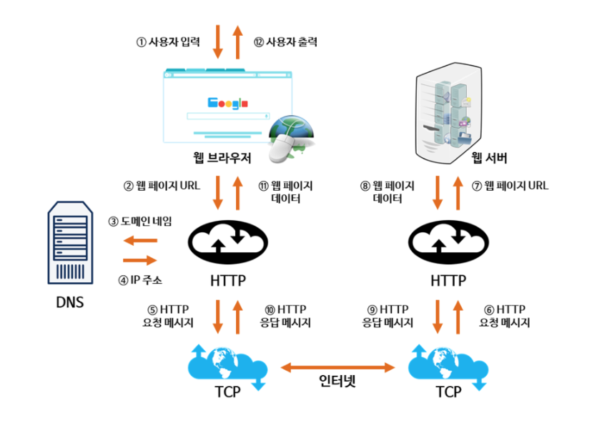
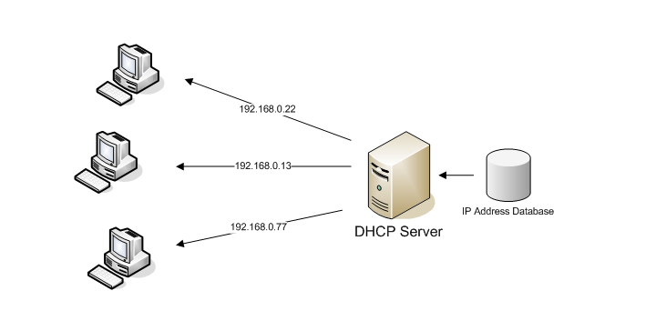
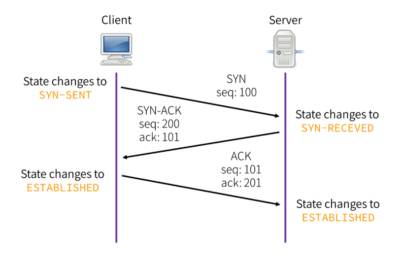

# 웹 통신흐름

# 웹이란

웹은 www(World Wide Web)의 약자로, 인터넷으로 연결된 컴퓨터를 통해 정보를 공유할 수 있는 공간을 뜻한다. 

# 웹통신

웹통신은 HTTP프로토콜을 사용하여 통신한다. 

통신의 주체는 크게 Client와 Server로 나눌 수 있다.

1. Client : 서버에게 정보를 요청하거나 접속하고자 한는 주체
2. Server : 클라이언트에게 정보 혹은 서비스를 제공하는 컴퓨터

Client와 Server가 Request와 Response를 주고 받으며 통신한다. 

# 작동방식

1. 사용자가 도메인 이름 입력
2. DNS를 통해 도메인 이름과 매핑되는 IP 주소 획득
3. HTTP 프로토콜을 사용하여 요청(= HTTP Request) 생성
4. TCP 프로토콜을 사용하여 서버의 IP 주소 컴퓨터로 Request 전송
5. 서버가 클라이언트의 요청에 대한 응답(= HTTP Response) 전송
6. 브라우저에 도착한 Response는 웹페이지를 나타내는 데이터로 변환되어 브라우저에 나타남.

# DNS서버의 주소찾기(IP할당과정에 필요한 프로토콜)

### DHCP (Dynamic Host Configuratoin Protocol)

호스트의 IP 주소와 TCP/IP 설정을 클라이언트에 의해 자동으로 제공하는 응용 계층 프로토콜

사용자는 DHCP 서버에서 자신의 IP주소, 가장 가까운 라우터의 IP 주소, 가장 가까운 DNS서버의 주소를 받는다. 

### ARP(Address Resolution Protocol)

네트워크상에서 IP주소를 물리적 네트워크 주소로 바인딩시키기 위해 사용하는 프로토콜

DHCP로 얻은 라우터의 IP주소를 MAC주소로 변환

# 웹 서버 접속

서버의 ip주소를 알아낸 후 

1. HTTP Request를 위해 TCP socket을 개방하고 연결한다.
2. TCP연결에 성공하면, HTTP Request가 TCP socket을 통해 보내진다.
3. 웹페이지의 정보가 응답으로 돌아온다. 

그림은 TCP 3 way handshake방법을 사용한 TCP연결과정

SYN, SYN/ACK, ACK 세번의 통신을 통해 서로 신뢰할 수 있는 상태임을 확인하는 과정

SYN : 접속요청 / ACK : 요청 수락

## 추가

### 1) 웹 서버

> 정적인 컨텐츠(HTML, CSS, IMAGE 등)를 요청받아 처리하여 제공하는 서버

- 웹 서버는 정적인 컨텐츠만 처리할 수 있기 때문에 동적 컨텐츠를 요청받았을 때 WAS에게 요청하고 응답받아 클라이언트에게 전달해준다.

👉 **Web Server의 예**
: Apache Server, Nginx 등

### 2) WAS (Web Application Server)

> 동적인 컨텐츠(JSP, ASP, PHP 등)를 요청받아 처리하여 제공하는 서버 (+정적 리소스 제공 가능)

- 웹 서버(Web Server)와 웹 컨테이너(Web Container)가 합쳐진 형태
- HTTP를 통해 컴퓨터나 장치에 애플리케이션을 수행해주는 미들웨어
- 주로 DB 서버와 함께 사용

👉 **WAS의 예**
: Tomcat, JBoss, Jeus, Web Sphere 등

👉 **WAS의 필요성**

웹 페이지는 정적 컨텐츠와 동적 컨텐츠가 모두 존재한다.

사용자의 요청에 맞게 적절한 동적 컨텐츠를 만들어서 제공해야 한다. 예를 들어 로그인 정보에 따라 화면에 표시되는 이름은 변경될 수 있다.

이때, Web Server만을 이용한다면 사용자가 원하는 요청에 대한 결과값을 모두 미리 만들어 놓고 서비스를 해야 한다. 하지만 이렇게 수행하기에는 자원이 절대적으로 부족하다.

따라서 WAS를 통해 요청에 맞는 데이터를 DB에서 가져와서 비즈니스 로직에 맞게 그때 그때 결과를 만들어서 제공함으로써 자원을 효율적으로 사용할 수 있다.

  

👉 웹 시스템 구성

**[ WAS + DB ]**

- WAS는 동적, 정적 컨텐츠를 모두 제공할 수 있기 때문에 웹 서버(Web Server)가 없이 시스템을 구성할 수 있다.
- 하지만 WAS에 모든 역할이 부여되었을 경우 서버 과부하로 가장 비싼 애플리케이션 로직이 정적 리소스로 인해 수행이 어려울 수 있다는 우려가 있다. 

  

**[ WEB + WAS + DB ]**

- 정적 컨텐츠는 웹 서버가 처리하고, 동적인 애플리케이션 로직을 처리는 WAS에 요청한다.
- 이렇게 시스템을 나누었을 때 정적 리소스가 많이 사용할 경우에는 웹 서버를 증설하고, 애플리케이션 리소스가 많이 사용될 경우 WAS를 증설하면 되어 효율적인 리소스 관리를 할 수 있다.

  

참고자료

[https://velog.io/@woo0_hooo/네트워크-웹-통신의-흐름](https://velog.io/@woo0_hooo/%EB%84%A4%ED%8A%B8%EC%9B%8C%ED%81%AC-%EC%9B%B9-%ED%86%B5%EC%8B%A0%EC%9D%98-%ED%9D%90%EB%A6%84)

[https://velog.io/@orijoon98/네트워크-웹-통신의-흐름](https://velog.io/@orijoon98/%EB%84%A4%ED%8A%B8%EC%9B%8C%ED%81%AC-%EC%9B%B9-%ED%86%B5%EC%8B%A0%EC%9D%98-%ED%9D%90%EB%A6%84)

[https://jjingho.tistory.com/90](https://jjingho.tistory.com/90)
