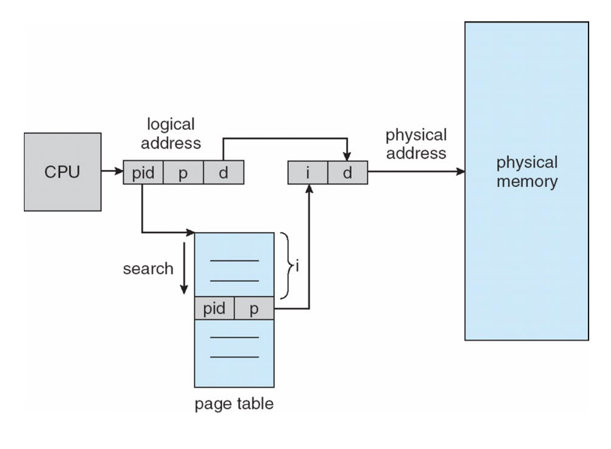

# Paging : Smaller Table

paging은 고정된 페이지 크기를 사용하여 메모리 관리가 편하다는 장점이 있다. 하지만 주소변환정보를 담고 있는 page table관련해서 두 가지 문제가 있다.

1. 속도 문제
    
    page table이 물리적 메모리에 있기 때문에 하나의 명령어를 수행하기 위해 여러번 메모리에 접근해야 해서 속도가 느리다.
    
    → TLB로 해결
    
2. 크기 문제
    
    **Page table**은 크기가 너무 커서 많은 메모리가 필요하다. 그렇다고 page의 크기를 크게 하면, page table entry개수는 줄어들지만 internal fragmentation이 생긴다. 
    
    → 작은 page table을 만들자.
    
    방법 3가지
    
    1. Hybrid Approach
    2. Multi-Level page table
    3. Inverted page table
    
    ### Hybrid Approach : paging and segments
    
    segmentation과 paging을 섞어서 장점만 취하는 방법이다.
    
    주소체계를 page로만 나누지 말고 segmentation도 함께 사용하자는 것이다.
    
    
    
    출처 : [https://star-peanuts.tistory.com/97](https://star-peanuts.tistory.com/97)
    
    위 그림처럼 16KB address space와 1KB 크기의 page를 가정해보자.
    
    page 대부분이 invalid entries여서 메모리 낭비가 심하다. 그래서 process의 address space가 하나의 page table을 갖게 하는 게 아니라, hybrid에서는 Address space의 Code, Heap, Stack 세 logical segment들이 각각 **page** table을 갖도록 했다.
    
    hybrid는 segment마다 bounds register를 가지고 있다는 점에서 기존과 다르다.
    
    문제점
    
    1. 크고 듬성듬성(Sparsely-used)하게 사용하면 page table 낭비가 심하다.
    
    2. hybrid는 external fragmentation을 유발한다. page-sized units으로 메모리를 관리하므로 page table 크기가 가변적이고, 따라서 free space를 찾기가 어렵다.
    
    ### **Multi-level Page Tables**
    
    multi level page table의 기본적인 아이디어는 page table을 page 단위로 자른 뒤 하나라도 유효한 entry가 없다면 해당 page table를 유지하지 않는 것입니다. 이러한 것을 처리하기 위해 multi level page table에는 page directory라는 개념을 도입합니다. Page directory는 page table의 page가 어디에 있는지, 해당 page table에 유효한 page가 있는지를 알려주는 데 사용합니다.
    
    
    
    왼쪽의 linear page table을 보면 중간에 정보가 없어도 indexing을 위해서 자리를 차지하고 있어야 해서 공간의 낭비가 큰것을 볼 수 있다.
    
    이것을 오른쪽 그림처럼 multi level page tables로 개선하면 저 중간에 있는 불필요한 공간들은 실제 물리메모리에 할당하지 않고, 필요한 페이지테이블만 page frame크기에 맞추어 물리메모리에 둘 수 있다.
    
    문제점
    
    1. 기존 paging의 단점이 주소변환을 위해 메모리 page table에 한번 더 접근해야 한다는 것인데, multi level paging에서는 page directory에 접근하는 과정이 추가되면서 메모리에 총 3번 접근해야 하는 일이 생긴다.
    
    2. complexity : page table을 찾기 더 복잡해진다.
    
    하지만 이러한 단점에도 불구하고 multi level paging을 사용하는 것은 TLB의 역할에 기대를 거는 것이라고 볼 수 있다.
    
    ### Inverted page tables
    
   
     page table은 한 프로세스당 page table을 가지고 있어야 하기 때문에, 사용되지 않는 page가 있더라도 page의 최대개수만큼 page table entry를 가지고있어야했다.
    
    Inverted page table로 이 문제 해결
    
    역페이지 테이블은 물리 메모리를 그대로 사상하고 있으며, 모든 프로세스가 하나의 페이지 테이블을 참조한다. → 페이지 테이블의 entry개수는 물리 메모리의 frame 개수와 동일하며 고정되어 있다.
    
    모든 프로세스가 역페이지 테이블을 참조하기 때문에, 어떤 프로세스의 사상 정보를 가지고 있는지 구분하기 위해 pid를 함께 사용하여 참조한다. 0번째 entry부터 순차적으로 pid와 page number를 비교하며 탐색하며, 일치하는 page table entry를 발견했을 때의 인덱스가 곧 frame number가 된다. 역페이지 테이블이 물리 메모리를 그대로 사상했기 때문에, i번째 index가 i번째 frame number와 동일하기 때문. 
    
    페이지를 고정크기로 관리하며, 페이지 테이블의 크기를 줄일 수 있다는 장점을 가지고 있다.
    
    문제점
    
    기존에 page table에서 entry를 인덱싱하는 방식과달리, pid와 page number를 비교하며 순차 탐색하기 때문에 O(n)만큼의 시간 복잡도가 소요된다. 

    
    참고자료
    
    [https://star-peanuts.tistory.com/97](https://star-peanuts.tistory.com/97)
    
    [https://rond-o.tistory.com/267](https://rond-o.tistory.com/267)
    
    [https://icksw.tistory.com/150](https://icksw.tistory.com/150)
    
    [https://itstory1592.tistory.com/103](https://itstory1592.tistory.com/103)
