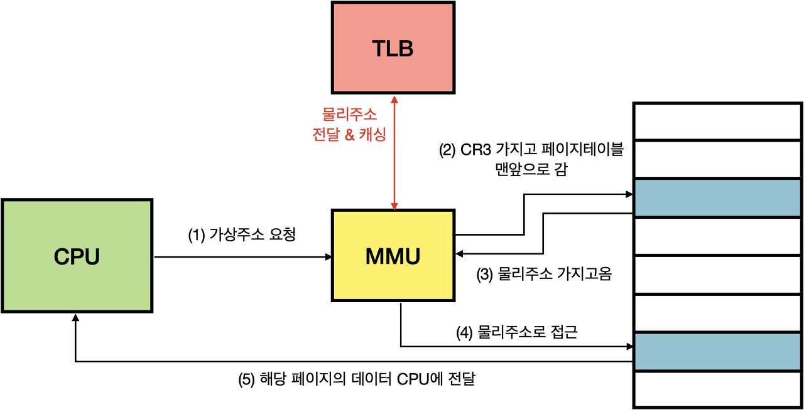

# TLB

### TLB란(Translation Lookaside Buffer)

- 가상 메모리 주소를 물리적 주소로 변환하는 속도를 높이기 위해 사용되는 캐시
- 최근에 일어난 가상 메모리와 물리 주소의 변환 테이블 저장

### TLB 등장배경

- CPU가 가상주소를 가지고 데이터를 요청하면, MMU라는 별도의 하드웨어가 페이지 테이블을 참고해 물리주소로 변환해서 CPU에게 해당 페이지의 데이터를 전달해주는 역할을 한다.
- page table은 메인 메모리에 존재하고, CPU가 요청한 데이터 또한 물리 메모리에 적재되어있다. 이 때문에 원하는 데이터를 얻기 위해 메인메모리에 최소 2번 접근해야한다.
    1. page table에 한번 접근
    2. page table을 기반으로 실제 메모리로 접근
    
    ⇒ 하드웨어적으로 지원하여 page table의 임시저장 cache역할을 하는 TLB를 만들어 메모리 접근을 줄였다.
    

### TLB동작과정

MMU가 가상주소A를 가지고 물리주소 A’를 한번 얻었다면 이 변환된 최근 매칭 정보를 TLB에 캐싱한다. 다음부터 A 가상주소를 가지고 물리주소를 찾아야 한다면 MMU는 물리 메모리에 접근하지 않고도 TLB를 통해 정보를 얻을 수 있다. 

TLB가 없으면 

1. CPU의 가상 주소 요청
2. MMU가 CR3의 base주소를 가지고 페이지 테이블로 간다.(물리 메모리 접근1)
3. MMU가 물리 주소를 가지고 온다.
4. MMU가 페이지의 물리 주소로 접근한다.(물리 메모리 접근2)
5. 해당 페이지의 데이터를 CPU에 전달

TLB가 있고 TLB에 기존에 가상주소-물리주소 캐싱이 되어있으면

1. CPU의 가상 주소 요청
2. MMU가 TLB에서 캐싱된 물리 주소를 가지고 온다.
3. MMU가 페이지의 물리 주소로 접근한다.(물리 메모리 접근1)
4. 해당 페이지의 데이터를 CPU에 전달

참고자료

[https://wpaud16.tistory.com/286](https://wpaud16.tistory.com/286)

[https://eunjinii.tistory.com/140](https://eunjinii.tistory.com/140)