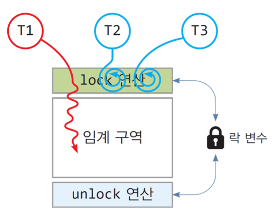
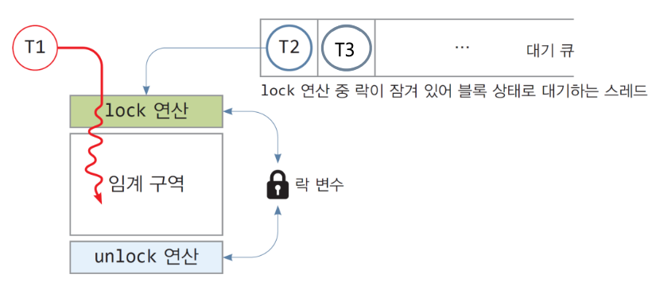

## 인터럽트

1. "cpu가 인터럽트를 처리한다"의 의미는?

2. 예외를 처리한 직후 예외가 발생한 명령어의 다음 명령어부터 실행을 재개하는 예외

## 세그멘테이션

1. segmentation을 보완하기 위한 주요 방법?

2. segment의 종류 3가지를 작성하라.

## 시스템 콜

1. CPU가 자원에 접근하기 위해 실행하는 모드는?

2. 시스템 호출의 종류는 [], 파일관리, 디렉터리 관리, 파일 시스템 관리 총 4가지가 있다.
빈칸의 알맞은  종류를 답하라.

## 주소변환

1. 프로그램의 크기보다 분할의 크기가 큰 경우 해당 분할에 프로그램을 적재하고 남는 현상은?

2. 논리주소와 물리 주소간의 변환을 위해 사용하는 하드웨어는 무엇인가?

## CPU 스케줄링 알고리즘
1. FCFS 스케줄링에 대해 설명해주세요.
    - 중요한 키워드:
    - 스케줄링 파라미터:
    - (선점/비선점):
    - 기아 발생(O/X):

2. Round-Robin 스케줄링에 대해 설명해주세요.
    - 중요한 키워드:
    - 스케줄링 파라미터:
    - (선점/비선점):
    - 기아 발생(O/X):

## 교착상태
1. 교착상태에 대해 설명해주세요.

2. 교착상태 발생 4가지 필요충분조건을 작성해주세요.

## 동기화(스핀락, 세마포어, 뮤텍스)
1. 뭔 사진일까요?
    - 
    - 

2. 표를 채워주세요.
    ||&nbsp;&nbsp;&nbsp;&nbsp;&nbsp;&nbsp;&nbsp;&nbsp;&nbsp;&nbsp;뮤텍스&nbsp;&nbsp;&nbsp;&nbsp;&nbsp;&nbsp;&nbsp;&nbsp;&nbsp;&nbsp;|&nbsp;&nbsp;&nbsp;&nbsp;&nbsp;&nbsp;&nbsp;&nbsp;&nbsp;&nbsp;스핀락&nbsp;&nbsp;&nbsp;&nbsp;&nbsp;&nbsp;&nbsp;&nbsp;&nbsp;&nbsp;|
    |------|---|---|
    |대기큐 유무|||
    |블록가능여부|||
    |lock/unlock 연산 비용|||
    |적합한 CPU|||
    |주 사용처|||

## 프로세스와 스레드
1. 옳은 것을 모두 골라주세요.
    1. 커널은 자동으로 프로세스 내에 1개의 스레드를 생성한다.
    2. 프로세스는 다른 프로세스의 영역에 직접적으로 접근할 수 있다.
    3. 프로그램이 실행될 때마다 독립된 프로세스가 생성된다.
    4. 프로세스에 관한 정보는 운영체제의 커널에 의해 관리된다.
    5. 프로세스는 자신에게 속한 모든 스레드의 부모이다.
2. 알맞은걸 연결해주세요.
    1. 프로세스 전역 변수와 정적 변수들이 적재되는 영역
    2. 함수 호출시 지역변수, 매개변수, 함수의 리턴 값등이 저장되는 영역
    3. 프로세스 실행 중에 동적 할당받는 영역
    4. 프로세스 코드가 적재되는 영역

    - 코드영역 : ____
    - 데이터영역 : ____ 
    - 힙영역 : ____ 
    - 스택영역 : ____ 
