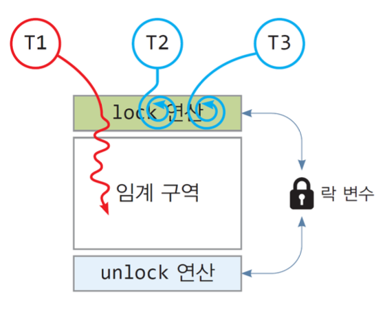

# 동기화(스핀락, 세마포어, 뮤텍스)

## 스레드 동기화

- 다수의 스레드가 공유 데이터를 동시에 접근하는 충돌 상황에서 공유 데이터가 훼손되지 않도록 스레드의 실행을 제어하는 기법
- 한 스레드가 공유 데이터에 대한 접근을 마칠 때까지 다른 스레드가 접근하지 못하도록 제어

## 임계구역(Critical Section)

- 사용자가 작성한 프로그램 중 공유 데이터에 접근하는 코드 블록
- 매우 중요한 코드 영역, 다수의 스레드로부터 공유 데이터의 훼손을 막기 위해, 임계구역은 반드시 한 스레드만 배타적, 독점적으로 실행해야 한다.

## 상호배제(Mutual Exclusion)

- 임계구역에 먼저 진입한 스레드가 임계구역 실행을 끝낼 때까지 다른 스레드가 진입하지 못하도록 보장하는 것

## 멀티스레드 동기화 기법

- 락(lock) 방식 : 하나의 락 변수를 두고, 락을 잠근 스레드만이 임계구역에 진입하도록 하는 기법
    - 상호배제 목적
    - 뮤텍스(mutex), 스핀락(spinlock)
- wait-signal 방식
    - 세마포(semaphore) : 여러 개의 공유 자원을 여러 스레드가 사용할 수 있도록 관리하는 기법
        - 공유 자원이 여러  개 있는 임계구역 문제 해결

## 뮤텍스(Mutex)

잠김/열림 중 한 상태를 가지는 락 변수를 이용하여, 한 스레드만 임계구역에 진입시키고 다른 스레드들은 큐에 대기시키는 기법

- **요소**
    - 락 변수 : 락 변수를 잠김으로 만든 스레드만이 임계구역 실행이 가능하다.
    - lock/unlock 연산 : lock 연산은 스레드가 임계구역에 들어가기 전 실행하는 진입(entry)코드, 락이 잠겨있는 상태면 스레드를 블록 상태로 만들어 대기 큐에 삽입한다. 락이 열린 상태라면 락을 잠그고 임계구역에 진입하게 한다. unlock 연산은 임계구역을 나올 때 실행하는 진출(exit)코드로서 락은 열림 상태로 바꾸고 대기 큐에 있는 스레드 하나를 깨워 준비 상태로 만든다.
    
    
    
    출처) 명품 운영체제
    
- **뮤텍스 스레드 동기화 과정**
    1. T1 스레드가 lock 연산을 실행하여 락을 잠그고 임계구역을 실행한다.
    2. T1이 임계구역을 실행하는 도중 T2가 실행되어 lock연산을 실행 → lock 연산은 락이 잠겨있어 T2를 중단시키고 대기 큐에 삽입한다.
    3. T1이 임계구역 실행을 마치고 unlock 연산을 실행 → unlock 연산은 락을 열림 상태로 바꾼 후 대기 큐에서 잠든 스레드 하나를 깨워 준비 리스트에 넣는다. T1은 unlock 연산 후 작업을 계속한다.
    4. 깨어난 T2는 준비 리스트에 있다가 스케줄되면 중단된 lock연산에서 실행을 계속하여 락이 잠겨있는지 검사하고 락을 잠근 후 임계구역으로 들어간다.
    
    
    
    출처) 명품 운영체제
    
- **특징**
    - 임계구역의 실행 시간이 짧은 경우 비효율적이다. 락이 잠겨있는 경우, 스레드는 CPU를 내놓고(컨텍스트 스위칭) 대기 큐로 들어가서 락이 풀리면 다시 CPU를 얻어(컨텍스트 스위칭) 실행된다. 임계구역의 실행 시간이 짧은 경우, 락이 잠겨 있는 시간보다 스레드가 잠자고 깨는데 걸리는 시간 낭비(2번의 컨텍스트 스위칭)가 더 크기 때문에 비효율적이다.

## 스핀락(Spinlock)

뮤텍스와 마찬가지로 락을 기반으로 하지만, 뮤텍스와 달리 대기큐가 없다.

- **요소**
    - 락 변수(스핀락) : 스핀락을 소유한 한 개의 스레드만 임계구역에 진입
    - lock/unlock 연산 : lock 연산은 락 변수가 열림 상태이면 잠금 상태로 만들고 스레드가 임계구역에 들어가도록 하고 락이 잠겨있는 상태라면 열릴 때까지 락 검사를 무한 반복하여 락이 열리면 즉각 락을 잠그고 스레드가 임계구역으로 들어가도록 한다. unlock 연산은 락을 열림으로 변경한다.
    
    
    
    출처) 명품 운영체제
    
- **스핀락 스레드 동기화 과정**
    1. T1 스레드가 lock 연산을 수행하여 락을 잠그고 임계구역을 실행한다.
    2. T1이 임계구역을 실행하는 중에 T2가 스케줄되어 lock 연산을 실행한다. lock 연산은 락이 열림 상태가 될 때까지 반복하여 락을 검사하는 CPU 명령들을 실행한다.
    3. T1 이 임계구역의 실행을 마치고 unlock 연산을 실행하면 락을 열림 상태로 만든 후, T1은 임계구역을 벗어나 실행을 계속한다.
    4. T2는 반복된 락 검사 중 열림 상태를 확인하고 락을 잠그고 임계구역으로 들어간다.
    
    
    
    출처) 명품 운영체제
    
- **특징**
    - 스핀락은 뮤텍스 기법의 바쁜 대기 모형, lock 연산에서 락이 잠겨 있을 때 블록되지 않고 락이 열릴 때까지 락을 검사하는 코드를 실행하기 때문
    - 단일 CPU를 가진 운영체제에서 비효율적이다. 멀티 코어 CPU에서 효율적이다.
        - T1 스레드 스핀락을 가지고 있고 T2가 대기하고 있을 때, T2는 해당 스핀락이 열리길 계속 확인 → T1의 타임 슬라이스 이후 T2의 타임 슬라이스에 T2스레드는 락 열림 상태 확인을 위해 CPU를 사용, 실제로 유용한 작업을 수행하지 않고 대기한다. → CPU를 비효율적으로 사용
    - 임계구역 코드가 짧아서 락이 빨리 열리는 상황에 매우 효과적이다. 뮤텍스는 2번의 컨텍스트 스위칭(락을 얻지 못한 스레드를 블록, 대기 큐에서 다시 실행)과 그 사이에서 일어나는 스케줄링 시간 때문에 비효율적이다.
    - 스핀락은 스레드들이 락을 얻기 위해 무한 경쟁하기 때문에 어떤 스레드는 오랫동안 락을 얻지 못해 기아가 발생할 수 있다. 또는 잘못된 코딩으로 무한 루프를 도는 경우, 락이 열리길 기다리는 다른 스레드들이 무한정 CPU를 사용하면서 영원히 기다리게 될 수도 있다.

출처) 명품 운영체제

## 세마포(Semaphore)

n개의 자원을 다수의 스레드가 공유하여 사용하도록 돕는 자원 관리 기법

멀티스레드를 위한 자원 관리

자원의 개수n를 알고, 스레드 요청을 받아 사용을 허락하고, 자원이 모자랄 때 요청한 스레드는 대기 큐에서 잠을 재우며, 자원 사용을 끝낸 스레드가 세마포에게 알리면 세마포가 대기 큐에서 잠을 자는 스레드를 깨워 자원을 사용하도록 허락하는 방식

- **요소**
    - 자원 : n개
    - 대기 큐 : 자원을 할당받지 못한 스레드가 잠자는 곳
    - counter 변수 : 사용가능한 자원의 개수를 나타내는 정수형 변수, 자원의 개수 n으로 초기화 된다. counter 변수가 음수이면 자원을 기다리는 스레드의 개수를 나타낸다. 구현에 따라 사용 가능한 자원이 없을 때 값을 0으로 유지하기도 한다.
    - P/V 연산 : P연산은 자원 요청 시, V연산은 자원 반환 시 실행되는 연산
- **세마포 스레드 동기화 과정**
    1. 자원에 4개의 인스턴스 → counter = 4
    2. T1이 P 연산할 때 counter 4 → 3, T2가 P 연산할 때 counter 3 → 2, … counter = 0
    3. T5, T6가 차례로 P연산 수행 → 사용 가능한 자원이 없으니 대기 큐에 들어가고 counter = -2
    4. T1 ~ T4 스레드는 하나씩 자원을 할당받아 사용, T5 ~ T6 스레드는 자원이 생기길 기다리는 상태, 자원을 할당받은 스레드는 자신의 자원을 활용하는 코드(A~D) 실행

출처) 명품 운영체제

## P연산 / V연산 (wait/signal 연산)

- P 연산 = 자원 사용 허가 counter - 1
- V 연산 = 스레드 자원 사용 끝났음을 세마포에게 공지 counter + 1
- 수면 대기 세마포 : P 연산 중 자원 사용을 허가받지 못한 스레드를 대기 큐에서 잠 재우고 V 연산에서 사용가능한 자원 생기면 스레드를 깨워 자원 사용 허락
- 바쁜 대기 세마포 : P 연산에서 가용 자원이 생길 때까지 무한 루프를 돌면서 검사하는 방식, 대기 큐가 존재하지 않는다.

### 카운터 세마포 : 자원이 여러 개인 경우

### 이진 세마포 : 자원이 1개인 경우, 하나의 자원에 대해 여러 스레드가 사용하고자 할 때 관리하는 기법 (=뮤텍스) 

> 하지만 뮤텍스는 할당받은 스레드에 의해서만 할당된 자원을 해제시킬 수 있지만, 이진 세마포의 경우 다른 스레드에 의해 자원 할당 해제가 가능하다는 차이가 있다.

### 스핀락 vs 뮤텍스
- 스핀락의 경우 while문과 같이 계속해서 기다리며 cpu 자원을 사용하며 기다린다. 하지만 뮤텍스의 경우 스레드들을 큐에서 대기시키며 sleep을 시키기 때문에 오버헤드가 비교적 적어진다. 

> 그렇다면 뮤텍스가 스핀락에 비해 항상 좋은가? => 그렇지는 않다. 뮤텍스에서 스레드의 상태를 변경시키는 과정은 오버헤드가 필요하다. 하지만 임계영역이 매우 짧다면 스핀락과 같이 상태를 변경시키지 않고 while문을 통해 대기하는 과정이 더 효율적일 수 있다!

### 뮤텍스 vs 세마포어
- 뮤텍스는 key를 통해 임계구역에 하나의 스레드만 할당된다. 하지만 세마포어는 value를 이용해서 스레드들의 개수를 지정할 수 있다는 차이점이 있다. 또한 뮤텍스의 경우 할당받은 스레드에 의해서만 할당된 자원을 해제시킬 수 있지만, 이진세마포의 경우 다른 스레드에 의해 자원 할당 해제가 가능하다는 차이가 있다.

## 모니터

- 공유 자원과 공유 자원에 접근하기 위한 인터페이스(통로)를 묶어 관리한다. 프로세스는 반드시 인터페이스를 통해서만 공유 자원에 접근하도록 한다. 모니터를 통해 공유 자원에 접근하고자 하는 프로세스를 큐에 삽입하고, 큐에 삽입된 순서대로 공유 자원을 이용하도록 한다.
- 프로세스나 스레드의 실행 순서를 제어하기 위해서 조건 변수 사용
- 조건변수 별로 큐를 만들고 이를 활용해 실행 순서 제어 동기화 제공
- 고급 언어의 설계 구조물로서, 개발자의 코드를 상호배제 하게끔 만든 추상화된 데이터 형태이다.
- 공유자원에 접근하기 위한 키 획득과 자원 사용 후 해제를 모두 처리한다. (세마포어는 직접 키 해제와 공유자원 접근 처리가 필요하다. )

 

### ref)

황기태 교수님의 명품 운영체제

혼자 공부하는 컴퓨터 구조 + 운영체제

[https://velog.io/@passion_man/운영체제-6.-스레드-동기화](https://velog.io/@passion_man/%EC%9A%B4%EC%98%81%EC%B2%B4%EC%A0%9C-6.-%EC%8A%A4%EB%A0%88%EB%93%9C-%EB%8F%99%EA%B8%B0%ED%99%94)

[https://github.com/JaeYeopHan/Interview_Question_for_Beginner/tree/main/OS#프로세스-동기화](https://github.com/JaeYeopHan/Interview_Question_for_Beginner/tree/main/OS#%ED%94%84%EB%A1%9C%EC%84%B8%EC%8A%A4-%EB%8F%99%EA%B8%B0%ED%99%94)

[https://coder-in-war.tistory.com/entry/OS-08-프로세스-동기화-모니터Monitor](https://coder-in-war.tistory.com/entry/OS-08-%ED%94%84%EB%A1%9C%EC%84%B8%EC%8A%A4-%EB%8F%99%EA%B8%B0%ED%99%94-%EB%AA%A8%EB%8B%88%ED%84%B0Monitor)