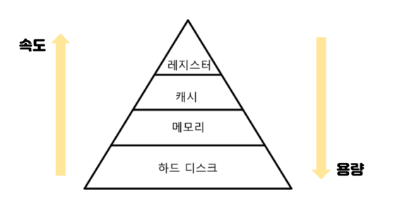
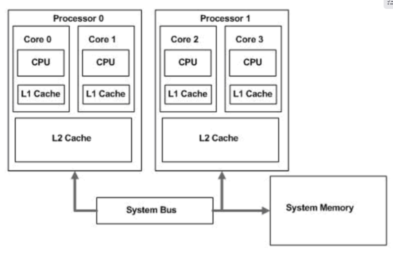
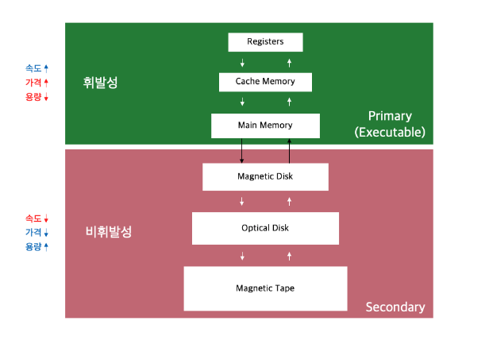
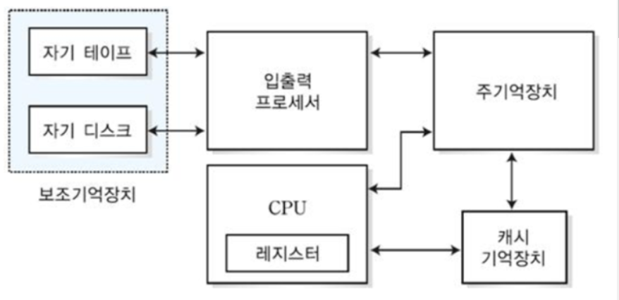

# 메모리 계층

## 메모리 계층 구조

메모리 관련 3가지 주요 특성인 용량, 접근속도, 비용 간의 절충 관계를 파악해 필요에 따라 채택할 수 있게 나타낸 구조.

 

 

### 레지스터

- 휘발성이며 속도가 가장 빠르고, 기억 용량이 가장 적다.
- CPU 내부의 작은 메모리로, CPU가 요청을 처리하는데 필요한 데이터를 일시적으로 저장하는 기억장치.
- CPU는 자체적으로 데이터를 저장할 방법이 없으므로 메모리로 직접 데이터를 전송할 수 없기 때문에 연산을 위해서 반드시 레지스터를 거쳐야한다. 때문에 레지스터는 특정 주소를 가리키거나 값을 읽어올 수 있다.
    
     
    

### 캐시

- L1, L2, L3 캐시를 지칭하고 휘발성이며, 속도가 빠르지만 기억 용량이 적다.
- 데이터를 미리 복사해 놓는 임시 저장소이자 빠른 장치와 느린 장치에서 속도 차이에 따른 병목 현상을 줄이기 위한 메모리. 이를 통해 데이터를 접근하는 시간이 오래 걸리는 경우를 해결하고 무언가를 다시 계산하는 시간을 절약할 수 있다.
- 메모리와 CPU사이의 속도 차이가 너무 크기 때문에 그 중간에 레지스터 계층을 둬서 속도 차이를 해결한다.
    
    
    
- L1캐시 : 일반적으로 코어안에 내장되어 데이터 사용/참조에 가장 먼저 사용된다.  CPU는 L1캐시에 가장 빠르게 접근하고, L1에서 데이터를 찾지 못하면 L2캐시를 참조한다.
- L2캐시 : L1보다 상대적으로 속도가 느리지만 상대적으로 많은 용량을 저장할 수 있다.
- L3캐시 : 잘 사용하지 않음.

### 주기억장치(메모리)

- 컴퓨터에서 수치, 명령, 자료 등을 기억하는 컴퓨터 하드웨어 장치이다.
    
    ### RAM
    
    - 빠른 접근을 위해 데이터를 단기간 저장하는 구성 요소
    - 휘발성 기억 장치 ( 전원 종료시 기억된 내용 삭제)
    - 전원이 유지되는 동안 CPU의 연산 및 동작에 필요한 모든 내용 저장
    
    ### ROM
    
    - 컴퓨터에 지시사항을 영구히 저장하는 비휘발성 메모리(고정 기억 장치)
    - 변경 가능성이 희박한 기능 및 부품에 사용
    

### 보조기억장치(디스크)

- HDD, SDD를 일컬으며 비휘발성이다. 속도는 느리지만 기억 용량이 많다.
    
    ### HDD(Hard Disk Drive)
    
    - 비휘발성 데이터 저장소를 의미.
    - 하드디스크는 물리적으로 동작하여 병목현상으로 인한 속도 저하가 심함.
    
    ### SSD(Solid State Drive)
    
    - HDD를 대체하기위해 개발된 보조저장장치
    - 데이터 입/출력 속도가 HDD에 비해 매우 빠름
    

참고자료

[https://nayoungs.tistory.com/entry/운영체제-메모리-계층-구조Memory-Hierachy](https://nayoungs.tistory.com/entry/%EC%9A%B4%EC%98%81%EC%B2%B4%EC%A0%9C-%EB%A9%94%EB%AA%A8%EB%A6%AC-%EA%B3%84%EC%B8%B5-%EA%B5%AC%EC%A1%B0Memory-Hierachy)

[https://brightstarit.tistory.com/14](https://brightstarit.tistory.com/14)