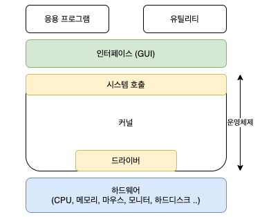

# 운영체제란? 역할과 구조

## 운영체제란

- 컴퓨터 시스템의 핵심 소프트웨어로, 컴퓨터 하드웨어와 응용 프로그램 간의 상호작용을 관리하고 제어하는 역할.

## 운영체제의 역할

1. 자원관리
    - 컴퓨터 시스템의 하드웨어 자원을 효율적으로 관리하는 역할
    - CPU, 메모리, 저장장치, 입출력장치 등 하드웨어의 자원을 할당하고 관리하여 여러 응용프로그램이 동시에 실행될 수 있도록 한다.
2. 메모리 관리
    - 컴퓨터의 메모리를 효율적으로 관리하여 응용프로그램이 필요로하는 메모리 공간을 할당
3. 프로세스 관리
    - 실행중인 응용프로그램인 프로세스를 관리한다.
    - 프로세스의 생성, 실행, 일시정지, 시스템 중지 등의 작업을 제어하며, 여러 프로세스 간의 자원 공유와 협력을 관리한다.
4. 디스크 및 파일 시스템 관리
    - 디스크와 파일 시스템을 관리하여 파일의 생성, 삭제, 복사, 이동 등의 작업을 처리
5. 입출력 관리
    - 입출력 장치와 상호작용을 관리한다.
    - 사용자와 응용 프로그램이 키보드, 마우스, 디스플레이, 프린터 등과의 통신을 할 수 있도록 지원하며, 입출력 장치의 성능을 최적화 한다.
6. 사용자 인터페이스
    - 사용자와 컴퓨터 간의 상호작용을 지원하는 사용자 인터페이스를 제공한다.
    - CLI, GUI를 통해 사용자가 컴퓨터를 조작할 수 있도록 한다.
7. 네트워킹
    - 컴퓨터 네트워크를 관리하고, 네트워크 프로토콜을 지원하여 컴퓨터 간의 통신을 가능하게 한다.
    - 인터넷 연결, 데이터 전송, 네트워크 보안 등을 관리한다.
8. 오류처리
    - 시스템 내부 또는 외부에서 발생하는 오류와 예외상황을 처리한다.
    - 프로세스의 비정상 종료, 메모리 오버플로우, 입출력 오류 등을 감지하고 처리하여 시스템의 안정성과 신뢰성을 유지한다.
9. 시스템 보안
    - 시스템의 보안을 유지하기 위해 접근 제어, 사용자 인증, 암호화 등의 기능을 제공한다.

## 운영체제 구조

 
### 인터페이스

사용자는 커널에 직접 접근할 수 없기 때문에 운영체제가 제공하는 인터페이스를 사용해 커널에 명령을 내려야한다. 사용자 애플리케이션은 인테페이스를 통해 커널에 명령을 전달하고, 인터페이스를 통해 실행결과를 전달받는다. 운영체제가 제공하는 대표적인 인터페이스는 GUI, CLI가 있다. 

### 커널

커널은 프로세스, 메모리, 저장장치를 관리한다. 

### 1. 시스템 호출(System Call)

- 커널이 자신을 보호하기 위해 만든 인터페이스. 응용프로그램과 커널의 인터페이스.
- 애플리케이션이 직접 자원에 접근하여 수정하려 하면 문제가 생길 수 있기때문에 커널이 시스템 콜 이라는 시스템 자원 사용과 관련된 함수 제공.
- write(), read(), printf() 등
- 애플리케이션이 하드웨어에 접근해야하거나 운영체제가 제공하는 서비스를 이용하기 위해서는 커널 함수를 호출하는 시스템 콜을 사용해야한다.
- 시스템 콜을 제공함으로써 운영체제는 컴퓨터 자원을 보호하게 된다.

### 2. 드라이버

- 커널과 하드웨어의 인터페이스
- 각 하드웨어에 맞는 인터페이스를 개발하기 어렵기 때문에 커널은 입출력의 기본적인 부분만 제작하고(키보드, 마우스 등), 하드웨어의 특성을 반영한 소프트웨어를 하드웨어 제작자에게 받아 커널이 실행될 때 함께 실행되도록한다. 이 때 하드웨어 제작자가 만든 소프트웨어를 디바이스 드라이버라고 부른다.

참고자료

[https://jerryjerryjerry.tistory.com/171](https://jerryjerryjerry.tistory.com/171)

[https://math-coding.tistory.com/80](https://math-coding.tistory.com/80)