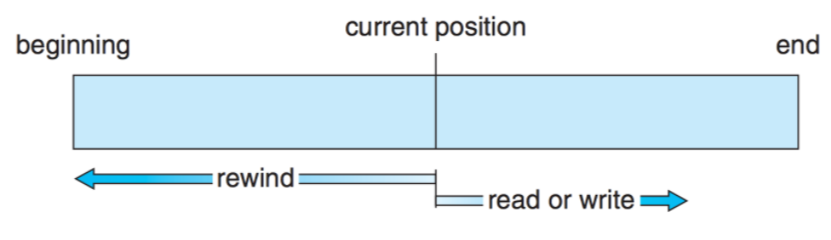
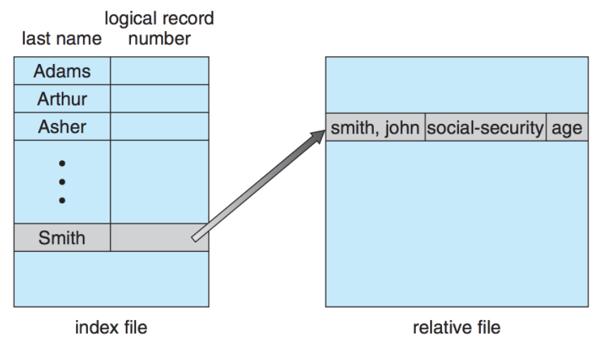
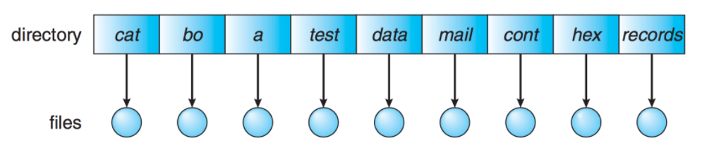
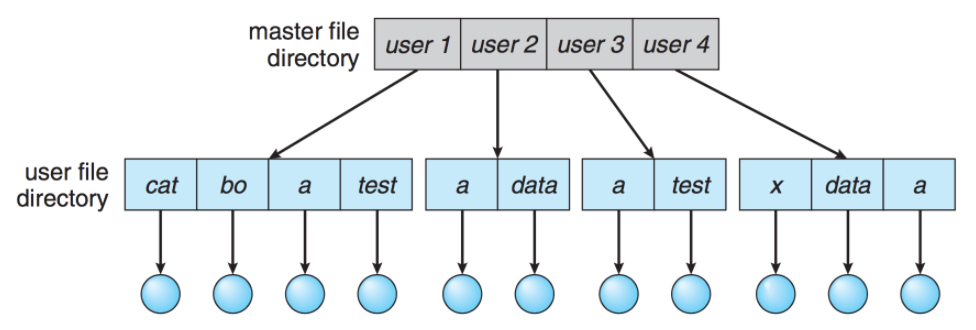
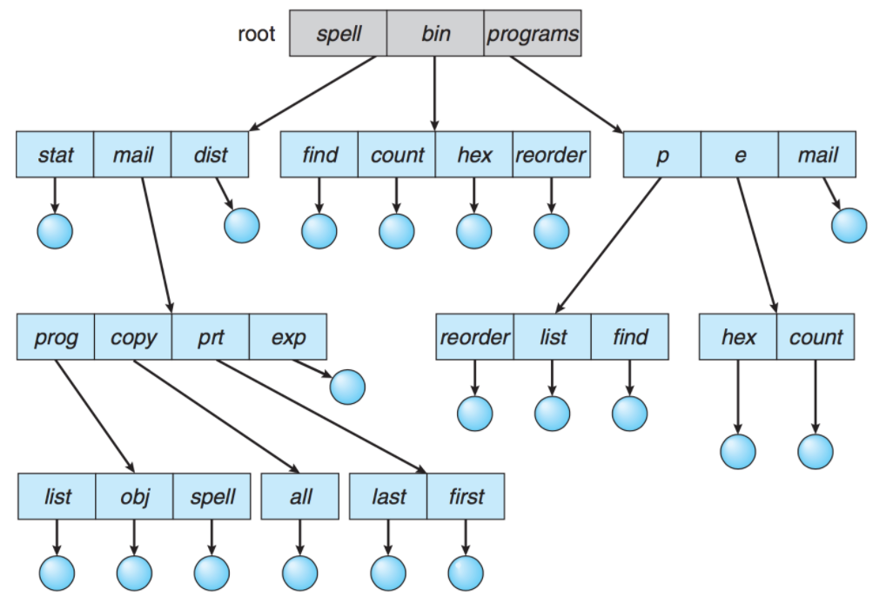
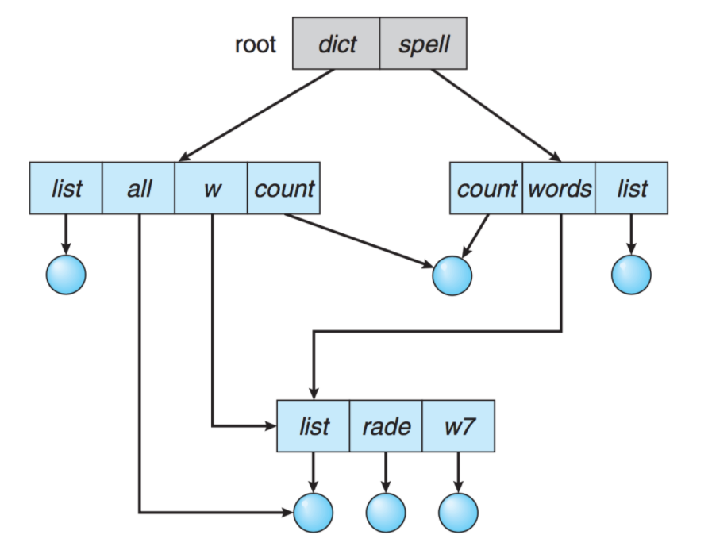
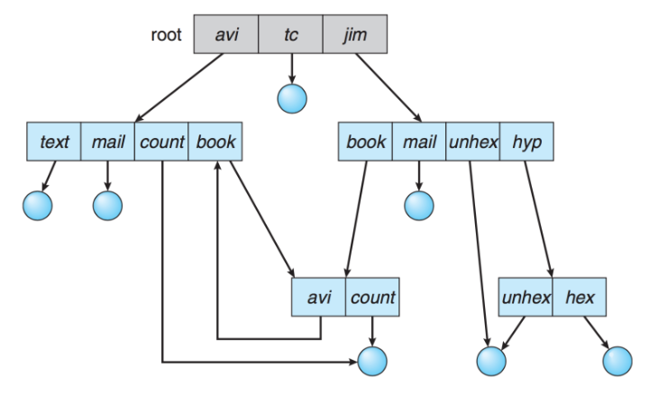
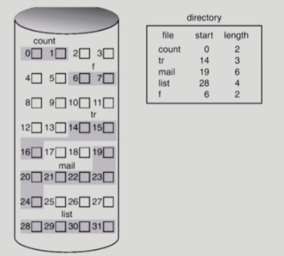
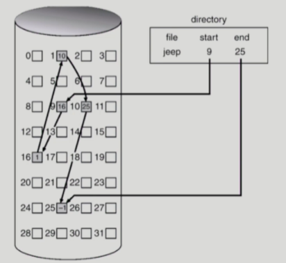
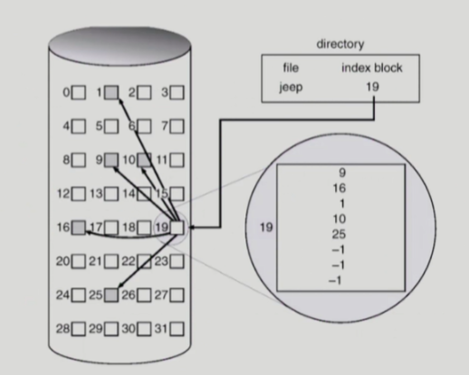

# 파일시스템

# 파일시스템

- 운영체제와 모든 데이터, 프로그램의 저장과 접근을 위한 기법을 제공.
- 시스템 내의 모든 파일에 관한 정보를 제공하는 계층적 디렉터리 구조이고, 파일 및 파일의 메타데이터, 디렉터리 정보 등을 관리.

# Access Methods

1. 순차접근 (Sequential Access)
    - 파일의 정보가 레코드 순서대로 처리된다.
    - 카세트테이프를 사용하는 방식과 동일하다.
    - 현재 위치에서 읽거나 쓰면 offset이 자동으로 증가하고, 뒤로 돌아가기 위해서 되감기가 필요하다.
    - 가장 일반적인 접근방식이며, 편집기나 컴파일러가 사용한다.
        
        
        
2. 직접접근 (Random Access)
- 파일의 레코드를 임의의 순서로 접근할 수 있다.
- LP판을 사용하는 방식과 동일하다. 디스크 모델에 기반을 두고 있다.
- 읽기나 쓰기의 순서에 제약이 없으며 현재 위치를 유지할 수 있다면 이를 통해 순차 접근 기능도 구현할 수 있다.
- 대규모 정보를 즉각적으로 접근하는 데에 유용하기 때문에 데이터베이스에 이용된다.

1. 색인접근 (Index Access)
- 파일에서 레코드를 찾기 위해 색인을 먼저 찾고 대응되는 포인터를 얻는다. 이를 통해 파일에 직접 접근하여 원하는 데이터를 얻을 수 있다.
- 크기가 큰 파일에서 유용하다.
    
     

# Directory

- 디렉터리는 파일의 메타데이터 중 일부를 보관하고 있는 일종의 특별한 파일이다.
- 해당 디렉터리에 속한 파일 이름과 속성들을 포함하고 있고, 다음과 같은 기능들을 제공한다.
    - 파일찾기(search)
    - 파일 생성(create)
    - 파일 삭제(delete)
    - 디렉터리 나열(list)
    - 파일 재명명(rename)
    - 파일 시스템 순회(traverse)
    

## 1단계 디렉터리( Single-Level Directory)

- 모든 디렉터리는 모든 파일이 디렉터리 밑에 존재하는 형태
- 파일들은 서로 유일한 이름을 가지고 서로 다른 사용자라도 같은 이름을 사용할 수 없다.
- 지원하기 쉽고, 이해하기 쉽다.
- 파일이 많아지거나 다수의 사용자가 사용하는 시스템에서 심각한 제약을 갖는다.
    
     
    

## 2단계 디렉터리(Two-Level Directory)

- 2단계 디렉터리는 각 사용자별로 별도의 디렉터리를 갖는 형태이다.
- 서로 다른 사용자가 같은 파일의 이름을 가질 수 있고, 효율적인 탐색이 가능하다.
- 그룹화가 불가능하고, 다른 사용자의 파일에 접근해야하는 경우에는 단점이된다.
    
     

## 트리 구조 디렉터리(Tree-Structured Directory)

- 사용자들이 자신의 서브 디렉터리를 만들어서 파일을 구성할 수 있다.
- 하나의 루트 디렉터리를 가지며 모든 파일은 고유한 경로를 가진다. 이를 통해 효율적인 탐색이 가능하고, 그룹화가 가능하다.
- 디렉터리는 일종의 파일이므로 일반 파일인지 디렉터리인지 구분할 필요가 있다. bit를 사용하여 0이면 일반파일, 1이면 디렉터리로 구분한다.
    
    
    

## 비순환 그래프 디렉터리(Acyclic-Graph Directory)

- 디렉터리들이 서브 디렉터리들과 파일을 공유할 수 있도록 한다. 트리 구조의 디렉터리를 일반화한 형태이다.
- 단순한 트리 구조보다는 더 복잡한 구조이기 때문에 몇몇 문제가 발생할 수 있다.
- 파일을 무작정 삭제하게 되면 현재 파일을 가리키는 포인터는 대상이 사라지게 된다. 따라서 참조되는 파일에 참조 계수를 두어서, 참조 계수가 0이 되면 파일을 참조하는 링크가 존재하지 않는다는 의미이므로 그때 파일을 삭제할 수 있도록 한다.
    
    
    

## 일반 그래프 디렉터리 (General Graph Directory)

- 순환을 허용하는 그래프 구조이다. 순환이 허용되면 무한 루프에 빠질 수 있다. 따라서 하위 디렉터리가 아닌 파일에 대한 링크만 허용하거나 garbage collection을 통해 전체 파일 시스템을 순회하고, 접근 가능한 모든 것을 표시한다.
    
    
    

# Allocation of File Data in Disk

- 파일 데이터를 디스크에 할당하는 방법

## Contiguous Allocation

- 파일을 디스크에 연속되게 저장하는 방식
- 디렉터리에는 파일이 시작 부분의 위치와 파일의 길이에 대한 정보를 저장하면 전체를 탐색 할 수 있다.
    
    
    

- 연속적으로 저장되어 있으므로 한 번의 탐색으로 많은 양을 전송할 수 있다.
- Random access가 가능하다.
- 외부 단편화가 발생하며, 파일의 크기를 키우기가 어렵다.
- 파일의 커질 가능성을 고려해서 미리 큰 공간을 할당한다면 내부 단편화가 발생할 수도 있다.

## Linked Allocation

- 연속적으로 할당하지 않고 빈 위치면 자유롭게 할당될 수 있다.
- 다음 읽어야 할 위치를 연결 리스트처럼 포인터로 가리킨다. 따라서 디렉터리에는 파일이 시작하는 위치와 끝나는 위치만 저장한다.
    
    
    
- 외부단편화가 발생하지 않는다.
- random access가 불가능하다.
- 포인터를 위한 공간이 block의 일부가 되어 공간 효율성을 떨어뜨린다.
- 포인터가 유실되면 데이터를 잃게 되는 신뢰성 문제가 있다.
- 이러한 단점을 보완하기 위해 FAT(File-allocation table)이라는 파일 시스템을 사용한다. 이는 포인터를 별도의 위치에 보관하여 신뢰성 문제와 공간 효율성 문제를 해결한다.

## Index Allocation

- 한 블록에 하나의 파일에 대한 데이터의 index들을 모두 저장하는 방식이다. 따라서 디렉터리에는 이 블록의 위치만 담게 된다.
    
   
    
- 외부단편화가 발생하지 않는다.
- random access가 가능하다.
- 작은파일인 경우 위치를 저장하는 블록의 공간 낭비가 생기고, 너무 큰 파일인 경우에는 하나의 블록으로 파일의 index들을 모두 저장할 수 없을 수 있다는 단점이 있다.

참고자료

[https://jackcokebb.tistory.com/15](https://jackcokebb.tistory.com/15)

[https://rebro.kr/181](https://rebro.kr/181)