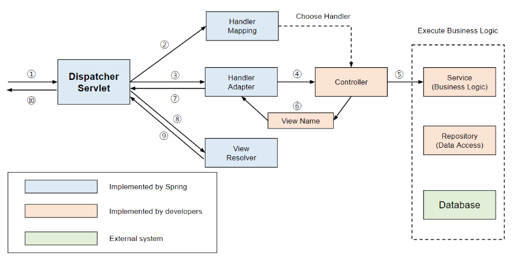
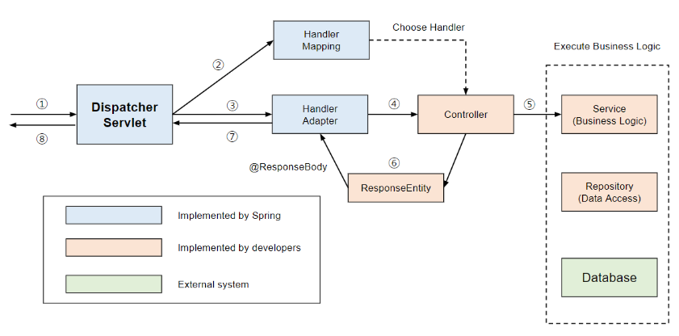

# @Controller와 @RestController

Controller를 지정해주기 위한 어노테이션은 @Controller와 @RestController가 있다. @Controller와 @RestController의 주요한 차이점은 HTTP Response Body생성 방식의 차이이다.

## @Controller

### View 반환

@Controller는 주로 View를 반환하기 위해 사용된다.



1. Client는 URI 형식으로 웹 서비스에 요청을 보낸다.
2. DispatcherServlet이 요청을 처리할 대상을 찾는다.
3. HandlerAdapter을 통해 요청을 Controller로 위임한다.
4. Controller는 요청을 처리한 후에 ViewName을 반환한다.
5. DispatcherServlet은 ViewResolver를 통해 ViewName에 해당하는 View를 찾아 사용자에게 반환한다.

> ViewResolver를 이용하여 Controller가 반환환 뷰의 이름으로부터 View를 렌더링!

### Data 반환

Data를 반환하고 싶다면, **@ResponseBody** 를 활용해야 한다. 이를 통해 **JSON 형태**로 데이터를 반환할 수 있다.



1. Client는 URI 형식으로 웹 서비스에 요청을 보낸다.
2. DispatcherServlet이 요청을 처리할 대상을 찾는다.
3. HandlerAdapter을 통해 요청을 Controller로 위임한다.
4. Controller는 요청을 처리한 후에 객체를 반환한다.
5. 반환되는 객체는 Json으로 Serialize되어 사용자에게 반환된다.

> 반환될때에는 일반적으로 ResponseEntity로 감싸서 반환한다. 그리고 객체를 반환하기 위해 viewResolver 대신에 HttpMessageConverter가 동작한다. HttpMessageConverter는 여러 Converter가 등록되어 있다. 데이터 종류에 따라 서로 다른 MessageConverter가 동작한다.

> (단순문자열 : StringHttpMessageConverter, 객체인 경우에는 MappingJackson2HttpMessageConverter)

```java
@Controller
@RequiredArgsConstructor
public class UserController {

    private final UserService userService;

    @GetMapping(value = "/users")
    public @ResponseBody ResponseEntity<User> findUser(@RequestParam("userName") String userName){
        return ResponseEntity.ok(userService.findUser(user)); // ResoibseEntity로
    }

    @GetMapping(value = "/users/detailView")
    public String detailView(Model model, @RequestParam("userName") String userName){
        User user = userService.findUser(userName);
        model.addAttribute("user", user);
        return "/users/detailView"; // view의 이름!
    }
}
```

## @RestController

@RestController는 @Controller에 @ResponseBody가 추가된 것입니다. 따라서 주로 JSON 형태로 객체 데이터를 반환한다.

```java
@Target(value=TYEP)
@Retention(value=RUNTIME)
@Documented
@Component
public @interface Controller
```

```java
@Target(value=TYEP)
@Retention(value=RUNTIME)
@Documented
@Controller
@ResponseBody
public @interface RestController
```

```java
@RestController
@RequiredArgsConstructor
public class UserController {

    private final UserService userService;

    @GetMapping(value = "/users")
    public User findUser(@RequestParam("userName") String userName){
        return userService.findUser(user);
    }

    @GetMapping(value = "/users")
    public ResponseEntity<User> findUserWithResponseEntity(@RequestParam("userName") String userName){
        return ResponseEntity.ok(userService.findUser(user));
    }
}
```

findUser는 User 객체를 그대로 반환하고 있습니다. 이러한 경우의 문제는 클라이언트가 예상하는 HttpStatus를 설정해줄 수 없다는 것입니다. 예를 들어 어떤 객체의 생성 요청이라면 201 CREATED를 기대할 것이지만 객체를 그대로 반환하면 HttpStatus를 설정해줄 수 없습니다. 그래서 객체를 상황에 맞는 ResponseEntity로 감싸서 반환해주어야 합니다.

<br>
<br>
<br>
---

출처: https://mangkyu.tistory.com/49 [MangKyu's Diary:티스토리]
