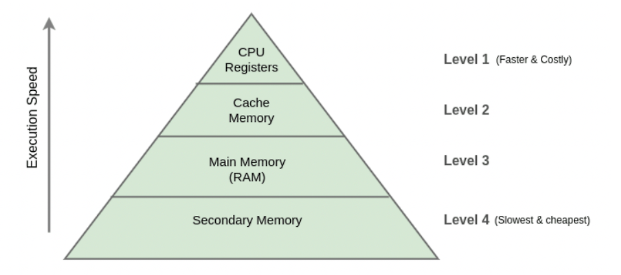
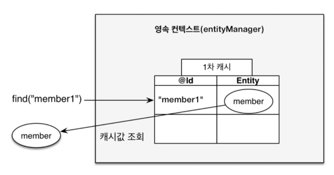
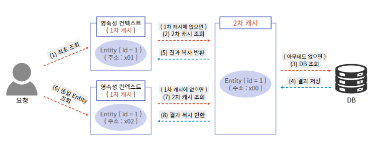

# JPA 캐싱과 영속성

## 캐시와 캐싱



- 동일한 데이터에 반복해서 접근해야 하거나 많은 연산이 필요한 일일 때,
  결과를 빠르게 이용하고자 성능이 좋은 / 가까운 곳에 저장하는 것

- 서버의 부담을 줄이고 성능을 높이기 위해 사용된다.

#### 캐시를 사용하기 좋은 경우

> 반복적으로 동일한 결과를 반환하는 경우 \
> DB에 접근하는 시간이 오래 걸리는 경우

#### 캐시 사용하기 좋지 않은 경우

> 실시간으로 정확성을 요구하는 경우\
> 빈번한 데이터 변경이 일어나는 경우\
> => DB에 있는 값과 캐시에 있는 값을 동일하게 맞춰야하는 오버헤드

### 캐싱

- 캐시 영역으로 부터 데이터를 가져와서 접근하는 방식

> 네트워크를 통해 DB에 접근하는 시간 비용은 어플리케이션 내부 메모리에 접근하는 비용에 비해 훨씬 비쌈 \
>  -> 필요한 데이터를 매번 DB에서 조회하지 않고 조회한 데이터를 메모리에 캐싱해두면 **DB접근 횟수를 줄여 애플리케이션의 성능 개선이 가능하다.**

## 1차 캐시



- Hibernate가 기본적으로 제공하는 캐시

- Transaction 범위 내에서 동작 -> 동일한 트랜잭션 내에서만 1차 캐시가 존재

- 1차 캐시는 영속성 컨텍스트 내부에 존재

  - 영속성 컨텍스트의 생명주기와 동일 -> 트랜잭션이 종료되면 1차캐시도 종료됨
  - OSIV를 이용하더라도 사용자의 요청이 들어올 때부터 끝날 때까지만 1차캐시가 유효함

```java
// 엔티티를 생성한 상태 (비영속)
Member member = new Member();
member.setId("member1");
member.setName("회원1");

// 엔티티를 영속 -> 1차 캐시에 저장됨.
// 여기서 트랜잭션이 commit 되지 않았음으로 실제 DB에 들어가지 않음.
entityManager.persist(member);

// 1차 캐시에서 조회
Member member = entityManager.find(Member.class, "member1");
```

<br>

- 객체의 동일성 보장
- 애플리케이션 전체로 봐서는 DB접근 횟수를 줄이지 못함

#### OSIV (Open Session In View)

- 영속성 컨텍스트를 뷰까지 열어두는 기능
  -> 영속성 컨텍스트를 열어두면 엔티티도 영속성 상태로 유지됨
- 뷰까지 영속성 컨텍스트가 살아있다면 뷰에서도 지연로딩 사용 가능

## 2차캐시

- Application 범위 내에서 동작 -> Application이 종료될 때까지 캐시가 유지됨

- 동시성을 극대화 하기 위해 캐시한 객체를 직접 반환하지 않고 **복사본**을 만들어 반환함

> 여기서 캐시한 객체를 그대로 반환하면 동시성 문제 발생 가능 -> 복사본을 만들어서 반환한다. 다른 해결책으로 락도 가능하겟지만 동시성이 떨어진다.

- 영속성 컨텍스트가 다르면 객체 동일성을 보장하지 않는다.

- 적절히 활용해 DB 접근 횟수 줄이기가 가능하다. -> 어플리케이션 성능 개선 가능!

> 동시성 문제
>
> - 여러 스레드가 동시에 같은 인스턴스 필드 값을 변경하면서 발생하는 문제
> - 값에 대해 변경이 일어나야만 발생

## 캐시 동작 방식



#### 1. 최초조회시

- 엔티티가 없으므로 DB에서 가져와서 반환
- DB에서 조회해온 데이터를 영속성 컨텍스트 내부 저장소(1차 캐시)에 보관

#### 2. 1차 캐시에 있는 경우

- 1차 캐시에서 반환

#### 3. 1차 캐시에는 없지만 2차 캐시에는 존재하는 경우

- 2차 캐시에서 반환

## 2차 캐시 사용법

캐시 모드를 설정하려면 Entity 객체 위에 @Cacheable을 작성해야 한다. 그리고 application.yml에 다음과 같이 설정

```yml
spring.jpa.properties.hibernate.cache.use_second_level_cache = true
// 2차 캐시 활성화합니다.

spring.jpa.properties.hibernate.cache.region.factory_class
// 2차 캐시를 처리할 클래스를 지정합니다.

spring.jpa.properties.hibernate.generate_statistics = true
// 하이버네이트가 여러 통계정보를 출력하게 해주는데 캐시 적용 여부를 확인할 수 있습니다.
```

```java
@Entity  // 2차캐시 활성화. true는 기본 값이라 생략가능 @Cacheable(value=true)
@Cacheable
public class Team {
	@Id @GeneratedValue
	private Long id;
	...
}
```

cache mode, 캐시 동시성 전략 등 다른 구체적인 설정들도 가능.

### 2차 캐시 사용여부

- 사실 실무에서는 2차 캐시를 많이 사용하지 않는다고 한다.

```
캐시와 관련해서 제가 실무 조언을 드리고 싶은 부분은 하이버네이트 2차 캐시보다는 스프링이 지원하는 캐시를 서비스 계층에서 사용하는게 더 효과적이라는 점 입니다.
2차 캐시는 설정도 복잡하고, 지원하는 캐시 라이브러리도 작습니다.
무엇보다 실무에서는 서비스 계층에서 복잡하게 외부 API도 호출하고,
여러 엔티티도 조회해서 그 결과로 DTO를 생성합니다.
스프링을 사용하면 이 DTO를 효과적으로 캐시할 수 있고, 지원하는 캐시 라이브러리도 풍부합니다.
그런데 2차 캐시는 단순히 엔티티 조회(쿼리포함)와 관련된 부분만 캐시가 지원됩니다.
이런 점 때문에 하이버네이트 2차 캐시 보다는 스프링이 지원하는 캐시를 적극 사용하는 것을 권장드립니다.
```

ref.
https://medium.com/ssonzk/jpa-%EC%98%81%EC%86%8D%EC%84%B1-%EC%BB%A8%ED%85%8D%EC%8A%A4%ED%8A%B8%EC%97%90-%EB%8C%80%ED%95%B4-%EC%95%8C%EC%95%84%EB%B3%B4%EC%9E%90-c6a6ff476464

https://junghyungil.tistory.com/203

https://www.inflearn.com/questions/33629/%EA%B0%95%EC%9D%98%EC%97%90%EB%8A%94-%EC%97%86%EB%8A%94-%EB%82%B4%EC%9A%A9%EC%9D%B4%EC%A7%80%EB%A7%8C-cache-%EA%B4%80%EB%A0%A8%ED%95%B4%EC%84%9C-%EC%A7%88%EB%AC%B8%EC%9D%B4-%EC%9E%88%EC%8A%B5%EB%8B%88%EB%8B%A4?source=post_page-----401ac9183a1d--------------------------------
