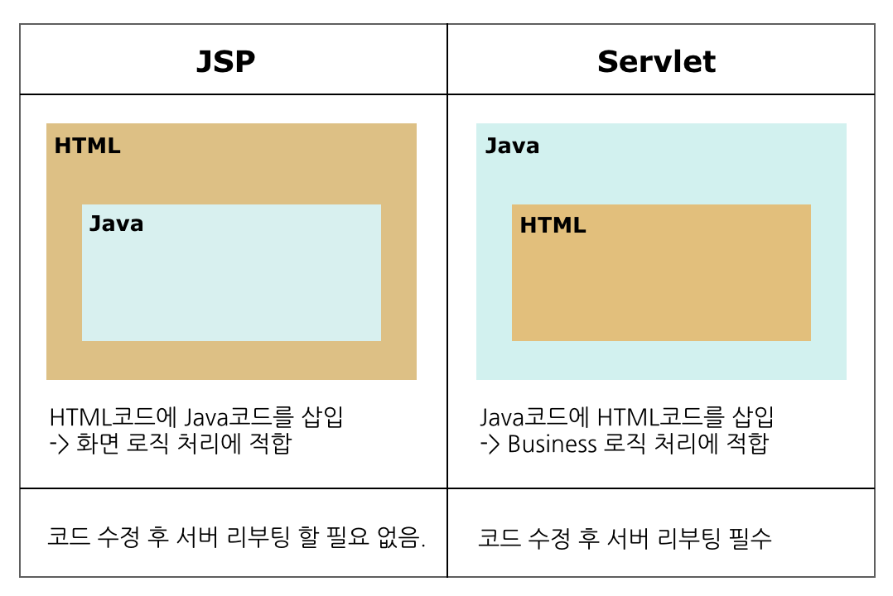
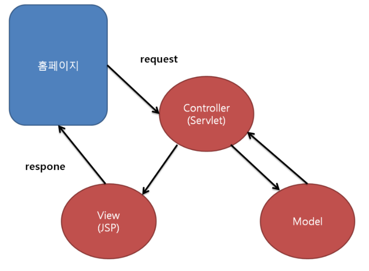

# JSP

# JSP란

- JavaServer Pages의 약자.
- HTML코드에 JAVA코드를 넣어 동적웹페이지를 생성하는 웹어플리케이션 도구.
- JSP가 실행되면 자바 서블릿으로 변환되며 웹 어플리케이션 서버에서 동작되면서 필요한 기능을 수행하고, 생성된 데이터를 웹페이지와 함께 클라이언트로 응답.

# Web Application

- 웹에서 실행되는 응용프로그램
- 인터넷을 통한 은행업무, 인터넷쇼핑 등 인터넷에서 하는 여러 서비스를 총칭
- 사용자는 요청(Request)하고, 서버는 요청을 수행 후 데이터를 응답(Response)

## 웹 어플리케이션 구성요소

- 웹 브라우저
    - 클라이언트에서 요청하고 전달받은 페이지를 볼수 있는 환경 ( 크롬, Safari 등)
- 웹 서버
    - 클라이언트로 부터 요청받아 서버에 저장된 리소스를 클라이언트에게 전달
    - 주로 정적컨텐츠
- 웹 어플리케이션 서버
    - 서버에서 필요한 기능을 수행하고, 결과를 웹서버에 전달한다.
- 데이터베이스
    - 서비스에 필요한 데이터를 보관, 갱신 등 관리

# Java Servlet

- 웹페이지를 동적으로 생성하기 위한 서버측 프로그램
- JAVA언어를 기반으로 만들어짐
- 웹 어플리케이션 서버 위에서 컴파일 되고 동작한다.

# JSP와 Servlet

| Servlet | JSP |
| --- | --- |
| 자바 코드로 구현, 컴파일, 배포해야 함 |  키워드가 태그화 되어 Servlet에 비해서 배우기 쉬움 |
|  HTML태그로 문자열로 처리해야 함 | 자바코드를 <% %>태그 안에 처리해야 함 |
| 코드가 수정되면 다시 컴파일하고 배포해야 함 | HTML처럼 태그를 사용하여 자바코드도 사용이 가능함 |

Servlet과 JSP는 사용방법에 차이가 있을 뿐 비슷한 역할을 수행한다. 

JSP는 웹어플리케이션 구조에서 사용자에게 결과를 보여주는 View의 역할을 담당.

Servlet은 Servlet의 기술적 장점을 최대한 사용할 수 있도록 사용자의 request를 받아 분석하고, 비즈니스층과 통신하여 처리한 결과를 다시 사용자에게 응답하는 Controller의 역할을 담당한다. 

참고자료

[https://joy-baek.tistory.com/32](https://joy-baek.tistory.com/32)

[https://javacpro.tistory.com/43](https://javacpro.tistory.com/43)

[https://velog.io/@junkue20/JSP이란-무엇일까](https://velog.io/@junkue20/JSP%EC%9D%B4%EB%9E%80-%EB%AC%B4%EC%97%87%EC%9D%BC%EA%B9%8C)