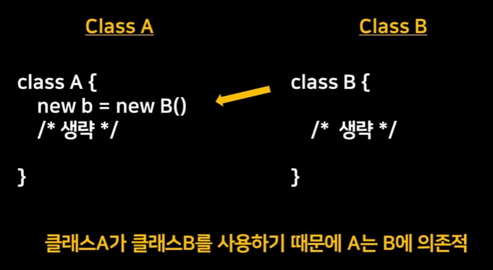

# POJO, PSA, IoC, AOP,

# POJO (Plain Old Java Object)

**특정한 제약이나 환경에 종속되지 않은 순수한 자바 객체** 

**(Spring IoC 컨테이너가 관리하는 자바 객체는 Bean이라 한다.)**

](images/s_img01.png)

출처) [https://ittrue.tistory.com/211](https://ittrue.tistory.com/211)

- **등장 배경 :**

```
자바를 이용해 비즈니스 서비스를 개발할 때 
비즈니스 로직 뿐만 아니라 트랜잭션, 보안 등 로우레벨의 로직까지 작성해야하는 
부담감을 없애고자 EJB(Enterprise Java Beans)를 만들게 되었다. 
EJB를 사용하면서 로우레벨의 로직 개발에 대한 수고를 덜 수 있었지만, 
한 두가지 기능을 사용하기 위해 거대한 EJB를 상속받거나 implements 하게 되어 가벼운 
서비스조차도 무겁게 만들어졌고, 다른 기능으로 대체하기 위해선 전체 코드를 수정해야 하는 
문제점이 발생하였다.

JAVA의 기본 개념인 객체지향에 집중하고, 특정 클래스나 라이브러리에 종속되지 않는 
POJO 구성으로 코드를 작성한다면 이런 문제점을 해결할 수 있을 것이라고 생각했다.
따라서 Spring은 POJO 방식을 기반으로 한 웹 프레임워크이고, IoC와 DI, AOP 등 
Spring의 주요 기술을 활용해 POJO 기반의 구성을 이루게 되었다.
```

### POJO 프로그래밍의 장점

1. 특정 제약이나 환경에 종속되지 않아서 재사용과 확장이 가능한 유연한 코드 작성 가능
2. 코드가 간결해지며 디버깅과 테스트가 용이
3. 객체지향적 설계를 자유롭게 적용

# 스프링의 주요 기술

## 1. DI(**Dependency Injection)**

```java
@Component
public class PersonService {
    private Person person;

    @Autowired
    public PersonService(Person person) {
        this.person = person;
    }

    public void printPerson() {
        System.out.println("Name: " + person.getName() + 
		", Age: " + person.getAge());
    }
}
//PersonService 클래스는 Person 객체에 의존하는 서비스
//Person 객체를 받기 위해 생성자 주입을 사용, Spring 컨테이너에서 제공된다.
```

**의존성 주입**

객체 간의 의존성을 외부에서 주입하는 디자인 패턴, 객체는 직접 자신이 필요로 하는 의존 객체를 생성하거나 관리하지 않고, 외부에서 주입된 의존 객체를 사용 → 결합도를 낮추고 유연한 구조 생성

## IoC(**Inversion of Control)**



](images/s_img02.png)

출처) [https://www.youtube.com/watch?v=1vdeIL2iCcM](https://www.youtube.com/watch?v=1vdeIL2iCcM)

**제어의 역전**

프로그램의 제어권이 개발자가 정의한 코드에서 외부 프레임워크 또는 컨테이너로 넘어가는 것을 의미 (매개체 = IoC컨테이너 : 개발자에게 일임받은 제어권을 사용하여 의존성을 관리, 주로 프레임워크가 포함)

**장점:**

1. 객체 간의 의존성을 줄이고 결합도를 낮춤 → 재사용성, 유지보수성 향상, 변화에 강하다
2. 테스트 용이성 향상
3. 코드양 감소

**DI (의존성 주입)** = IoC 컨테이너라는 매개체를 두고 여기에 필요한 모든 모듈들을 등록해둔다. 사용처에서 직접 생성하는 것이 아니라 필요할 때 IoC 컨테이너가 의존성이 있는 모듈들을 주입해주는 방식

## 2. AOP(**Aspect Oriented Programming)**

**관점 지향 프로그래밍**

애플리케이션의 로직은 크게 **핵심 기능**과 **부가 기능**으로 나누어진다.

- **핵심 기능** : 해당 객체가 제공하는 고유의 기능
- **부가 기능 (**= 횡단 관심사 cross-cutting concerns) : 핵심 기능을 보조하기 위해서 여러 객체에서 공통적으로 사용되는 기능 (로깅, 보안, 트랜잭션 등)

](images/s_img04.png)

출처) [https://engkimbs.tistory.com/entry/스프링AOP](https://engkimbs.tistory.com/entry/%EC%8A%A4%ED%94%84%EB%A7%81AOP)

위와 같은 부가 기능을 핵심 기능으로부터 분리함으로써 모듈성을 증가시키는 프로그래밍 패러다임

여러 객체에 공통으로 적용할 수 있는 기능을 분리해서 반복 작업을 줄이고 핵심 기능 개발에만 집중

**핵심 기능의 코드를 수정하지 않으면서 공통 기능의 구현을 추가하는 것**

### Spring AOP

1. **주요 용어**

](images/s_img05.PNG)

출처) [https://adjh54.tistory.com/133](https://adjh54.tistory.com/133)

1. **주요 어노테이션**

](images/s_img06.PNG)

출처) [https://adjh54.tistory.com/133](https://adjh54.tistory.com/133)

### AOP 구현 방법

- **컴파일 시점**에 코드에 공통 기능 삽입
- **클래스 로딩 시점**에 바이트 코드에 공통 기능 삽입
- **런타임 시점**에 프록시 객체를 생성하여 공통 기능 삽입 (**Spring에서 사용하는 방법**)
    - 컴파일러나 클래스 로더 조작기를 설정하지 않아도 된다.
    - 프록시는 메서드 오버라이딩 개념으로 동작하기 때문에, 스프링 AOP는 메서드 실행 시점에서만 AOP를 적용할 수 있다.
    - 스프링 AOP는 스프링 컨테이너가 관리할 수 있는 빈에만 AOP를 적용할 수 있다.
    - AspectJ를 직접 사용 X, AspectJ의 문법을 차용하고 프록시 방식의 AOP 적용

**프록시 :** 자신이 클라이언트가 사용하려고 하는 실제 대상인 것처럼 위장해서 클라이언트의 요청을 받아주는 것(대리인, 대리자), 객체와의 직접적인 상호 작용을 통제하거나 변경하지 않고 기능을 추가할 수 있어 유연성을 제공 (자세한 설명 [https://sabarada.tistory.com/20](https://sabarada.tistory.com/20))

## 3. PSA(Portable Service Abstraction)

이식 가능한서비스 추상화, 스프링이 제공하는 다양한 기술을 하나의 추상화된 인터페이스로 제공하여 개발자가 특정 기술에 종속되지 않고 서비스를 사용할 수 있도록 해준다. 유연성과 이식성을 높이고, 다른 기술로의 전환을 쉽게 해준다.

**PSA = 잘 만든 인터페이스**

Spring은 Spring Web MVC, Spring Transaction, Spring Cache 등의 다양한 PSA를 제공

### 출처)

[https://velog.io/@galaxy/Spring의-기본-특징-POJO](https://velog.io/@galaxy/Spring%EC%9D%98-%EA%B8%B0%EB%B3%B8-%ED%8A%B9%EC%A7%95-POJO)

[https://ittrue.tistory.com/211](https://ittrue.tistory.com/211)

[https://mangkyu.tistory.com/281](https://mangkyu.tistory.com/281)

[https://www.youtube.com/watch?v=1vdeIL2iCcM&t=161s](https://www.youtube.com/watch?v=1vdeIL2iCcM&t=161s)

[https://www.youtube.com/watch?v=hjDSKhyYK14](https://www.youtube.com/watch?v=hjDSKhyYK14) 

[https://adjh54.tistory.com/133](https://adjh54.tistory.com/133)

[https://hstory0208.tistory.com/entry/Spring-스프링-AOPAspect-Oriented-Programming란-Aspect](https://hstory0208.tistory.com/entry/Spring-%EC%8A%A4%ED%94%84%EB%A7%81-AOPAspect-Oriented-Programming%EB%9E%80-Aspect)

[https://dev-coco.tistory.com/83](https://dev-coco.tistory.com/83)
