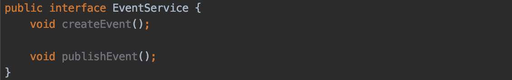
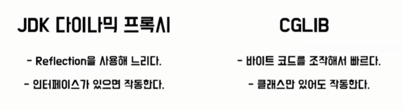

# Proxy

1. 클라이언트로부터 타겟을 대신해서 요청을 받는 대리인
2. 실제 오브젝트의 타겟은 프록시를 통해 최종적으로 요청받아 처리
3. 타겟은 자신의 기능에만 집중하고 부가기능은 프록시에게 위임

](images/041101.PNG)

출처) [https://www.youtube.com/watch?v=MFckVKrJLRQ&ab_channel=우아한테크](https://www.youtube.com/watch?v=MFckVKrJLRQ&ab_channel=%EC%9A%B0%EC%95%84%ED%95%9C%ED%85%8C%ED%81%AC)

### 사용 목적

1. 클라이언트가 타겟에 접근하는 방법을 **제어**
2. 타겟에 **부가적인 기능**을 부여

### 프록시 패턴

](images/041106.png)

출처) [https://velog.io/@max9106/Spring-프록시-AOP-xwk5zy57ee](https://velog.io/@max9106/Spring-%ED%94%84%EB%A1%9D%EC%8B%9C-AOP-xwk5zy57ee)

TestEventService의 createEvent 메서드와 publishEvent 메서드에 동일한 기능을 하는 코드를 넣고 싶을 때, 각각 메서드에 넣어주는 것은 효율성이 떨어진다. → 프록시 패턴 사용

](images/041107.png)

출처) [https://velog.io/@max9106/Spring-프록시-AOP-xwk5zy57ee](https://velog.io/@max9106/Spring-%ED%94%84%EB%A1%9D%EC%8B%9C-AOP-xwk5zy57ee)

프록시 객체는 원래 객체와 같은 interface를 구현해준 후 원래 객체를 주입받아서 interface의 메서드들을 위임받아 사용하고, 원하는 추가 코드를 넣어주면 된다.

### 장점

- OCP : 기존 코드 변경없이 기능을 추가
- SRP : 기존 코드가 해야 하는 일만 유지할 수 있음
- 기능 추가, 접근 제어 등 다양하게 응용하여 활용할 수 있음

### 단점

- 코드의 복잡도 증가
- 중복 코드 발생

이를 개선한게..

# JDK Dynamic Proxy

- 프록시 클래스를 직접 구현하지 않아도 됨 → 코드 복잡도 해소
- Invocation Handler → 중복 코드 제거
    - Reflection API : 구체적인 클래스 타입을 알지 못해도 런타임에 클래스의 정보에 접근할 수 있게 해주는 자바 API, 외부 라이브러리에 의존 X, **성능상 느리다**

](images/041108.PNG)

출처) [https://www.youtube.com/watch?v=MFckVKrJLRQ&ab_channel=우아한테크](https://www.youtube.com/watch?v=MFckVKrJLRQ&ab_channel=%EC%9A%B0%EC%95%84%ED%95%9C%ED%85%8C%ED%81%AC)

](images/041110.PNG)

출처) [https://www.youtube.com/watch?v=MFckVKrJLRQ&ab_channel=우아한테크](https://www.youtube.com/watch?v=MFckVKrJLRQ&ab_channel=%EC%9A%B0%EC%95%84%ED%95%9C%ED%85%8C%ED%81%AC)

### 특징

1. JDK에서 지원하는 프록시 생성 방법, 외부 의존 X
2. Reflection API 사용 → 느리다
3. **인터페이스가 반드시 필요**
4. Invocation Handler를 재정의한 **invoke를 구현해줘야 부가기능이 추가**된다.

# CGLIB

- **상속을 통한 프록시 구현**
- 바이트 코드를 조작해서 프록시 생성
- MethodInterceptor를 재정의한 intercept를 구현해야 부가기능이 추가된다.

](images/041109.PNG)

출처) [https://www.youtube.com/watch?v=MFckVKrJLRQ&ab_channel=우아한테크](https://www.youtube.com/watch?v=MFckVKrJLRQ&ab_channel=%EC%9A%B0%EC%95%84%ED%95%9C%ED%85%8C%ED%81%AC)

](images/041111.PNG)

출처) [https://www.youtube.com/watch?v=MFckVKrJLRQ&ab_channel=우아한테크](https://www.youtube.com/watch?v=MFckVKrJLRQ&ab_channel=%EC%9A%B0%EC%95%84%ED%95%9C%ED%85%8C%ED%81%AC)

### 특징

1. 인터페이스에도 강제로 적용할 수 있다. 이때는 클래스에도 프록시를 적용시켜야 한다.
2. 메서드에 final을 붙이면 오버라이딩이 불가능하다.
3. **net.sf.cglib.proxy.Enhancer 의존성을 추가해야한다.**
4. **Default 생성자 필요**
5. **타겟의 생성자 두번 호출**

# JDK Dynamic Proxy vs CGLIB

### CGLIB

1. 메소드가 처음 호출되었을 때 동적으로 타겟 클래스의 바이트 코드 조작
2. 이후 호출시엔 조작된 바이트 코드를 재사용

](images/041113.PNG)

출처) [https://www.youtube.com/watch?v=MFckVKrJLRQ&ab_channel=우아한테크](https://www.youtube.com/watch?v=MFckVKrJLRQ&ab_channel=%EC%9A%B0%EC%95%84%ED%95%9C%ED%85%8C%ED%81%AC)

**스프링 부트 CGLIB 디폴트**

이유) 인터페이스 기반 프록시는 때때로 ClassCast Exceptions를 추적하기 어렵게 한다.

](images/041112.PNG)

출처) [https://www.youtube.com/watch?v=MFckVKrJLRQ&ab_channel=우아한테크](https://www.youtube.com/watch?v=MFckVKrJLRQ&ab_channel=%EC%9A%B0%EC%95%84%ED%95%9C%ED%85%8C%ED%81%AC)

### Spring Proxy 구현

1. Spring 에서는 프록시를 Bean으로 만들어주는 ProxyFactoryBean을 제공한다.
2. ProxyFactoryBean을 통해 Proxy를 생성 할 수 있음

### ProxyFactoryBean 특징

1. 타겟의 인터페이스 정보가 필요없다.
2. 프록시 빈을 생성해준다.
3. 부가기능을 MethodInterceptor로 구현

**InvocationHandler는 타겟의 정보 가지고 있어야한다. (의존적) 필드로 가져야한다.**

](images/041115.PNG)

출처) [https://www.youtube.com/watch?v=MFckVKrJLRQ&ab_channel=우아한테크](https://www.youtube.com/watch?v=MFckVKrJLRQ&ab_channel=%EC%9A%B0%EC%95%84%ED%95%9C%ED%85%8C%ED%81%AC)

](images/041114.PNG)

출처) [https://www.youtube.com/watch?v=MFckVKrJLRQ&ab_channel=우아한테크](https://www.youtube.com/watch?v=MFckVKrJLRQ&ab_channel=%EC%9A%B0%EC%95%84%ED%95%9C%ED%85%8C%ED%81%AC)

- MethodInterceptor는 타켓 정보를 가지지 않음
- 부가기능을 독립적으로 유지하기 위해
- 부가기능을 싱글톤으로 공유하여 사용할 수 있다.

**ProxyFactoryBean** 

1. 스프링에서 지원하는 프록시 생성 방법
2. MethodInterceptor를 재정의한 invoke를 구현해줘야 부가기능이 추가된다.
3. 인터페이스가 반드시 필요하지 않다.
4. 한계) ProxyFactoryBean 매번 생성해주어야한다.

**GPT**

1. **CGLIB (Code Generation Library)**:
    - CGLIB은 동적으로 클래스를 생성하여 프록시를 만드는 데 사용되는 라이브러리입니다.
    - CGLIB은 클래스의 상속을 통해 프록시를 생성하기 때문에, 대상 클래스가 final이거나 메서드가 final이면 프록시를 생성할 수 없습니다.
    - CGLIB 프록시는 대상 클래스의 모든 메서드를 오버라이딩하여 프록시로 감싸는 방식을 사용합니다.
2. **ProxyFactoryBean의 MethodInterceptor**:
    - ProxyFactoryBean은 스프링 AOP를 구현하기 위한 일종의 팩토리 클래스입니다.
    - ProxyFactoryBean은 프록시를 생성할 때 사용하는 MethodInterceptor를 지정할 수 있습니다.
    - MethodInterceptor는 스프링 AOP에서 Advice를 구현하는 인터페이스 중 하나이며, 프록시가 호출되는 메서드 전후에 실행될 코드를 정의할 수 있습니다.
    - MethodInterceptor를 구현한 클래스는 invoke 메서드를 오버라이딩하여 Advice의 동작을 정의합니다.

따라서 CGLIB은 프록시를 생성하는 라이브러리이고, ProxyFactoryBean은 스프링에서 AOP를 구현하기 위한 클래스입니다. CGLIB은 클래스의 상속을 통해 프록시를 생성하는 반면, ProxyFactoryBean은 스프링의 MethodInterceptor 인터페이스를 사용하여 Advice를 구현하여 프록시 동작을 제어합니다.

### 출처)

[https://www.youtube.com/watch?v=MFckVKrJLRQ&ab_channel=우아한테크](https://www.youtube.com/watch?v=MFckVKrJLRQ&ab_channel=%EC%9A%B0%EC%95%84%ED%95%9C%ED%85%8C%ED%81%AC)

[https://velog.io/@max9106/Spring-프록시-AOP-xwk5zy57ee](https://velog.io/@max9106/Spring-%ED%94%84%EB%A1%9D%EC%8B%9C-AOP-xwk5zy57ee)
