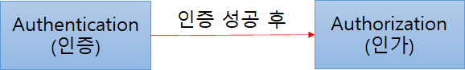
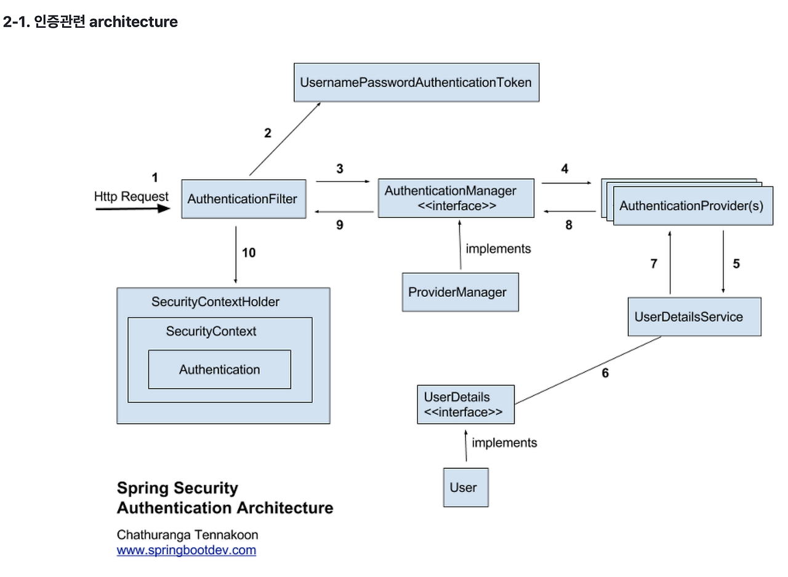

# Spring Security 개념과 인증처리 과정

# Spring Security

> 스프링 기반의 애플리케이션의 보안(인증과 권한, 인가 등)을 담당하는 프레임워크. 보안과 관련해서 체계적으로 많은 옵션을 제공해주기 때문에 개발자 입장에서 일일이 보안관련 로직을 작성하지 않아도 된다는 장점이 있다.
> 

필터(Fileter)기반으로 동작하기 때문에 스프링 MVC와 분리되어 관리 및 동작한다.

## 인증(Authorization)과 인가(Authentication)

- 인증 : 해당 사용자가 본인이 맞는지를 확인한느 절차
- 인가 : 인증된 사용자가 요청한 자원에 접근 가능한지를 결정하는 절차



Spring Security는 기본적으로 인증 절차를 거친 후에 인가 절차를 진행하며, 인가 과정에 해당 리소스에 대한 접근 권한이 있는지 확인한다. 

인증과 인가를 위해 Principal을 아이디로, Credential을 비밀번호로 사용하는 Credential기반의 인증 방식을 사용한다.

- Principal(접근 주체) : 보호받는 Resource에 접근하는 대상
- Credential(비밀 번호) : Resource에 접근하는 대상의 비밀번호

## Spring Security모듈

### Authentication

현재 접근하는 주체의 정보와 권한을 담는 인터페이스.

```java
ublic interface Authentication extends Principal, Serializable {
    // 현재 사용자의 권한 목록을 가져옴
    Collection<? extends GrantedAuthority> getAuthorities();
    
    // credentials(주로 비밀번호)을 가져옴
    Object getCredentials();
    
    Object getDetails();
    
    // Principal 객체를 가져옴.
    Object getPrincipal();
    
    // 인증 여부를 가져옴
    boolean isAuthenticated();
    
    // 인증 여부를 설정함
    void setAuthenticated(boolean isAuthenticated) throws IllegalArgumentException;
}
```

### SecurityContext

Authentication을 보관하는 역할을 하며, SecurityContext를 통해 Authentication객체를 꺼내 올 수 있다.

### SecurityContextHolder

보안 주체의 세부 정보를 포함하여 응용프로그램의 현재 보안 컨텍스트에 대한 세부 정보가 저장된다. 

1. 유저가 로그인을 통해 인증을 마친다. 
2. 인증에 성공하면 principal과 credential 정보를 **Authentication**에 담는다.
3. Spring Security에서 **Authentication**을 **SpringContext**에 보관한다.
4. 이 **SpringContext**를 **SecurityContextHolder**에 담아 보관한다.

### UserDetails

인증에 성공하여 생성된 UserDetails객체는 Authentication객체를 구현한 UsernamePasswordAuthenticationToken을 생성하기 위해 사용된다. UserDetails를 implements하여 처리할 수 있다.

```java
public interface UserDetails extends Serializable {

    Collection<? extends GrantedAuthority> getAuthorities();

    String getPassword();

    String getUsername();

    boolean isAccountNonExpired();

    boolean isAccountNonLocked();

    boolean isCredentialsNonExpired();

    boolean isEnabled();
    
}
```

### UserDetailsService

UserDetailsService는 UserDetails객체를 반환하는 하나의 메서드만을 가지고 있는데, 일반적으로 이를 implements 한 래스에 UserRepository를 주입받아 DB와 연결하여 처리한다. 

즉, 이곳에서 DB의 사용자 정보를 조회한다. 

```java
public interface UserDetailsService {

    UserDetails loadUserByUsername(String var1) throws UsernameNotFoundException;

}
```

### UsernamePasswordAuthenticationToken

Authentication을 implements한 AbstractAuthenticationToken의 하위 클래스로, User의 ID가 Principal역할을 하고, Password가 Credential의 역할을 한다.

UsernamePasswordAuthenticationToken의 첫 번째 생성자는 인증 전의 객체를 생성하고, 두 번째는 인증이 완료된 객체를 생성한다.

```java
public class UsernamePasswordAuthenticationToken extends AbstractAuthenticationToken {
    // 주로 사용자의 ID에 해당함
    private final Object principal;
    // 주로 사용자의 PW에 해당함
    private Object credentials;
    
    // 인증 완료 전의 객체 생성
    public UsernamePasswordAuthenticationToken(Object principal, Object credentials) {
		super(null);
		this.principal = principal;
		this.credentials = credentials;
		setAuthenticated(false);
	}
    
    // 인증 완료 후의 객체 생성
    public UsernamePasswordAuthenticationToken(Object principal, Object credentials,
			Collection<? extends GrantedAuthority> authorities) {
		super(authorities);
		this.principal = principal;
		this.credentials = credentials;
		super.setAuthenticated(true); // must use super, as we override
	}
}

public abstract class AbstractAuthenticationToken implements Authentication, CredentialsContainer {
}
```

### AuthenticationManager

인증에 대한 부분은 AuthenticationManager를 통해서 처리하게 되는데, 실질적으로는 AuthenticationManager에 등록된 AuthenticationProvider에 의해 처리된다. 

(이것을 implements 한 것이 ProviderManager이다.)

인증에 성공하면 두 번째 생성자를 이용해 객체를 생성하여 SecurityContext에 저장한다.

### AuthenticationProvider

AuthenticationProvider에서는 실제 인증에 대한 부분을 처리하는데, 인증 전의 Authentication객체를 받아서 인증이 완료된 객체를 반환하는 역할을 한다.

# Spring Security인증 처리 과정



### 1 ) 유저가 로그인을 시도한다.

### 2 ) AuthenticationFilter 에서 인증을 처리한다.

Servlet Filter에 의해서 Security Filter로 Security작업이 위임되고, 여러 Security Filter 중에서 UsernamePasswordAuthenticationFilter에서 인증을 처리한다.

### 2-2) UsernameAuthenticationToken 발급

AuthenticationFilter는 HttpServletRequest에서 아이디와 비밀번호를 추출하여 UsernameAuthenticationToken 토큰을 발급한다.

### 3 ) AuthenticationManager에게 인증 객체 전달

AuthenticationFilter는 AuthenticationManager에게 인증 객체를 전달한다. AuthenticationManager는 인증을 담당한다. 그래서 2번에서 발급한 토큰이 올바른 유저인지 확인한다.

### 4 ) 인증을 위해 AuthenticationProvider에게 인증 객체 전달

### 5 ) 전달받은 인증 객체의 정보를 UserDetailsService에 전달

AuthenticationProvider는 전달받은 인증 객체의 정보를 UserDetailsService에 넘겨준다.

### 6 ) UserDetails 구현 객체 생성

UserDetailsService는 전달받은 사용자 정보를 통해 DB에서 알맞은 사용자를 찾고 이를 기반으로 UserDetails를 구현한 객체를 반환한다. 

### 7 ) UserDetails객체를 AuthenticationProvider에 전달

### 8 ) ProviderManager에게 권한을 담은 검증된 인증 객체를 전달

AuthenticationProvider은 전달받은 UserDetails를 인증해 성공하면 ProviderManager에게 권한을 담은 검증된 인증 객체를 전달한다.

### 9 ) 검증된 인증 객체를 AuthenticationFilter에게 전달

ProviderManager가 AuthenticationFilter에 전달한다.

### 10 ) 검증된 인증 객체를 SecurityContextHolder의 SecurityContext에 저장

AuthenticationFilter가 UserDetails정보를 SecurityContextHolder에 저장한다. 

출처

[https://hello-judy-world.tistory.com/216](https://hello-judy-world.tistory.com/216)

[https://mangkyu.tistory.com/76](https://mangkyu.tistory.com/76)