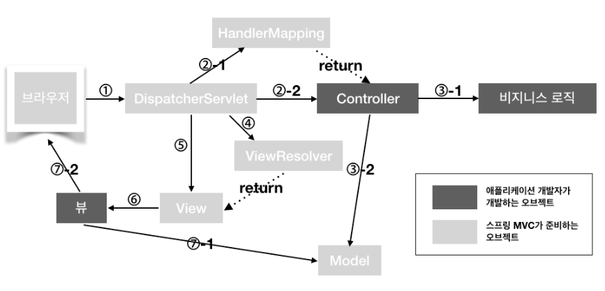

# Web MVC 요청 처리 과정

## Spring Framework가 제공하는 Class

### DispatcherServlet

- 스프링 프레임워크가 제공하는 servlet 클래스
- 클라이언트의 요청을 처음으로 받는 클래스
- Dispathcer가 받은 요청은 HandlerMapping으로 넘어간다.

### HandlerMapping

- 사용자의 요청을 처리할 Controller를 찾는다.
- 요청 url에 해당하는 Controller 정보를 저장하는 table을 가진다.
- 즉, 클래스에 @RequestMapping("/url") annotation을 명시하면 해당 URL에 대한 요철이 들어왔을 때, table에 저장된 정보에 따라 해당 클래스 또는 메서드에 Mapping한다.

### ViewResolver

- Controller가 반환한 View name에 prefix, suffix를 적용하여 View Object를 반환한다.
- View name : home, prefix : /WEB-INF/views, suffix:.jsp 라면 "/WEB-INF/views/home.jsp"라는 위치의 View에 Controller에게 받은 Model을 전달한다.
- 이후 해당 View에서 Model data를 이용하여 적절한 페이지를 만들어 사용자에게 보여준다.

## MVC 요청 처리 과정

1. 클라이언트가 웹 브라우저에서 HTTP 요청을 전송 -> DispatcherServlet 이 이 요청을 받아들임

2. DispatcherServlet은 요청 처리를 위해 HandlerMapping에게 요청을 전달하고 HandlerMapping은 요청 URL과 일치하는 컨트롤러(Controller)를 찾아서 DispatcherServlet에게 반환한다.

3. DispatcherServlet은 선택된 controller의 비즈니스 로직 실행 작업을 HandlerAdapter에게 위임한다.

4. HandlerAdapter는 Controller를 호출(비니지스 로직 호출)해서 Model 데이터와 View 이름을 반환

5. DispatcherServlet 은 ViewResolver에게 view 이름을 전달하며 검색 요청

6. ViewResolver는 View 이름을 실제 View 객체로 변환

7. DispatcherServlet 은 View를 실행하여 결과를 클라이언트에게 반환

 
 
 
---

출처 : https://velog.io/@hsw0194/Spring-MVC-HandlerMapping%EC%9D%98-%EB%8F%99%EC%9E%91%EB%B0%A9%EC%8B%9D-%EC%9D%B4%ED%95%B4%ED%95%98%EA%B8%B0-1%ED%8E%B8
