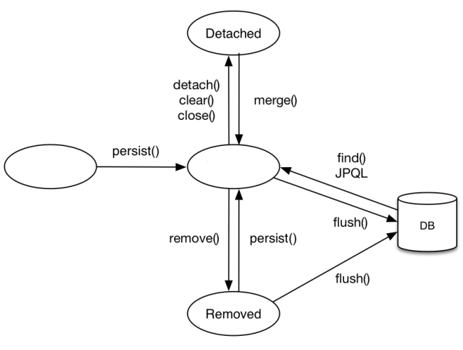

# JSP

1. JSP는 OOOO코드에 XXXX코드를 넣어 동적 웹페이지를 생성하는 웹어플리케이션 도구이다. OOOO와 XXXX에 들어갈 말을 쓰세요
2. JSP가 담당하는 역할은?
    1. model
    2. view
    3. controller

# 영속성 컨텍스트

1. 빈칸에 들어갈 단어를 각각 쓰세요

1. 영속성 컨텍스트 특징을 2개 이상 쓰세요

# 다대다 해결전략

1. 다대다 관계의 문제점을 쓰세요.
2. 해결방안을 쓰세요

# @valid 를 사용한  dto검증

1. @valid란?
2. @valid를 추가해야하는 부분은?
    1. dto
    2. service
    3. controller

# spring security개념과 인증처리 과정

1. 스프링기반의 애플리케이션의 보안을 담당하는 프레임워크/라이브러리 이다. 
    
    둘중 하나 고르세요.
    
2. 인증과 인가의 정의를 쓰세요
3. spring security에서 Principal 객체란?
4. spring security는 OO기반으로 동작한다.

# 웹 애플리케이션 이해

1. WS와 WAS의 차이를 알려주세요.

2. 스레드 풀에 대해 설명하고, 사용시 얻을 수 있는 효과를 알려주세요.

# POJO, PSA, IoC, AOP

1. IoC/DI에 대해 간단히 설명해주세요.

2. AOP에 대해 간단히 설명해주세요.

3. PSA에 대해 간단히 설명해주세요.

# Proxy

1. Proxy객체에 대해 간단히 설명해주세요.

2. Proxy의 사용 목적을 알려주세요.

# @Autowired

1. @Autowired 방법 3가지를 알려주세요.

2. 위의 3가지 중 주로 쓰는 방식이 무엇인지와 쓰는 이유를 알려주세요.

# Spring vs Spring Boot

1. Spring의 개선할 점 2가지를 알려주세요.

2. SpringBoot 사용시 얻을 수 있는 장점 2가지를 알려주세요.

# 서블릿

1. 서블릿에서 HTTP 요청 메시지를 편리하게 사용할 수 있도록 HTTP 요청 메시지를 파싱하는 객체는?(대소문자 주의)

2. 서블릿 컨테이너의 특징은?

# Eager, Lazy Loading

1. 즉시 로딩(Eager Loading)과 지연 로딩(Lazy Loading)에 대해 설명하시오.
   
2. 객체 조회 시 항상 연관된 객체까지 함께 조회되는 것은 효율적이지 않은데, 이때 지연 로딩을 사용하기 위해
사용 되는 객체란 무엇인가?

# Filter and Interceptor

1. Filter와 Interceptor는 각각 어디에서 관리되는가?

2. 인터셉터의 메소드 가운데, 컨트롤러가 호출되기 전에 실행이 되며, 컨트롤러 이전에 처리해야 하는 전처리
작업이나 요청 정보를 가공하거나 추가하는 경우에 사용되는 메소드는 무엇인가?
