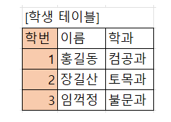
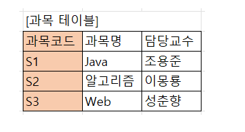
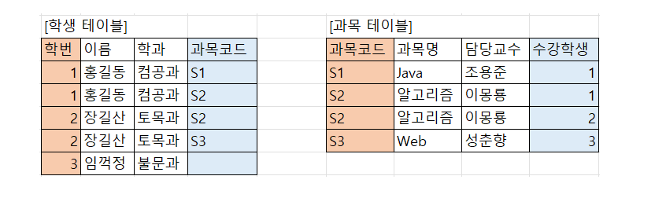
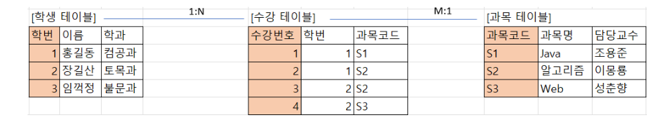

# 다대다 해결전략

# 다대다[N:M]

관계형 데이터베이스는 정규화된 테이블 2개로 다대다 관계를 표현할 수 없다.

연결 테이블(조인 테이블)을 추가해서 일대다, 다대일 관계로 풀어내야한다.

### 학생과 과목의 관계

학생은 여러 과목을 수강할 수 있고, 과목은 여러 학생에게 수강 될 수 있다.

학생은 학번,이름,학과에 대한 정보를 갖는다. 학번이 각각의 학생을 구별하는 P.K가 된다.



과목은 과목코드, 과목명, 담당교수를 갖는다. 과목코드가 각각의 과목을 구별하는 P.K가 된다.



두 테이블은 서로 관계를 가질 수 있다.

홍길동이 S1,S2를 수강하고 장길산은 S2와 S3를 수강했다고 하자. 

**학생테이블**에서 학생의 수강 정보를 확인하기 위해서 학생이 수강한 **과목정보**가 **필요**하고, 

**과목테이블**에서는 수강생의 정보를 관리하기 위한 **학번**이 **필요**하다. 

때문에 테이블은 아래와 같이 구성된다. 


# 다대다 관계의 문제점

- 테이블의 PK가 없어져 학생테이블에서는 학번만으로 데이터를 구분할 수 없어졌다. 그렇다고 학번+과목코드의 조합키로 구별할수도 없다. (S1을 수강한 1번 학생과 S2를 수강한 1번 학생이 다른 학생이 아님)
- 데이터의 중복이 발생한다.(1번학생의 수강과목을 확인하기 위해 학생테이블을 확인해야할지 과목테이블을 확인해야 할지 애매하다.)

# 해결 방안

N:M관계를 1:N, 1:M 으로 풀어줄 수 있는 연관 테이블을 추가해준다. 



Member와 Product의 관계에서 MemberProduct라는 엔티티 추가. 

해당 MemberProduct엔티티에서 member와 Product를 FK로 가지며, 다른 부가 정보들을 추가할 수 있다.

연결 테이블

```java
@Entity
public class MemberProduct {

    @Id @GeneratedValue
    private Long id;

    @ManyToOne
    @JoinColumn(name = "MEMBER_ID")
    private Member member;

    @ManyToOne
    @JoinColumn(name = "PRODUCT_ID")
    private Product product;

    private int amount;
    private int price;

    private LocalDateTime orderDateTime;
}
```

MemberProduct는 MEMBER_ID와 PRODUCT_ID를 FK로 가지게 되고, 각각 ManyToOne으로 연관관계의 주인이된다.

```java
@Entity
public class Member {
    @Id @GeneratedValue
    private Long id;
    private String username;

    @OneToMany(mappedBy = "member")
    private List<MemberProduct> memberProducts = new ArrayList<>();
}
```

Member는 MemberProduct의 member와 매핑된다.

```java
@Entity
public class Product {
    @Id @GeneratedValue
    private Long id;
    private String name;

    @OneToMany(mappedBy = "product")
    private List<MemberProduct> memberProducts = new ArrayList<>();
}
```

Product는 MemberProduct의 product와 매핑된다.

참고자료

[https://ict-nroo.tistory.com/127](https://ict-nroo.tistory.com/127)

[https://goodteacher.tistory.com/466](https://goodteacher.tistory.com/466)

[https://innovation123.tistory.com/180](https://innovation123.tistory.com/180)