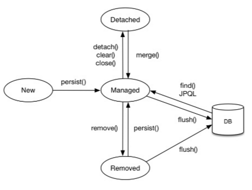

# 영속성 컨텍스트

# 영속성 컨텍스트란

- 엔티티를 영구 저장하는 환경
- 애플리케이션과 데이터베이스 사이에서 객체를 보관하는 가상의 데이터베이스 같은 역할
- 엔티티매니저를 통해 엔티티를 저장하거나 조회하면 엔티티 매니저는 영속성 컨텍스트에 엔티티를 보관하고 관리한다.

# 엔티티의 생명주기

- 비영속(new/transient) : 영속성 컨텍스트와 전혀 관계 없는 상태
- 영속(managed) : 영속성 컨텍스트에 저장된 상태
- 준영속(detached) : 영속성 컨텍스트에 저장되었다가 분리된 상태
- 삭제(removed) : 삭제된 상태


    
    

# 비영속

객체를 생성한 상태. 아직 영속성 컨텍스트에 저장하지 않은 상태

```java
Member member = new Member();
```

# 영속

엔티티 매니저를 통해서 엔티티를 영속성 컨텍스트에 저장한 상태. 영속성 컨텍스트에 의해 관리됨.

```java
EntityManager em = EntityManagerFactory.createEntityManager();
em.getTransaction().begin();

Member member = new Member();
em.persist(member);
```

# 준영속

영속성 컨텍스트가 관리하던 영속 상태의 엔티티를 더이상 관리하지 않게 함

1차캐시, 쓰기 지연, 변경 감지, 지연 로딩 등 영속성 컨텍스트가 제공하는 기능이 동작하지 않는다.

```java
em.detach(member);
```

# 삭제

엔티티를 영속성 컨텍스트와 데이터베이스에서 삭제한다.

```java
em.remove(member);
```

# 영속성 컨텍스트의 특징

- 1차캐시
- 동일성 보장
- 트랜잭션을 지원하는 쓰기 지연
- 변경 감지
- 지연 로딩

    

영속성 컨텍스트에는 1차 캐시 영역과 쓰기 지연 SQL저장소 영역이 있다.

## 1차캐시

영속성 컨텍스트의 내부 캐시를 1차 캐시라고 한다.

영속상태의 엔티티를 1차캐시에 저장한다.

1차 캐시의 키는 식별자값 (데이터베이스의 기본 키)이고 값은 엔티티 인스턴스이다.

## 영속성 컨텍스트의 조회 - find()

### 1차 캐시에서 조회하는 경우

```java
Member member = new Member();
member.setId("1");
member.setUsername("홍길동");

em.persist(member);

Member member = em.find(Member.class,"1"); //em.find(엔티티 클래스 타입,식별자 값);
```

- 객체를 생성한 후 em.persist(member)를 통해 1차 캐시에 저장한다.
- 1차 캐시에 저장된 상태에서 find() 메서드를 통해 조회할 경우 1차 캐시에 저장된 데이터를 그대로 조회한다.

### 데이터베이스에서 조회하는 경우

```java
Member findMember2 = em.find(Member.class, "2");
```

- find()메서드는 먼저 영속성 컨텍스트의 1차 캐시에 조회할 엔티티가 존재하는지 먼저 탐색한다.
- 1차 캐시에 존재하지 않을 경우 데이터베이스에서 조회한 뒤 1차 캐시에 저장한다.
- 이후 조회 데이터를 반환한다.

### 같은 데이터를 2번 조회할 경우

```java
Member findMember1 = em.find(Member.class, "1");
Member findMember2 = em.find(Member.class, "1");

System.out.println(findMember1 == findMember2); // true. 조회된 데이터는 같은 데이터.-> 영속 엔티티의 동일성을 보장한다는 의미
```

- 먼저 1을찾기 위해 1차 캐시를 찾는다.
- 1차 캐시에 존재하지 않기 때문에데 이터베이스에 접근해 조회한다.
- 이후 1차 캐시에 저장한 뒤 1을 반환한다.
- 두번째 find가 실행되면 1차 캐시에서 데이터를 조회한다.
- 1차 캐시에 존재하기 때문에 1차캐시에 저장된 1을 반환한다.
- 같은 데이터를 2번 조회할 경우 조회 쿼리는 1회만 실행된다.

## 엔티티 등록 - 쓰기 지연

엔티티 매니저는 데이터 변경 시 반드시 트랜잭션을 시작해야 한다.

```java
EntityManager em = EntityManagerFactory.createEntityManager();
EntityTransaction tx = em.getTransaction(); // 트랜잭션

// 트랜잭션 시작
tx.begin();

// 비영속
Member member = new Member();
member.setId("1");
member.setUsername("홍길동");

// 영속
em.persist(member);

// 엔티티 등록
tx.commit();

```

- em.persist(member) : member 엔티티를 영속 컨텍스트에 저장하지만 데이터베이스에는 반영되지 않는다.
- tx.commit() : 트랜잭션을 커밋하는 순간 데이터베이스에 INSERT SQL을 보내 저장한다.
- persist()를 실행할 때, 영속 컨텍스트의 1차 캐시에 member엔티티가 저장되고. 쓰기 지연 SQL저장소에는 member엔티티의 INSERT SQL 쿼리문이 저장된다.
- txcommit()을 실행하는 순간 쓰기 지연 SQL저장소에 저장된 INSERT SQL 쿼리를 보내 데이터베이스에 저장한다.
    
    ⇒ 여러개의 엔티티를 생성하고 persist를 하더라도 commit()을 하기 전에는 데이터베이스에 저 장되지 않는다. 이를 쓰기 지연이라 하며, 영속 커넥스트의 장점이다.
    

## 엔티티 수정 - 변경감지

```java
EntityManager em = EntityManagerFactory.createEntityManager();
EntityTransaction tx = em.getTransaction(); // 트랜잭션

// 트랜잭션 시작
tx.begin();

// member 조회
Member member = em.find(Member.class, "1");
member.setUsername("hello");
member.setAge("20");

// 엔티티 등록
tx.commit();
```

- 변경 감지(Dirty Checking)기능을 제공한다.
- 변경을 감지하기 때문에 엔티티의 수정은 set메서드를 통해서 변경하면, 별다른 로직 없이 트랜잭션 커밋을 하는 순간에 업데이트된다.
- 영속 컨텍스트의 1차 캐시에 member의 초기 데이터가 저장된다.
- 이후 set 메서드를 통해 데이터를 변경한다.
- 트랜잭션 커밋 시 flush()가 발생하면서 1차 캐시에서 엔티티와 스냅샷을 비교하여 변경에 대한 감지를 한다.
- 이후 SQL UPDATE 쿼리를 생성하여 쓰기 지연 SQL저장소에서 쿼리를 보낸다.
- DB에 저장된 데이터가 수정된다.

## 엔티티 삭제

```java
Member member = em.find(Member.class, "1");
em.remove(member); // 엔티티 삭제
```

- 엔티티 삭제는 remove() 메서드를 통해 데이터를 삭제할 수 있다.
- 영속성 컨텍스와 데이터베이스에서 모두 제거된다.

## 플러시 - flush()

- 트랜잭션 커밋을 실행하면 플러시가 발생하여 데이터베이스에 반영된다.
- 플러시는 영속성 컨텍스트의 변경 내용을 데이터베이스에 반영하는 것이다.

### 플러시 발생 시

- 변경감지(dirty checking)
- 수정된 엔티티 쓰기 지연 SQL 저장소에 등록
- 쓰기 지연 SQL저장소의 쿼리를 데이터베이스에 전송(등록, 수정,삭제 쿼리)

### 영속성 컨텍스트를 플러시 하는 방법

- em.flush - 직접 호출(테스트에 사용)
- tx.commit() - 트랜잭션 커밋을 통한 자동 호출
- JPQL 쿼리 실행 - 플러시 자동 호출

### 직접 호출 예시

```java
Member member = new Member(200L, "member200");
em.persist(member);

em.flush(); // 강제 호출
System.out.println("------------");

tx.commit();
```

- flus()는 변경을 감지하여 데이터베이스에 반영하는 역할을 한다.
- 따라서 이후에 commit()이 발생해도 쿼리를 다시 실행하지는 않는다.
- 또한 flush()를 한다고 해서 1차 캐시의 내용이 사라지지 않는다.

## 준영속상태

em.persist()또는 em.find()를 실행하면 해당 데이터는 영속 컨텍스트에 저장되어 영속 상태가 된다.

- 준영속 상태는 영속 상태의 엔티티가 영속성 컨텍스트에서 분리(detached)된 상태를 말한다.
- 준영속 상태에서는 영속성 컨텍스트가 제공하는 기능을 사용하지 못하게 된다.

### 준영속 상태로 만드는 방법

- em.detach(entity) : 특정 엔티티만 준영속상태로 변환
- em.clear() : 영속성 컨텍스트를 완전히 초기화
- em.close() : 영속성 컨텍스트를 종료

참고자료

[https://ittrue.tistory.com/254](https://ittrue.tistory.com/254)

[https://velog.io/@neptunes032/JPA-영속성-컨텍스트란](https://velog.io/@neptunes032/JPA-%EC%98%81%EC%86%8D%EC%84%B1-%EC%BB%A8%ED%85%8D%EC%8A%A4%ED%8A%B8%EB%9E%80)