# 웹 애플리케이션 이해

# 1. 웹 서버, 웹 애플리케이션 서버

웹은 HTTP를 기반으로 통신(클라이언트 → 서버 전송, 서버 → 클라이언트 응답)

- HTML, TEXT
- 이미지, 음성, 영상, 파일
- JSON, XML (API)
- 거의 모든 형태의 데이터 전송 가능
- 서버간에 데이터 교환도 대부분 HTTP 사용

### 웹 서버(Web Server)

- HTTP 기반으로 동작
- 정적 리소스 제공, 기타 부가 기능
- 정적인 파일 (HTML, CSS, JS, 이미지)
    - APACHE, NGINX

### 웹 애플리케이션 서버 WAS(Web Application Server)

- HTTP 기반으로 동작
- 웹 서버 기능 포함 (정적 리소스 제공 가능)
- 프로그램 코드를 실행해서 애플리케이션 로직 수행
    - 동적 HTML, HTTP API (JSON)
    - 서블릿, JSP, Spring MVC
- Tomcat, Jetty, Undertow

### 웹 서버, WAS 차이

- 웹 서버는 정적 리소스를 제공하는 서버, WAS는 애플리케이션 로직을 실행하는 서버
- WAS는 애플리케이션 로직을 실행하는데 더 특화된 서버, 자바의 경우 서블릿 컨테이너의 기능을 제공하면 대부분 WAS라 칭한다.

### 웹 시스템 구성

1. **WAS, DB**

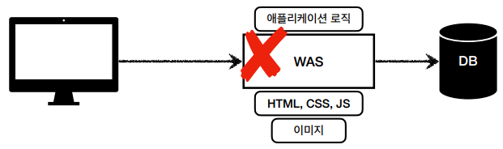

- WAS, DB 만으로 시스템 구성이 가능하지만 WAS가 너무 많은 역할을 담당 → 서버 과부하 우려
- 애플리케이션 로직은 가장 중요하고 가장 비싼 자원이기 때문에 정적 리소스가 이를 방해하면 안된다.
1. **WEB, WAS, DB**

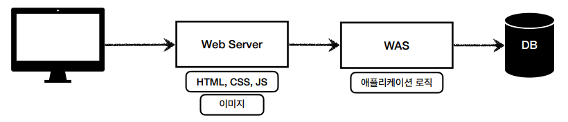

- 정적 리소스는 웹 서버가 처리하고 애플리케이션 로직같은 동적인 처리가 필요할 때 WAS에 요청을 위임하여 처리하게 한다.

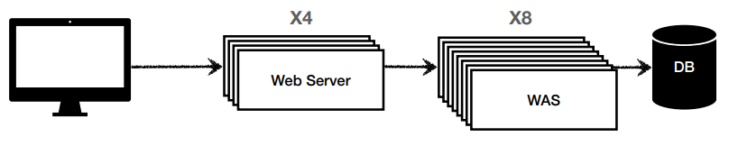

- 효율적인 리소스 관리 가능
    - 정적 리소스가 많이 사용되면 웹 서버 증설
    - 애플리케이션 리소스가 많이 사용되면 WAS 증설

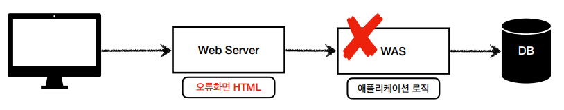

- 정적 리소스만 제공하는 웹 서버는 잘 죽지않지만 애플리케이션 로직이 동작하는 WAS 서버는 잘 죽는다.
- WAS, DB 장애시 웹 서버가 오류화면을 제공할 수 있다.

# 2. 서블릿(Servlet)

비즈니스 로직을 제외한 과정들은 Servlet의 도움으로 처리(HTTP 요청, HTTP 응답)

= **개발자가 비즈니스 로직에만 집중할 수 있게된다.**

서블릿을 사용해서 HTTP 응답 정보를 처리하는 WAS = **서블릿 컨테이너** (Tomcat)

요청시 마다 계속 객체를 생성하는 것을 비효율적 → 싱글톤

하나의 객체로 여러 요청 처리하는 방법 → **멀티 스레드**

# 3. 멀티 스레드

### 스레드(Thread)

- 실행중인 프로그램에서 실제로 작업을 수행하는 주체
- 애플리케이션 코드를 하나하나 순차적으로 실행
- 스레드가 없으면 자바 애플리케이션 실행 불가능
- 동시 처리가 필요하면 스레드를 추가로 생성

### 방안 1. 요청마다 스레드 생성

- 요청마다 스레드를 생성하면 동시 요청을 처리할 수 있지만 생성 비용이 비싸다.
- 스레드는 컨텍스트 스위칭 비용 발생
- 스레드 생성에 제한이 없으면 요청이 너무 많을 시 CPU, 메모리 임계점을 넘어서 서버가 죽을 수 있다. → **스레드 풀 사용**

### 방안 2. 스레드 풀

미리 정해진 개수의 스레드를 생성해놓고 필요할 때마다 사용하고 반환하는 방식으로 사용

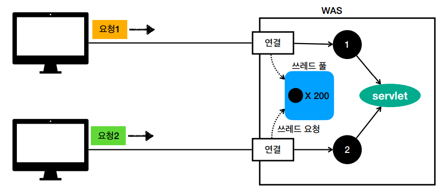

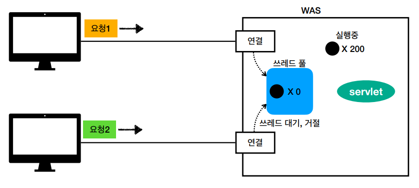

### 효과

- 스레드가 미리 생성되어 있어서 스레드를 생성하고 종료하는 비용(CPU)이 절약되고, 응답 시간이 빠르다.
- 생성 가능한 스레드의 최대치가 설정돼 있어서 너무 많은 요청이 들어와도 기존 요청은 안전하게 처리 가능

### 스레드 풀 스레드 수 설정

- 애플리케이션 로직의 복잡도, CPU, 메모리, IO 리소스 상황 등을 고려하여 설정
- 최대한 실제 서비스와 유사하게 성능 테스트를 시도하여 설정

### WAS의 멀티 스레드 지원

- WAS가 멀티 스레드에 관한 부분을 알아서 처리해준다.
- 개발자는 멀티 스레드 관해 신경쓰지 않아도 된다.
- 멀티 스레드 환경이므로 싱글톤 객체(서블릿, 스프링 빈)은 주의해서 사용해야 한다. (공유 변수)

# 4. **HTML, HTTP API, SSR, CSR**

### 정적 리소스

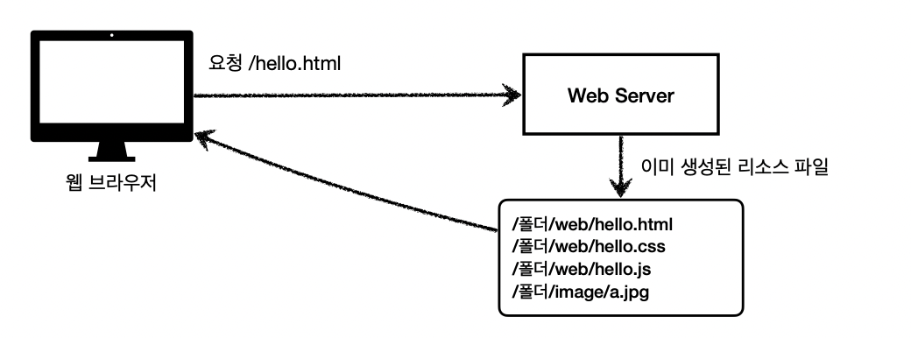

- 고정된 HTML 파일, CSS, JS, 이미지, 영상 등을 제공
- 주로 웹 브라우저

### HTML 페이지

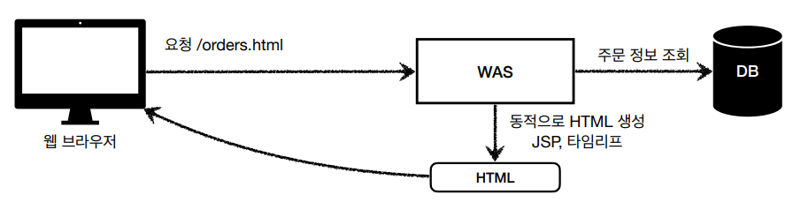

- 동적으로 필요한 HTML 파일을 생성해서 전달 (JSP, Thymeleaf)
- 웹 브라우저 : HTML 해석
- 웹 브라우저에서 동적 HTML 요청시, WAS에서 주문내역 정보 조회 후, 프로그래밍을 통해 HTML을 동적으로 생성한다. 생성된 HTML을 웹 브라우저에 내려준다.

### HTTP API

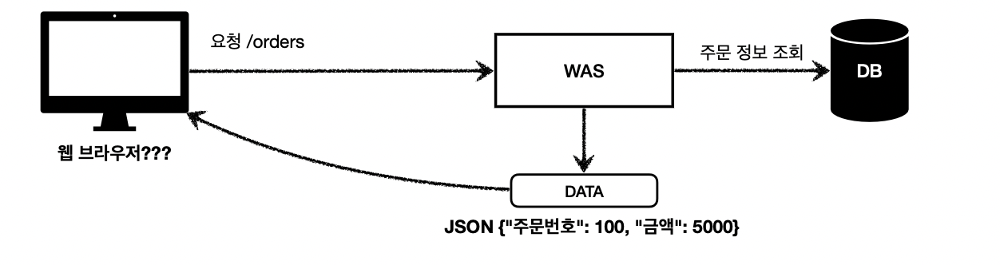

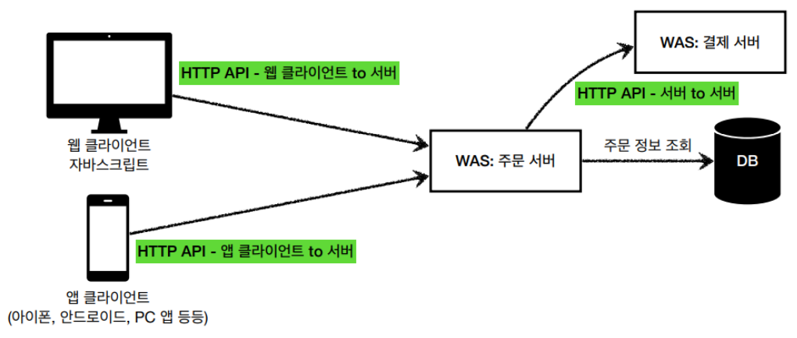

- HTML 파일 자체를 보내는 게 아니라 데이터만 전달한다.
- 주로 JSON 사용
- HTTP API 방식은 다양한 시스템에서 사용 (앱 클라이언트, 웹 클라이언트, 서버 to 서버)

### 서버 사이드 렌더링 SSR

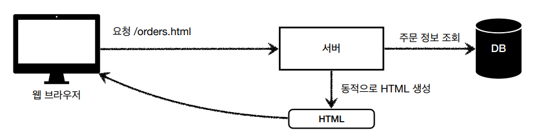

- HTML 결과를 서버에서 만들어서 웹 브라우저에 전달
- 주로 정적인 화면에 사용
- JSP, Thymeleaf → 백엔드 개발자

### 클라이언트 사이드 렌더링 CSR

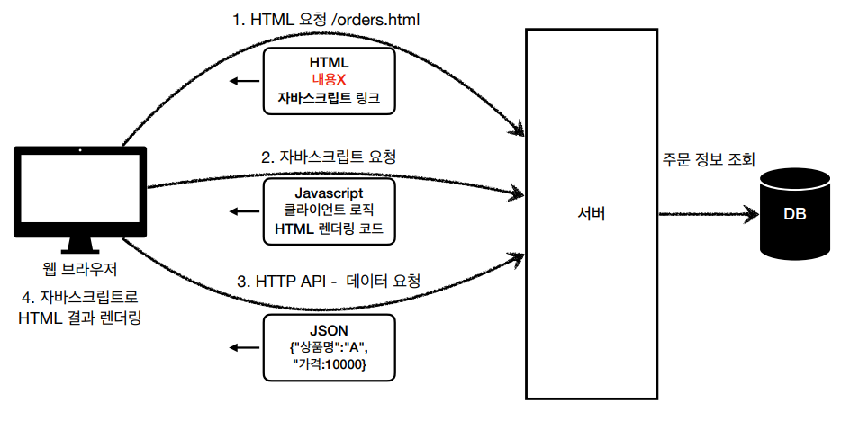

- HTML 결과를 자바스크립트를 사용해 웹 브라우저에 동적으로 생성해 적용
- 주로 동적인 화면에 사용, 웹 환경을 마치 앱처럼 필요한 부분만 변경할 수 있다.
    - ex) 구글 지도, Gmail, 구글 캘린더
- React, Vue.js → 프론트엔드 개발자

### 출처)

[https://www.inflearn.com/course/스프링-mvc-1](https://www.inflearn.com/course/%EC%8A%A4%ED%94%84%EB%A7%81-mvc-1)

[https://velog.io/@tngh4037/김영한-스프링-MVC-1편-백엔드-웹-개발-핵심-기술-1-웹-애플리케이션-이해](https://velog.io/@tngh4037/%EA%B9%80%EC%98%81%ED%95%9C-%EC%8A%A4%ED%94%84%EB%A7%81-MVC-1%ED%8E%B8-%EB%B0%B1%EC%97%94%EB%93%9C-%EC%9B%B9-%EA%B0%9C%EB%B0%9C-%ED%95%B5%EC%8B%AC-%EA%B8%B0%EC%88%A0-1-%EC%9B%B9-%EC%95%A0%ED%94%8C%EB%A6%AC%EC%BC%80%EC%9D%B4%EC%85%98-%EC%9D%B4%ED%95%B4)

[https://velog.io/@somyeong0623/Spring-MVC-1편-01.-웹-애플리케이션의-이해](https://velog.io/@somyeong0623/Spring-MVC-1%ED%8E%B8-01.-%EC%9B%B9-%EC%95%A0%ED%94%8C%EB%A6%AC%EC%BC%80%EC%9D%B4%EC%85%98%EC%9D%98-%EC%9D%B4%ED%95%B4)

[https://jinyoungchoi95.tistory.com/17](https://jinyoungchoi95.tistory.com/17)